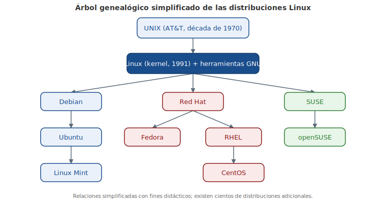

# Capítulo 1: Introducción a Linux y los Sistemas Operativos

## 1.1 Introducción

En este capítulo vamos a explorar la evolución de **Linux®** y los sistemas operativos populares. También vamos a hablar sobre las consideraciones para elegir un sistema operativo.

Linux es de **Código Abierto**. ¿Qué significa eso? El código que impulsa a Linux no es propiedad de una empresa. En cambio, lo desarrolla la comunidad que lo usa. ¿Por qué es esto bueno? Libera a los usuarios de los costos de licencia y permite modificar el código según las necesidades cambiantes.

Linux® es una marca registrada de Linus Torvalds en los Estados Unidos y otros países.

## 1.2 La evolución del Linux y los sistemas operativos populares

La definición de la palabra Linux depende del contexto en el que se utiliza. Linux se refiere al **kernel**. Es el controlador central de todo lo que pasa en el equipo (veremos más detalles a continuación). Quienes dicen que su equipo "se ejecuta con Linux" generalmente se refieren al kernel y el conjunto de herramientas que vienen con él (llamados **distribución**). Si tienes "Experiencia con Linux", probablemente te refieres a los propios programas, aunque dependiendo del contexto, podrías hablar sobre tu capacidad de ajustar con precisión el kernel. Cada uno de estos componentes será explorado para que puedas entender exactamente qué papel juega cada uno.

El término que más complica las cosas es **UNIX**. UNIX era originalmente un sistema operativo desarrollado en los laboratorios de Bell AT&T en la década de 1970. Éste fue modificado y bifurcado (es decir, las personas lo modificaron y estas modificaciones sirvieron de base para otros sistemas). En la actualidad hay muchas variantes de UNIX. Sin embargo, UNIX es ahora una marca registrada y una especificación, propiedad de un consorcio industrial llamado Open Group. Sólo el software que ha sido certificado por el Open Group puede llamarse UNIX. A pesar de la adopción de todos los requisitos de la especificación de UNIX, Linux no ha sido certificado. ¡Eso significa que Linux realmente no es un UNIX! Es sólo... como UNIX.

### 1.2.2 Las Aplicaciones

Al igual que un controlador de tráfico aéreo, el kernel no es útil sin tener algo que controlar. Si el kernel es la torre, las **aplicaciones** son los aviones. Las aplicaciones mandan peticiones al kernel, en cambio, éste recibe recursos tales como memoria, CPU y disco. El kernel también abstrae los detalles complicados de la aplicación. La aplicación no sabe si un bloque de disco es una unidad de estado sólido de fabricante A, un disco duro metálico de spinning del fabricante B, o incluso, alguna parte del archivo de red. Las aplicaciones sólo tienen que seguir la **Interfaz de Programación de Aplicaciones (API - Application Programming Interface)** del kernel y a cambio no tienen que preocuparse por los detalles de implementación.

Cuando nosotros, como usuarios, pensamos en aplicaciones, tendemos a pensar en los procesadores de texto, navegadores web y clientes de correo electrónico. Al kernel no le importa si se está ejecutando algo orientado al usuario, es un servicio de red que se comunique con un equipo remoto, o una tarea interna. Por lo tanto, de esto obtenemos una abstracción llamada **proceso**. Un proceso es solamente una tarea que está cargada y rastreada por el kernel. Una aplicación puede necesitar incluso múltiples procesos para funcionar, por lo que el kernel se encarga de ejecutar los procesos, los arranca y para según lo requerido, y entrega los recursos del sistema.

### 1.2.3 Rol de Código Abierto

Linux comenzó como un proyecto de pasatiempo por Linus Torvalds en 1991. Hizo la fuente disponible libremente y otros se unieron para formar este sistema operativo de vanguardia. Su sistema no fue el primero desarrollado por un grupo. Sin embargo, ya que fue un proyecto creado desde cero, los primeros usuarios podían influir el rumbo del proyecto y asegurarse de que no se repitieran los errores de otros UNIXes.

Los proyectos de software toman la forma de **código fuente**, que es un conjunto de instrucciones de cómputo legibles para el humano. El código fuente puede escribirse en cualquiera de los cientos de lenguajes diferentes; Linux ha sido escrito solamente en **C**, que es un lenguaje que comparte historia con el UNIX original.

El código fuente no se entiende directamente por el equipo, por lo que debe ser **compilado** en instrucciones de máquina por un **compilador**. El compilador reúne todos los archivos fuente y genera algo que se puede ejecutar en el equipo, como el kernel de Linux.

Históricamente, la mayor parte del software se ha publicado bajo una **licencia de código cerrado**, lo que significa que obtienes el derecho a utilizar el código de máquina, pero no puedes ver el código fuente. ¡A menudo la licencia dice específicamente que no se intente revertir el código máquina al código fuente para averiguar lo que hace!

El **Código Abierto** toma una vista centrada en la fuente del software. La filosofía de código abierto es que tienes derecho a obtener el software y modificarlo para tu propio uso. Linux adoptó esta filosofía con gran éxito. La gente tomó la fuente, hizo cambios y lo compartió con el resto del grupo.

Junto a esto, fue el proyecto **GNU** (GNU, no UNIX). Mientras que GNU estaba construyendo su propio sistema operativo, eran mucho más eficaces en la creación de las herramientas que están de acuerdo con el sistema operativo UNIX, como los compiladores y las interfaces de usuario. La fuente era completamente gratuita, así que Linux pudo enfocar sus herramientas y proporcionar un sistema completo. Como tal, la mayoría de las herramientas que forman parte del sistema Linux provienen de estas herramientas GNU.

Hay muchas diversas variantes en código abierto, y los veremos en un capítulo posterior. Todos coinciden en que debes tener acceso al código fuente, pero difieren en cómo puedes, o en algunos casos, cómo debes redistribuir los cambios.

### 1.2.4 Distribuciones de Linux

Toma las herramientas de GNU y Linux, añade algunas aplicaciones para el usuario como un cliente de correo, y obtienes un sistema Linux completo. Se empezó a empaquetar todo este software en una **distribución** casi tan pronto como Linux llegó a ser utilizable. La distribución se encarga de configurar el almacenamiento de información, instalar el kernel e instalar el resto del software. Las distribuciones recomendadas completas también incluyen herramientas para administrar el sistema y un **administrador de paquetes** para añadir y eliminar el software después de la instalación.

Como en UNIX, hay muchos sabores diferentes de distribuciones. En estos días, hay distribuciones que se centran en el funcionamiento en servidores, computadoras de escritorio (desktop) o incluso herramientas específicas de la industria como el diseño de la electrónica o la computación estadística. Los principales actores en el mercado se remontan a Red Hat o Debian. La diferencia más visible es el administrador de paquetes, aunque encontrarás otras diferencias en todo, desde ubicaciones de archivos a filosofías de políticas.

A continuación, un resumen de las principales distribuciones y familias mencionadas:

| Distribución | Origen / familia | Características principales |
|---|---|---|
| **Red Hat** | Independiente | Introdujo el **RPM** (Red Hat Package Manager); centrada en servidor web y servicios de archivos; **Red Hat Enterprise Linux (RHEL)** es de pago con ciclo de liberación largo |
| **Fedora** | Patrocinada por Red Hat | Escritorio personal con software más reciente, ciclo de liberación corto, mismos principios que RHEL |
| **CentOS** | Recompilación de RHEL | Recompila los paquetes de RHEL y los ofrece gratis; compatible en gran parte con RHEL, sin soporte pagado |
| **Scientific Linux** | Basada en Red Hat | Patrocinada por Fermilab; diseñada para computación científica (p. ej. aceleradores de partículas como el Gran Colisionador de Hadrones del CERN) |
| **Open SUSE** | Derivada originalmente de Slackware | Incorpora aspectos de Red Hat; comprada por Novell (2003), luego por Attachmate Group (2011), fusionado con Micro Focus International; versión empresarial (**SUSE Linux Enterprise**) es propietaria y para servidor |
| **Debian** | Esfuerzo comunitario | Promueve software de código abierto y adherencia a estándares; sistema de paquetes propio basado en archivos **.deb**; soporta más plataformas Intel/AMD que Red Hat |
| **Ubuntu** | Derivada de Debian | La más popular derivada de Debian; creada por Canonical, que se financia proporcionando soporte |
| **Linux Mint** | Bifurcación de Ubuntu | Depende de los repositorios de Ubuntu; versiones gratuitas, algunas con código propietario restringido en ciertos países; está suplantando a Ubuntu como la solución de escritorio más popular |

Hemos tratado el tema de las distribuciones mencionadas específicamente en los objetivos de Linux Essentials. Debes saber que hay cientos, y hasta miles más que están disponibles. Es importante entender que si bien hay muchas diferentes distribuciones de Linux, muchos de los programas y comandos siguen siendo los mismos o muy similares.

#### 1.2.4.1 ¿Qué es un Comando?

La respuesta más simple a la pregunta "¿Qué es un comando?" es que un **comando** es un programa de software que, cuando se ejecuta en la línea de comandos, realiza una acción en el equipo.

Cuando tomas en cuenta un comando utilizando esta definición, en realidad estás tomando en cuenta lo que sucede al ejecutar un comando. Cuando se escribe un comando, el sistema operativo ejecuta un proceso que puede leer una entrada, manipular datos y producir la salida. Desde esta perspectiva, un comando ejecuta un proceso en el sistema operativo, y entonces la computadora realiza un trabajo.

Sin embargo, un comando se puede ver desde una perspectiva diferente: desde su origen. La fuente es desde donde el comando "proviene", y hay varios orígenes diferentes de comandos dentro del shell de la CLI:

- **Comandos integrados en el shell**: un buen ejemplo es el comando `cd`, ya que es parte del **bash shell**. Cuando un usuario escribe el comando `cd`, el bash shell ya se está ejecutando y sabe cómo interpretar ese comando, sin requerir de ningún programa adicional para iniciarse.
- **Comandos que se almacenan en archivos que son buscados por el shell**: si escribes un comando `ls`, entonces el shell busca en los directorios que aparecen en la variable **RUTA DE ACCESO (PATH)** para tratar de encontrar un archivo llamado `ls` que pueda ejecutar. Estos comandos se pueden ejecutar también escribiendo la ruta de acceso completa del comando.
- **Alias**: un **alias** puede reemplazar un comando integrado, la función o un comando que se encuentra en un archivo. Los alias pueden ser útiles para la creación de nuevos comandos a partir de funciones y comandos existentes.
- **Funciones**: las **funciones** también pueden ser construidas usando los comandos existentes o crear nuevos comandos, reemplazar los comandos integrados en el shell o comandos almacenados en archivos. Los alias y las funciones normalmente se cargan desde los archivos de inicialización cuando se inicia el shell por primera vez, que veremos más adelante.

> **Para considerar:** Aunque los alias serán tratados en detalle en una sección posterior, este ejemplo breve puede ser útil para entender el concepto de comandos.
>
> Un alias es esencialmente un apodo para otro comando o una serie de comandos. Por ejemplo, el comando `cal 2014` muestra el calendario para el año 2014. Supongamos que acabes ejecutando este comando a menudo. En lugar de ejecutar el comando completo cada vez, puedes crear un alias llamado `mycal` y ejecutar el alias como se muestra en el siguiente gráfico:

```bash
sysadmin@localhost:~$ alias mycal="cal 2014"
sysadmin@localhost:~$ mycal
```

```
                                    2014
     Enero               Febrero               Marzo
Do Lu Ma Mi Ju Vi Sá Do Lu Ma Mi Ju Vi Sa Do Lu Ma Mi Ju Vi Sá
          1  2  3  4                     1                     1
 5  6  7  8  9 10 11   2  3  4  5  6  7  8   2  3  4  5  6  7  8
12 13 14 15 16 17 18   9 10 11 12 13 14 15   9 10 11 12 13 14 15
19 20 21 22 23 24 25  16 17 18 19 20 21 22  16 17 18 19 20 21 22
26 27 28 29 30 31     23 24 25 26 27 28     23 24 25 26 27 28 29
                                            30 31
       Abril                  Mayo                   Junio
Do Lu Ma Mi Ju Vi Sá Do Lu Ma Mi Ju Vi Sa Do Lu Ma Mi Ju Vi Sá
       1  2  3  4  5               1  2  3   1  2  3  4  5  6  7
 6  7  8  9 10 11 12   4  5  6  7  8  9 10   8  9 10 11 12 13 14
13 14 15 16 17 18 19  11 12 13 14 15 16 17  15 16 17 18 19 20 21
20 21 22 23 24 25 26  18 19 20 21 22 23 24  22 23 24 25 26 27 28
27 28 29 30           25 26 27 28 29 30 31  29 30
        Julio                 Agosto              Septiembre
Do Lu Ma Mi Ju Vi Sá Do Lu Ma Mi Ju Vi Sa Do Lu Ma Mi Ju Vi Sá
      1  2  3  4  5                 1  2      1  2  3  4  5  6
```

<figure>

<figcaption>Árbol genealógico simplificado de las principales familias de distribuciones Linux.</figcaption>
</figure>

### 1.2.5 Plataformas de Hardware

Linux comenzó como algo que sólo funcionaría en un equipo como el de Linus: un 386 con un controlador de disco duro específico. El rango de soporte creció gracias a que se empezó a implementar soporte para otro hardware. Finalmente, Linux comenzó a apoyar a otros chips, incluido el hardware que se hizo para ejecutar sistemas operativos competitivos.

Los tipos de hardware crecieron desde el simple chip de Intel hasta supercomputadores. Más tarde se desarrollaron chips de menor tamaño compatibles con Linux, pensados para que quepan en dispositivos de consumo, llamados **dispositivos integrados**. El soporte para Linux se hizo omnipresente de tal manera que a menudo es más fácil construir hardware para soportar Linux y usar Linux como un trampolín para su software personalizado, que construir el hardware y el software personalizados desde cero.

Finalmente, teléfonos celulares y tabletas empezaron a funcionar con Linux. Una empresa, más tarde comprada por Google, salió con la plataforma **Android**, que es un paquete de Linux y el software necesario para ejecutar un teléfono o una tableta. Esto significa que el esfuerzo para introducir un teléfono al mercado es significativamente menor, y las empresas pueden pasar su tiempo innovando el software orientado al usuario en lugar de reinventar la rueda cada vez. Android es ahora uno de los líderes del mercado en el espacio.

Además de teléfonos y tabletas, muchos dispositivos de consumo llevan Linux. Los enrutadores inalámbricos normalmente funcionan con Linux porque tiene un gran conjunto de características de red. El TiVo es un grabador de vídeo digital para el consumidor basado en Linux. A pesar de que estos dispositivos tienen Linux en el kernel, los usuarios finales no tienen que saberlo. El software a la medida interactúa con el usuario y Linux proporciona una plataforma estable.

## 1.3 Elegir un Sistema Operativo

Has aprendido que Linux es un sistema operativo de tipo UNIX, lo que significa que no ha pasado por una certificación formal y por lo tanto no puede usar la marca oficial de UNIX. Hay muchas otras alternativas; algunas son tipo UNIX y algunas están certificadas como UNIX. Existen también sistemas operativos no-Unix como Microsoft Windows.

La pregunta más importante para determinar la configuración de una máquina es "¿Qué hará esta máquina?" Si necesitas ejecutar un software especializado que sólo se ejecuta en Oracle Solaris, entonces eso es lo que necesitarás. Si necesitas leer y escribir documentos de Microsoft Office, entonces necesitarás Windows o algo capaz de ejecutar OpenOffice o LibreOffice.

### 1.3.1 Puntos de Decisión

En primer lugar tienes que decidir qué rol debe tener tu máquina. ¿Estará sentado en la consola ejecutando aplicaciones de productividad o navegando la web? Si es así, necesitarás un equipo de escritorio (desktop). ¿Vas a utilizar la máquina como un servidor Web o de otra manera, aparte de estar sentado en una estantería de servidor en algún lugar? Estás buscando un servidor.

Los servidores generalmente están en un rack y comparten un teclado y un monitor con muchos otros equipos, ya que el acceso de la consola sólo se utiliza para configurar y solucionar problemas en el servidor. El servidor se ejecutará en modo no gráfico, que libera recursos para el propósito real de la computadora. Un equipo de escritorio ejecutará principalmente una **GUI**.

Los puntos de decisión clave al elegir un sistema operativo son los siguientes:

- **Rol de la máquina**: ¿escritorio, para productividad y navegación, o servidor, dedicado a una función específica?
- **Funciones necesarias**: ¿existe software específico que se necesita para funcionar, o funciones específicas que debe realizar la máquina? ¿Se administrarán cientos o miles de estas máquinas a la vez? ¿Cuál es el conjunto de habilidades del equipo que administra la máquina y el software?
- **Vida útil y tolerancia al riesgo**: determinada por el **ciclo de liberación** (frecuencia con la que salen nuevas versiones) y el **ciclo de mantenimiento** (o ciclo de vida), que es el tiempo durante el cual el proveedor sigue dando soporte a una versión antes de su **Fin de Vida (EOL - End of Life)**. Por ejemplo, las versiones principales de Fedora Linux salen aproximadamente cada 6 meses y llegan a su EOL tras 2 versiones principales más un mes (entre 7 y 13 meses de soporte), mientras que Red Hat Enterprise Linux puede usarse hasta 13 años sin necesidad de actualizar.
- **Frecuencia de actualización deseada**: en un entorno de servidor empresarial las actualizaciones importantes requieren mucho tiempo y se hacen raramente, prefiriendo reemplazar el servidor completo cuando es necesario; en cambio, en desarrollo de software o trabajo de escritorio suele preferirse el software más reciente, ya que el escritorio guarda su trabajo en un servidor remoto y puede reinstalarse con poca interrupción.
- **Estabilidad de la versión**: el software puede clasificarse como **beta** (con funciones nuevas aún no probadas rigurosamente) o **estable** (ya probado en el campo). Los servidores generalmente prefieren software estable, mientras quien necesita las últimas funciones optará por un ciclo de liberación corto con software beta de fácil acceso.
- **Compatibilidad con versiones anteriores**: la capacidad de un sistema operativo más reciente de seguir siendo compatible con software creado para versiones anteriores, relevante cuando se actualiza el sistema operativo pero no la aplicación.
- **Costo**: Linux en sí puede ser gratuito, pero puede implicar pago por soporte; Microsoft cobra licencias de servidor y puede sumar gastos de soporte; el sistema operativo elegido puede además requerir hardware particular, lo que también afecta el costo.

### 1.3.2 Microsoft Windows

El mundo de Microsoft divide los sistemas operativos de acuerdo al propósito de la máquina: ¿escritorio o servidor? La edición de escritorio de Windows ha experimentado diversos esquemas de nomenclatura, con la versión actual (al momento de escribir esto) siendo simplemente Windows 8. Nuevas versiones del escritorio salen cada 3-5 años y tienden a recibir soporte por muchos años. La compatibilidad con versiones anteriores es también una prioridad para Microsoft, llegando incluso a agrupar tecnología de máquina virtual para que los usuarios puedan ejecutar software antiguo.

En el mundo de los servidores existe **Windows Server**. Actualmente hay (hasta la fecha de este texto) la versión 2012 para indicar la fecha de lanzamiento. El servidor ejecuta una GUI, pero en gran parte como una respuesta competitiva a Linux. Ha hecho progresos sorprendentes en la línea de comandos con capacidades de scripting a través de **PowerShell**. También puedes hacer que el servidor parezca una computadora de sobremesa con un paquete de experiencia de escritorio opcional.

### 1.3.3 Apple OS X

Apple produce el sistema operativo **OS X**, que sí pasó por la certificación de UNIX. OS X está parcialmente basado en software del proyecto **FreeBSD**.

Por el momento, OS X es principalmente un sistema operativo de escritorio, pero existen paquetes opcionales que ayudan con la gestión de servicios de red que permiten a muchas computadoras de escritorio OS X colaborar, tal como compartir archivos o ejecutar un inicio de sesión de red.

OS X en el escritorio suele ser una decisión personal, ya que mucha gente considera este sistema más fácil de usar. La creciente popularidad de OS X ha asegurado un sano soporte de proveedores de software. OS X es también muy popular en las industrias creativas, como por ejemplo la producción de vídeo. Es un área donde las aplicaciones manejan la decisión de sistema operativo y por lo tanto la elección de hardware, ya que OS X se ejecuta en el hardware de Apple.

### 1.3.4 BSD

Hay varios proyectos open source **BSD** (Berkeley Software Distribution), como OpenBSD, FreeBSD y NetBSD. Estas son alternativas a Linux en muchos aspectos, ya que utilizan una gran cantidad de software común. BSD por lo general se implementa en la función del servidor, aunque también hay variantes como GNOME y KDE que fueron desarrolladas para las funciones del escritorio.

### 1.3.5 Otros UNIX Comerciales

Algunos de los UNIX comerciales más populares son:

- **Oracle Solaris**
- **IBM AIX**
- **HP-UX**

Cada uno de ellos se ejecuta en el hardware de sus respectivos creadores. El hardware es generalmente grande y potente, y ofrece características tales como integración de intercambio de CPU y memoria con sistemas de legado mainframe también ofrecidos por el proveedor.

A menos que el software requiera un hardware específico o las necesidades de la aplicación requieran redundancia en el hardware, muchas personas tienden a elegir estas opciones porque ya son usuarios de productos de la compañía. Por ejemplo, IBM AIX se ejecuta en una amplia variedad de hardware de IBM y puede compartir el hardware con mainframes. Por lo tanto, encontrarás AIX en empresas que ya tienen una larga tradición de uso de IBM o que hacen uso de software de IBM como WebSphere.

### 1.3.6 Linux

Un aspecto donde Linux es muy diferente a las alternativas es que, después de que un administrador haya elegido Linux, todavía tiene que elegir una **distribución** Linux. Acuérdate del tema 1: la distribución empaca el kernel, utilidades y herramientas administrativas de Linux en un paquete instalable y proporciona una manera de instalar y actualizar paquetes después de la instalación inicial.

Algunos sistemas operativos están disponibles a través de un único proveedor, como OS X y Windows, con el soporte del sistema proporcionado por el proveedor. Con Linux, hay múltiples opciones, desde las ofertas comerciales para el servidor o de escritorio, hasta las distribuciones personalizadas hechas para convertir una computadora antigua en un firewall de red.

A menudo los proveedores de aplicaciones eligen un subconjunto de distribuciones para proporcionar soporte. Diferentes distribuciones tienen diferentes versiones de las librerías (bibliotecas) principales, y es difícil para una empresa dar soporte a todas estas versiones diferentes.

Los gobiernos y las grandes empresas también pueden limitar sus opciones a las distribuciones que ofrecen soporte comercial. Esto es común en las grandes empresas, donde pagar por otro nivel de soporte es mejor que correr el riesgo de interrupciones extensas. También, las diferentes distribuciones ofrecen ciclos de liberación a veces tan frecuentes como cada seis meses. Mientras que las actualizaciones no son necesarias, cada versión puede obtener soporte sólo por un periodo razonable. Por lo tanto, algunas versiones de Linux tienen un **Periodo Largo de Soporte (LTS - Long Term Support)** de hasta 5 años o más, mientras que otras sólo recibirán soporte por dos años o menos.

Algunas distribuciones se diferencian entre estables, de prueba e inestables. La diferencia es que la distribución inestable intercambia fiabilidad a cambio de funciones. Cuando las funciones se hayan integrado en el sistema por mucho tiempo y muchos de los errores y problemas hayan sido abordados, el software pasa por pruebas para convertirse en una versión estable. La distribución Debian advierte a los usuarios sobre los peligros de usar la liberación "sid" con la siguiente advertencia:

> "sid" está sujeta a cambios masivos y actualizaciones de librerías (biblioteca). Esto puede resultar en un sistema muy "inestable" que contiene paquetes que no se pueden instalar debido a la falta de librerías, dependencias que no se pueden satisfacer, etc. ¡Usar bajo el propio riesgo!

Otras versiones dependen de distribuciones Beta. Por ejemplo, la distribución de Fedora libera versiones Beta o versiones de su software antes de la liberación completa para minimizar errores. Fedora se considera a menudo una comunidad orientada a la versión Beta de RedHat. Se agregan y cambian las funciones en la versión de Fedora antes de encontrar su camino en la distribución de RedHat Enterprise.

### 1.3.7 Android

**Android**, patrocinado por Google, es la distribución Linux más popular del mundo. Es fundamentalmente diferente de sus contrapartes. Linux es un kernel, y muchos de los comandos que se tratarán en este curso son en realidad parte del paquete **GNU** (GNU no es Unix). Por esta razón, algunas personas insisten en utilizar el término **GNU/Linux** en lugar de Linux por sí solo.

Android utiliza la máquina virtual **Dalvik** con Linux, proporcionando una sólida plataforma para dispositivos móviles como teléfonos y tabletas. Sin embargo, carece de los paquetes tradicionales que se distribuyen a menudo con Linux (como GNU y Xorg), por lo que Android es generalmente incompatible con distribuciones Linux de escritorio.

Esta incompatibilidad significa que un usuario de RedHat o Ubuntu no puede descargar software de la tienda de Google Play. Además, un terminal emulador en Android carece de muchos de los comandos de sus contrapartes de Linux. Sin embargo, es posible utilizar **BusyBox** con Android para habilitar el funcionamiento de la mayoría de los comandos.

### Resumen del capítulo

- Linux es, en sentido estricto, el **kernel**: el controlador central que gestiona procesos, memoria, CPU y disco, y que expone una **API** para que las aplicaciones funcionen sin conocer los detalles del hardware.
- Linux es de **código abierto** y, aunque comparte diseño con UNIX, no está certificado por Open Group y por eso técnicamente no es UNIX, sino un sistema "tipo UNIX".
- Una **distribución** combina el kernel de Linux con las herramientas GNU y aplicaciones adicionales, empaquetadas junto con un administrador de paquetes; las principales familias son Red Hat (RPM) y Debian (.deb), de las que derivan Fedora, CentOS, Scientific Linux, openSUSE, Ubuntu y Linux Mint, entre otras.
- Un **comando** puede entenderse como un proceso que el sistema operativo ejecuta, o según su origen: comandos integrados en el shell, comandos almacenados en archivos localizados vía la variable PATH, alias y funciones.
- Linux se ejecuta en una enorme variedad de hardware, desde el PC original hasta supercomputadoras y dispositivos integrados, siendo la base de plataformas como Android.
- Elegir un sistema operativo depende del rol de la máquina (escritorio o servidor), las funciones requeridas, el ciclo de liberación y mantenimiento, la necesidad de software estable o de última generación, la compatibilidad con versiones anteriores y el costo; las alternativas incluyen Windows, OS X, BSD, UNIX comerciales (Solaris, AIX, HP-UX) y las múltiples distribuciones de Linux, incluyendo Android.
