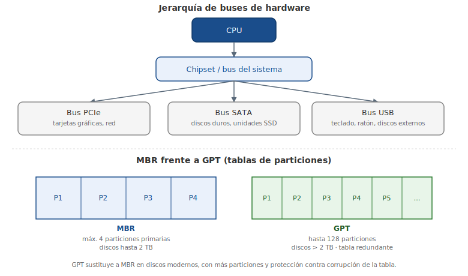

# Capítulo 10: Hardware y Dispositivos

## 10.1 Introducción

Una de las muchas ventajas de tener tantas distribuciones distintas de Linux es que algunas de ellas están diseñadas para funcionar en plataformas de hardware específicas. De hecho, hay una distribución de Linux diseñada para casi todas las plataformas de hardware modernas.

Cada una de estas plataformas de hardware tiene una gran cantidad de variedad en los componentes de hardware que están disponibles. Además de diferentes tipos de unidades de disco duro, hay muchos monitores e impresoras diferentes. Con la popularidad de los dispositivos USB, tales como dispositivos de almacenamiento USB, cámaras y teléfonos celulares, el número de dispositivos disponibles llega a calcularse en miles.

En algunos casos, esto plantea problemas, ya que estos dispositivos típicamente necesitan algún tipo de software (llamados **controladores** o «drivers» en inglés, o módulos) que les permite comunicarse con el sistema operativo instalado. Los fabricantes de hardware a menudo proporcionan este software, pero típicamente para Microsoft Windows, no para Linux. La mascota de Linux, Tux, sin embargo, está empezando a aparecer más a menudo en los productos de hardware, indicando soporte de Linux.

Además del apoyo de los proveedores, hay una gran cantidad de apoyo de la comunidad que se esfuerza por proporcionar controladores para los sistemas Linux. Aunque no todo el hardware tiene los controladores necesarios, hay una buena cantidad que sí los tiene, lo que supone un reto para los usuarios y administradores Linux para encontrar los controladores correctos o elegir el hardware que tiene cierto nivel de soporte en Linux.

En este capítulo aprenderás acerca de los dispositivos de *core* hardware, incluyendo la manera de utilizar los comandos de Linux para mostrar la información vital de hardware del dispositivo.

## 10.2 Los Procesadores

La **Unidad Central de Procesamiento** (CPU, «Central Processing Unit») es uno de los componentes más importantes de hardware en una computadora. Realiza la toma de decisiones, así como los cálculos que deben realizarse para ejecutar correctamente un sistema operativo. El procesador es esencialmente un chip de computadora.

El procesador está conectado con otro hardware a través de una **placa base** (o «motherboard»), también conocida como la placa del sistema. Las placas base están diseñadas para funcionar con determinados tipos de procesadores.

Si un sistema tiene más de un procesador, el sistema se denomina **multiprocesador**. Si se combina más de un procesador en un único chip del procesador, entonces se llama **multi-core** (o «multi-núcleo»).

Aunque el apoyo está disponible para más tipos de procesadores en Linux que en cualquier otro sistema operativo, principalmente hay dos tipos de procesadores utilizados en las computadoras de escritorio y en los servidores: **x86** y **x86_64**. En un x86, el sistema procesa los datos de 32 bits a la vez; en un x86_64 el sistema procesa datos de 64 bits a la vez. Un sistema x86_64 también es capaz de procesar datos de 32 bits a la vez en un modo compatible con las versiones anteriores. Una de las ventajas principales de un sistema de 64 bits es que el sistema es capaz de trabajar con más memoria.

La familia de procesadores x86 fue creada por Intel en 1978 con el lanzamiento del procesador 8086. Desde entonces, Intel ha producido muchos otros procesadores que son mejoras del 8086 original; se conocen genéricamente como los procesadores x86. Estos procesadores incluyen:

- El **80386** (también conocido como el i386).
- El **80486** (i486).
- El **Pentium** (i586).
- La serie del **Pentium Pro** (i686).

Además de Intel, hay otras empresas como AMD y Cyrix que también han producido procesadores compatibles con x86. Si bien Linux es capaz de soportar procesadores de la generación del i386, muchas distribuciones limitan su soporte al i686 o posteriores.

La familia de los procesadores x86_64, incluyendo los procesadores de 64 bits de Intel y AMD, ha estado en producción desde alrededor del año 2000. Como resultado, la mayoría de los procesadores modernos construidos hoy en día son x86_64. Mientras que el hardware ha estado disponible por más de una década hasta ahora, el software de soporte para esta familia de procesadores se ha estado desarrollando mucho más lento. Incluso en 2013 ya había muchos paquetes de software disponibles para la arquitectura x86, pero no para x86_64.

Puedes ver a qué familia pertenece tu CPU usando el comando `arch`:

```bash
sysadmin@localhost:~$ arch
x86_64
sysadmin@localhost:~$
```

Otro comando que puedes utilizar para identificar el tipo de CPU en el sistema es el comando `lscpu`:

```bash
sysadmin@localhost:~$  lscpu
Architecture:          x86_64
CPU op-mode(s):        32-bit, 64-bit
Byte Order:            Little Endian
CPU(s):                4
On-line CPU(s) list:   0-3
Thread(s) per core:    1
Core(s) per socket:    4
Socket(s):             1
NUMA node(s):          1
Vendor ID:             GenuineIntel
CPU family:            6
Model:                 44
Stepping:              2
CPU MHz:               2394.000
BogoMIPS:              4788.00
Virtualization:        VT-x
Hypervisor vendor:     VMware
Virtualization type:   full
L1d cache:             32K
L1i cache:             32K
L2 cache:              256K
L3 cache:              12288K
NUMA node0 CPU(s):     0-3
sysadmin@localhost:~$
```

La primera línea de esta salida muestra que se está utilizando la CPU en modo de 32 bits, ya que la arquitectura reportada es x86_64. La segunda línea de la salida muestra que la CPU es capaz de operar en modo ya sea de 32 o 64 bits, por lo tanto realmente es una CPU de 64 bits.

La manera más detallada de obtener información acerca de tu CPU es visualizando el archivo `/proc/cpuinfo` con el comando `cat`:

```bash
sysadmin@localhost:~$ cat /proc/cpuinfo
processor       : 0
vendor_id       : GenuineIntel
cpu family      : 6
model           : 44
model name      : Intel(R) Xeon(R) CPU           E5620  @ 2.40GHz
stepping        : 2
microcode       : 0x15
cpu MHz         : 2394.000
cache size      : 12288 KB
physical id     : 0
siblings        : 4
core id         : 0
cpu cores       : 4
apicid          : 0
initial apicid  : 0
fpu             : yes
fpu_exception   : yes
cpuid level     : 11
wp              : yes
flags           : fpu vme de pse tsc msr pae mce cx8 apic sep mtrr pge mca cmov
pat pse36 clflush dts mmx fxsr sse sse2 ss ht syscall nx rdtscp lm constant_ts
arch_perfmon pebs bts nopl xtopology tsc_reliable nonstop_tsc aperfmperf pni pcl mulqdq vmx ssse3 cx16 sse4_1 sse4_2 x2apic popcnt aes hypervisor lahf_lm ida arat dtherm tpr_shadow vnmi ept vpid
```

Mientras que la gran parte de la salida del comando `lscpu` y del contenido del archivo `/proc/cpuinfo` parece ser la misma, una de las ventajas de visualizar `/proc/cpuinfo` es que aparecen los **flags** (o «indicadores») de la CPU. Los flags de una CPU son un componente muy importante, ya que señalan qué características soporta la CPU y sus capacidades.

Por ejemplo, la salida del ejemplo anterior contiene el flag `lm` (*long mode*, o «modo largo»), indicando que esta CPU es de 64 bits. También hay flags que indican si la CPU es capaz de soportar máquinas virtuales (la capacidad de tener varios sistemas operativos en un único equipo).

## 10.3 Tarjetas Madre y los Buses

La **tarjeta madre** o «motherboard», es el tablero principal del hardware en la computadora a través del cual se conectan la CPU, la Memoria de Acceso Aleatorio (RAM) y otros componentes. Algunos dispositivos se conectan directamente a la tarjeta madre, mientras que otros se conectan a la tarjeta madre mediante un **bus**.

### 10.3.1 dmidecode

La tarjeta madre de muchas computadoras contiene lo que se conoce como **Basic Input and Output System (BIOS)**. **System Management BIOS (SMBIOS)** es el estándar que define las estructuras de datos y cómo se comunica la información acerca del hardware de la computadora. El comando `dmidecode` es capaz de leer y mostrar la información del SMBIOS.

Un administrador puede utilizar el comando `dmidecode` para ver los dispositivos conectados directamente a la tarjeta madre. Hay una gran cantidad de información proporcionada por la salida de este comando.

> Nota: los ejemplos siguientes son ilustrativos; el comando `dmidecode` no está disponible dentro del entorno de la máquina virtual de este curso.

En el primer ejemplo, se puede ver que el BIOS soporta el arranque directamente desde el CD-ROM. Esto es importante ya que los sistemas operativos a menudo se instalan arrancando directamente desde el CD de instalación:

```bash
# dmidecode 2.11
SMBIOS 2.4 present.
364 structures occupying 16040 bytes.
Table at 0x000E0010

Handle 0x0000, DMI type 0, 24 bytes
BIOS Information
	Vendor: Phoenix Technologies LTD
	Version: 6.00
	Release Date: 06/22/2012
	Address: 0xEA0C0
	Runtime Size: 89920 bytes
	ROM Size: 64 kB
	Characteristics:
		ISA is supported
		PCI is supported
		PC Card (PCMCIA) is supported
		PNP is supported
		APM is supported
		BIOS is upgradeable
		BIOS shadowing is allowed
		ESCD support is available
		Boot from CD is supported
--More--
```

En el siguiente ejemplo puedes ver que un total de 2048 MB (aproximadamente 2 GB) de RAM está instalado en el sistema:

```
Socket Designation: RAM socket #0
Bank Connections: None
Current Speed: Unknown
Type: EDO DIMM
Installed Size: 2048 MB (Single-bank Connection)
Enabled Size: 2048 MB (Single-bank Connection)
Error Status: OK
```

### 10.3.2 Memoria de Acceso Aleatorio (RAM)

La tarjeta madre normalmente tiene ranuras donde la **Memoria de Acceso Aleatorio (RAM)** puede conectarse al sistema. Los sistemas de arquitectura de 32 bits pueden utilizar hasta 4 gigabytes (GB) de RAM, mientras que las arquitecturas de 64 bits son capaces de abordar y usar mucha más RAM.

En algunos casos, la RAM que tiene tu sistema podría no ser suficiente para manejar todos los requisitos del sistema operativo. Cada programa necesita almacenar datos en la RAM y los programas mismos se cargan en la RAM cuando se ejecutan.

Para evitar que el sistema falle por falta de RAM, se utiliza una **RAM virtual** (o espacio de intercambio, «swap space»). La RAM virtual es un espacio en el disco duro que se utiliza para almacenar temporalmente los datos de RAM cuando el sistema se está quedando sin la RAM. Los datos que se almacenan en la RAM y que no se han utilizado recientemente se copian al disco duro, para que los programas utilizados recientemente puedan usar la RAM. Si es necesario, los datos intercambiados pueden almacenarse en la RAM en un momento posterior.

Para ver la cantidad de RAM en tu sistema, incluyendo la RAM virtual, ejecuta el comando `free`. El comando `free` tiene:

- La opción **`-m`**: para forzar la salida a ser redondeada al megabyte más cercano.
- La opción **`-g`**: para forzar la salida a ser redondeada al gigabyte más cercano.

```bash
sysadmin@localhost:~$ free -m
             total        used       free     shared     buffers     cached
Mem:          1894        356       1537          0          25       177
-/+ buffers/cache:        153        1741
Swap:         4063          0       4063
sysadmin@localhost:~$
```

La salida al ejecutar este comando `free` muestra que el sistema fue ejecutado en un sistema que tiene un total de 1.894 megabytes y está utilizando actualmente 356 megabytes.

La cantidad de swap aparece ser aproximadamente 4 gigabytes, aunque nada de esto parece estar en uso. Esto tiene sentido porque la gran parte de la RAM física está libre, así que en este momento no se necesita utilizar la RAM virtual.

### 10.3.3 Los Dispositivos Periféricos

La tarjeta madre tiene buses que permiten conectar múltiples dispositivos al sistema, incluyendo la **Interconexión de los Componentes Periféricos (PCI)** y el **Bus Serie Universal (USB)**. La tarjeta madre tiene también conectores para monitores, teclados y ratones.

Para ver todos los dispositivos conectados por un bus PCI ejecuta el comando `lspci`. El siguiente ejemplo muestra una salida de este comando. Como se puede ver a continuación, este sistema tiene un controlador VGA (conector de un monitor), un controlador de almacenamiento SCSI (un tipo de disco duro) y un controlador de Ethernet (un conector de red):

> Nota: el comando `lspci` no está disponible dentro del entorno de la máquina virtual de este curso; los siguientes gráficos son sólo ejemplos de uso.

```bash
sysadmin@localhost:~$ lspci
00:00.0 Host bridge: Intel Corporation 440BX/ZX/DX - 82443BX/ZX/DX Host bridge (rev 01)
00:01.0 PCI bridge: Intel Corporation 440BX/ZX/DX - 82443BX/ZX/DX AGP bridge (rev 01)
00:07.0 ISA bridge: Intel Corporation 82371AB/EB/MB PIIX4 ISA (rev 08)
00:07.1 IDE interface: Intel Corporation 82371AB/EB/MB PIIX4 IDE (rev 01)
00:07.3 Bridge: Intel Corporation 82371AB/EB/MB PIIX4 ACPI (rev 08)
00:07.7 System peripheral: VMware Virtual Machine Communication Interface (rev 10)
00:0f.0 VGA compatible controller: VMware SVGA II Adapter
03:00.0 Serial Attached SCSI controller: VMware PVSCSI SCSI Controller (rev 02
0b:00.0 Ethernet controller: VMware VMXNET3 Ethernet Controller (rev 01)
```

Ejecutar el comando `lspci` con la opción `-nn` muestra un identificador numérico para cada dispositivo, así como la descripción del texto original:

```bash
sysadmin@localhost:~$ lspci -nn
00:00.0 Host bridge [0600]: Intel Corporation 440BX/ZX/DX - 82443BX/ZX/DX Host bridge [8086:7190] (rev 01)
00:01.0 PCI bridge [0604]: Intel Corporation 440BX/ZX/DX - 82443BX/ZX/DX AGP bridge [8086:7191] (rev 01)
00:07.0 ISA bridge [0601]: Intel Corporation 82371AB/EB/MB PIIX4 ISA [8086:7110](rev 08)
00:07.1 IDE interface [0101]: Intel Corporation 82371AB/EB/MB PIIX4 IDE [8086:7111] (rev 01)
00:07.3 Bridge [0680]: Intel Corporation 82371AB/EB/MB PIIX4 ACPI [8086:7113](rev 08)
00:07.7 System peripheral [0880]: VMware Virtual Machine Communication Interface [15ad:0740] (rev 10)
00:0f.0 VGA compatible controller [0300]: VMware SVGA II Adapter [15ad:0405]
03:00.0 Serial Attached SCSI controller [0107]: VMware PVSCSI SCSI Controller
[15ad:07c0] (rev 02)
0b:00.0 Ethernet controller [0200]: VMware VMXNET3 Ethernet Controller
[15ad:07b0] (rev 01)
```

La selección resaltada, `[15ad:07b0]`, se refiere a la sección `[vendor:device]` (o «vendedor:dispositivo»).

Utilizar la información `[vendor:device]` puede ser útil para mostrar información detallada acerca de un dispositivo específico. Utilizando la opción `-d vendor:device`, puedes seleccionar ver la información sobre un sólo dispositivo.

También puedes ver información más detallada mediante cualquiera de las opciones `-v`, `-vv` o `-vvv`. Cuantos más caracteres `v`, más detallada será la salida. Por ejemplo:

```bash
sysadmin@localhost:~$ lspci -d 15ad:07b0 -vvv
0b:00.0 Ethernet controller: VMware VMXNET3 Ethernet Controller (rev 01)
        Subsystem: VMware VMXNET3 Ethernet Controller
        Physical Slot: 192
        Control: I/O+ Mem+ BusMaster+ SpecCycle- MemWINV- VGASnoop- ParErr- Stepping- SERR- FastB2B- DisINTx+
        Status: Cap+ 66MHz- UDF- FastB2B- ParErr- DEVSEL=fast >TAbort- <TAbort-
<MAbort- >SERR- <PERR- INTx-
        Latency: 0, Cache Line Size: 32 bytes
        Interrupt: pin A routed to IRQ 19
        Region 0: Memory at fd4fb000 (32-bit, non-prefetchable) [size=4K]
        Region 1: Memory at fd4fc000 (32-bit, non-prefetchable) [size=4K]
        Region 2: Memory at fd4fe000 (32-bit, non-prefetchable) [size=8K]
        Region 3: I/O ports at 5000 [size=16]
        [virtual] Expansion ROM at fd400000 [disabled] [size=64K]
        Capabilities: <access denied>
        Kernel driver in use: vmxnet3
        Kernel modules: vmxnet3
sysadmin@localhost:~$
```

El comando `lspci` muestra información detallada sobre los dispositivos conectados al sistema a través del bus PCI. Esta información puede ser útil para determinar si el dispositivo es compatible con el sistema, tal como se indica por un *Kernel driver* o un *Kernel module* en uso, como se muestra en el último par de líneas de la salida anterior.

### 10.3.4 Los Dispositivos de Bus Serie Universal (USB)

Mientras que el bus PCI se utiliza para muchos dispositivos internos, tales como las tarjetas de sonido y red, muchos dispositivos externos (o periféricos) están conectados a la computadora vía USB. Los dispositivos conectados internamente son generalmente de **cold-plug** (o «conectables en frío»), lo que significa que el sistema debe ser apagado para conectar o desconectar un dispositivo. Los dispositivos USB son **hot-plug** (o «conectables en caliente»), lo que significa que se conectan o desconectan mientras el sistema está funcionando.

> Nota: el comando `lsusb` no está disponible dentro del entorno de la máquina virtual de este curso; los siguientes gráficos son sólo ejemplos de uso.

Para mostrar los dispositivos conectados al sistema vía USB, ejecuta el comando `lsusb`:

```bash
sysadmin@localhost:~$ lsusb
Bus 001 Device 001: ID 1d6b:0001  Linux Foundation 1.1 root hub
sysadmin@localhost:~$
```

La opción detallada, `-v`, del comando `lsusb` muestra una gran cantidad de detalles acerca de cada dispositivo:

```bash
sysadmin@localhost:~$ lsusb -v

Bus 001 Device 001: ID 1d6b:0001  Linux Foundation 1.1 root hub
Couldn't open device, some information will be missing
Device Descriptor:
        bLength		       18
	bDescriptorType	 	1
	bcdUSB		     1.10
	bDeviceClass		9 Hub
	bDeviceSubClass		0 Unused
	bDeviceProtocol		0 Full speed (or root) hub
	bMaxPacketSize0	       64
	idVendor	   0x1d6b Linux Foundation
	idProduct	   0x0001 1.1 Linux Foundation
	bcDevice	     2.06
	iManufacturer		3
	iProduct		2
	iSerial			1
	…
```

<figure>

<figcaption>Jerarquía de buses de hardware y comparación entre las tablas de particiones MBR y GPT.</figcaption>
</figure>

## 10.4 La Capa de Abstracción de Hardware

**HAL** o «Hardware Abstraction Layer», es la Capa de Abstracción de Hardware. El demonio o programa vigilante (o «daemon») de la HAL es `hald`, un proceso que recoge información sobre todos los dispositivos conectados al sistema. Cuando se producen eventos que cambian el estado de los dispositivos conectados, tales como un dispositivo USB que es conectado al sistema, `hald` emite esta nueva información a los procesos que se hayan registrado para ser notificados sobre nuevos eventos.

> Nota: el comando `lshal` no está disponible dentro del entorno de la máquina virtual de este curso.

El comando `lshal` te permite ver los dispositivos detectados por HAL. Este comando produce una gran cantidad de salida.

## 10.5 Los Dispositivos de Disco

Los **Dispositivos de Disco** (también conocidos como discos duros) se pueden conectar al sistema de varias maneras: el controlador puede integrarse a la tarjeta madre, a una tarjeta PCI (Interconexión de Componente Periférico) o a un dispositivo USB.

Los discos duros se dividen en **particiones**. Una partición es una división lógica de un disco duro, diseñada para tomar una gran cantidad de espacio de almacenamiento disponible y dividirlo en «trozos» más pequeños. Si bien en Microsoft Windows es común tener una única partición para cada disco duro, en las distribuciones de Linux lo común es tener varias particiones por disco duro.

Algunos discos duros hacen uso de una partición llamada **Registro de Arranque Maestro (MBR, «Master Boot Record»)**, mientras que otros hacen uso de un tipo de partición llamada **Tabla de Particiones GUID (GPT, «GUID Partitioning Table»)**. El tipo MBR de partición se ha utilizado desde los primeros días de la computadora personal (PC), y el tipo GPT ha estado disponible desde el año 2000.

Un viejo término usado para describir un disco duro interno es «disco fijo», ya que el disco es fijo (no extraíble). Este término dio lugar a varios nombres de comando:

- **`fdisk`**, **`cfdisk`** y **`sfdisk`**: herramientas para trabajar con particiones de discos MBR.

Los discos GPT usan un tipo de particionado más nuevo, que permite al usuario dividir el disco en más particiones de lo que soporta una MBR. La GPT también permite tener particiones que pueden ser más grandes que dos terabytes (MBR no lo permite). Las herramientas para gestionar los discos GPT se llaman de manera similar a las contrapartes de `fdisk`:

- **`gdisk`**, **`cgdisk`** y **`sgdisk`**.

También existe una familia de herramientas que intenta apoyar ambos tipos de disco, MBR y GPT. Este conjunto de herramientas incluye:

- El comando **`parted`**.
- La herramienta gráfica **`gparted`**.

Las unidades de disco duro están asociadas a nombres de archivos (llamados archivos de dispositivo) que se almacenan en el directorio `/dev`. Diferentes tipos de unidades de disco duro reciben nombres ligeramente diferentes:

- **`hd`**: para los discos duros IDE (*Intelligent Drive Electronics* o «Unidad Electrónica Inteligente»).
- **`sd`**: para USB, SATA (*Serial Advanced Technology Attachment* o «Aditamento de Tecnología Serial Avanzada») y los discos duros SCSI (*Small Computer System Interface* o «Interfaz Estándar de Equipos Pequeños»).

A cada disco se le asigna una letra; por ejemplo, el primer disco duro IDE tendría un nombre de archivo de dispositivo `/dev/hda` y el segundo disco duro IDE se asociaría al archivo de dispositivo `/dev/hdb`.

Las particiones reciben números únicos para cada dispositivo. Por ejemplo, si un disco duro USB tenía dos particiones, éstas pueden asociarse a los archivos de dispositivo `/dev/sda1` y `/dev/sda2`.

En la salida siguiente puedes ver que este sistema tiene tres dispositivos sd: `/dev/sda`, `/dev/sdb` y `/dev/sdc`. También puedes ver que hay dos particiones en el primer dispositivo (`/dev/sda1` y `/dev/sda2`) y una partición en el segundo dispositivo (`/dev/sdb1`):

```bash
root@localhost:~$  ls /dev/sd*
/dev/sda  /dev/sda1  /dev/sda2  /dev/sdb  /dev/sdb1  /dev/sdc
root@localhost:~$
```

En el ejemplo siguiente se utiliza el comando `fdisk` para mostrar la información de la partición en el primer dispositivo de sd.

> Nota: el siguiente comando requiere acceso root.

```bash
root@localhost:~# fdisk -l /dev/sda
Disk /dev/sda: 21.5 GB, 21474836480 bytes
255 heads, 63 sectors/track, 2610 cylinders, total 41943040 sectors
Units = sectors of 1 * 512 = 512 bytes
Sector size (logical/physical): 512 bytes / 512 bytes
I/O size (minimum/optimal): 512 bytes / 512 bytes
Disk identifier: 0x000571a2

   Device Boot      Start         End      Blocks   Id  System
/dev/sda1   *        2048    39845887    19921920   83  Linux
/dev/sda2        39847934    41940991     1046529    5  Extended
/dev/sda5        39847936    41940991     1046528   82  Linux swap / Solaris
root@localhost:~#
```

La creación y modificación de particiones está fuera del alcance de este curso.

## 10.6 Los Discos Ópticos

Los **discos ópticos**, referidos a menudo como CD-ROM, DVD o Blu-Ray, son medios de almacenamiento extraíbles. Mientras que algunos dispositivos usados con discos ópticos son de sólo lectura, otros pueden ser grabados (escritos), cuando se utiliza un tipo de disco grabable. Hay varios estándares para los discos grabables y regrabables, como CD-R, CD+R, DVD+RW y DVD-RW. Estos estándares de soporte físico van más allá del alcance del plan de estudios.

La ubicación de estos discos extraíbles en el sistema de archivos es una consideración importante para un administrador de Linux. Las distribuciones modernas a menudo montan los discos bajo la carpeta `/media`, mientras que las distribuciones antiguas suelen montarlos en la carpeta `/mnt`.

Al insertar los discos, la mayoría de las interfaces GUI piden al usuario que tome una acción, así como abrir el contenido del disco en un explorador de archivos o iniciar un programa de multimedia. Cuando el usuario termina de usar el disco, conviene expulsarlo mediante el menú o con el comando `eject` (o «expulsar»). Mientras que presionar el botón de expulsar abrirá la bandeja de disco, algunos programas no se darán cuenta de que el disco ya no está en el sistema de archivos.

## 10.7 Dispositivos de Visualización de Video

Para visualizar un video (salida al monitor) la computadora debe tener un dispositivo de visualización de vídeo (también conocido como la tarjeta de video) y un monitor. Los dispositivos de visualización de video a menudo vienen unidos directamente a la tarjeta madre, aunque también pueden ser conectados a través de las ranuras de bus PCI en la tarjeta madre.

Lamentablemente, desde los primeros días de la PC, los principales proveedores no han aprobado estándares de video, por lo que cada dispositivo de visualización de video generalmente requiere un **controlador propietario** suministrado por el proveedor. Los **drivers** o controladores son programas de software que permiten al sistema operativo comunicarse con el dispositivo.

Los drivers deben estar escritos para el sistema operativo específico, algo que se hace comúnmente para Microsoft Windows, pero no siempre para Linux. Afortunadamente, los tres proveedores de visualización de video más grandes ahora proporcionan al menos cierto nivel de soporte para Linux.

Hay dos tipos de cables de vídeo de uso general:

- El cable analógico de 15 pines **Video Graphics Array (VGA)**.
- El cable de 29 pines **Digital Visual Interface (DVI)**.

Para que los monitores trabajen correctamente con las tarjetas de video, deben ser capaces de soportar la misma resolución que la tarjeta de video. Normalmente, el software de la tarjeta de video (comúnmente el servidor X.org) será capaz de detectar automáticamente la máxima resolución que la tarjeta de vídeo y el monitor pueden soportar, y establecer la resolución de pantalla a ese valor.

Las herramientas gráficas normalmente sirven para cambiar tu resolución, así como el número máximo de colores que se pueden mostrar (conocido como la **profundidad de color**) con tu distribución de Linux. Para las distribuciones que utilizan el servidor X.org, se puede utilizar el archivo `/etc/X11/xorg.conf` para cambiar la resolución, profundidad de color y otros ajustes.

## 10.8 Gestionar los Dispositivos

Para poder utilizar un dispositivo en Linux puede haber varios tipos de software que se requieren. El primero es el software de **driver**. El driver puede compilarse como parte del kernel de Linux, cargarse al kernel como un módulo, o cargarse por un comando de usuario o una aplicación. La mayoría de los dispositivos tienen el driver incorporado en el kernel o lo tienen cargado al kernel, ya que el driver puede requerir una clase de acceso de nivel bajo que tiene el kernel con los dispositivos.

Los dispositivos externos, como las impresoras y los escáneres, normalmente tienen sus drivers cargados por una aplicación, y estos drivers a su vez se comunican con el dispositivo vía el kernel por una interfaz como USB.

Para activar los dispositivos en Linux con éxito, es mejor consultar la distribución de Linux para ver si el dispositivo está certificado para trabajar con esa distribución. Las distribuciones comerciales como Red Hat y SUSE tienen páginas web con una lista de hardware certificado o aprobado para trabajar con su software.

Consejos adicionales para conectar tus dispositivos de manera exitosa:

- Evitar dispositivos nuevos o altamente especializados.
- Consultar con el proveedor del dispositivo para ver si soporta Linux antes de hacer cualquier compra.

## 10.9 Fuentes de Poder

Las **fuentes de poder** son los dispositivos que convierten la corriente alterna (120v, 240v) a corriente directa, la cual la computadora utiliza en varios voltajes (3.3v, 5v, 12v, etc.). Las fuentes de poder generalmente no son programables, sin embargo su funcionamiento tiene un impacto importante en el resto del sistema.

Aunque no son supresores de picos, estos dispositivos a menudo protegen la computadora de las fluctuaciones en el voltaje que provienen del origen. Es aconsejable que el administrador de red elija una fuente de poder basada en la calidad más que en el precio, ya que una falla de la fuente de poder puede resultar en la destrucción de la computadora.

### Resumen del capítulo

- Los procesadores modernos pertenecen principalmente a las familias **x86** (32 bits) y **x86_64** (64 bits); comandos como `arch`, `lscpu` y el archivo `/proc/cpuinfo` permiten identificar la arquitectura y las capacidades (flags) de la CPU.
- La **tarjeta madre** conecta la CPU, la RAM y los dispositivos periféricos mediante buses como PCI y USB; el comando `dmidecode` expone información del BIOS/SMBIOS, `lspci` lista dispositivos PCI y `lsusb` lista dispositivos USB.
- La **RAM** física puede complementarse con **RAM virtual (swap)** en disco para evitar que el sistema se quede sin memoria; el comando `free -m`/`free -g` muestra el uso de memoria y swap.
- Los discos duros usan particionado **MBR** (herramientas `fdisk`, `cfdisk`, `sfdisk`) o **GPT** (herramientas `gdisk`, `cgdisk`, `sgdisk`, o las universales `parted`/`gparted`); los archivos de dispositivo se nombran `hd` (IDE) o `sd` (USB/SATA/SCSI) bajo `/dev`, y `fdisk -l` muestra el detalle de las particiones.
- Los discos ópticos, los dispositivos de video (con drivers a menudo propietarios) y las fuentes de poder completan el panorama de hardware; los discos se montan típicamente en `/media` o `/mnt`.
- La gestión de dispositivos en Linux depende de **drivers** (integrados al kernel, cargados como módulos, o cargados por aplicaciones) y de verificar la certificación o el soporte de Linux del hardware antes de su adquisición.
