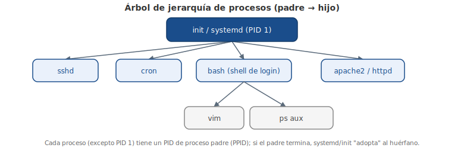

# Capítulo 11: Administración de Paquetes y Procesos

## 11.1 Introducción

Un sistema típico de Linux tiene miles de archivos. El **Filesystem Hierarchy Standard** (o «estándar jerárquico del sistema de archivos» en español) (explicado en detalle en un capítulo posterior) proporciona una guía para las distribuciones en cómo organizar estos archivos. En este capítulo verás cómo los sistemas de **administración de paquetes** de software pueden proporcionar información sobre la ubicación de los archivos pertenecientes a un paquete.

El **kernel** de Linux es el núcleo del sistema operativo GNU/Linux. Este capítulo explica el papel del kernel de Linux y cómo proporciona información acerca del sistema bajo los pseudo-sistemas de archivo `/proc` y `/sys`.

Verás cómo cada comando que se ejecuta causa que se ejecute un **proceso** y podrás ver los procesos ejecutándose con el comando `ps`. También verás discusión sobre cómo el sistema graba o registra mensajes desde los procesos en segundo plano llamados **demonios** (o «daemons» en inglés).

Finalmente, verás cómo visualizar el **ring buffer** del kernel con el comando `dmesg` para ver los mensajes que contiene.

> Conociendo cómo Linux promueve carreras profesionales: el 86% de los profesionistas de Linux reportan que saber Linux les ha dado más oportunidades de carrera profesional. Y el 64% dicen que seleccionaron trabajar con Linux por su omnipresencia en la infraestructura de tecnología del mundo moderno.

## 11.2 Administración de Paquetes

La **administración de paquetes** es un sistema que instala, actualiza, consulta o elimina software dentro de un sistema de archivos. En Linux hay muchos sistemas de administración de paquetes de software diferentes, pero los dos más populares son Debian y Red Hat.

### 11.2.1 Administración de Paquetes Debian

La distribución Debian y sus derivados como Ubuntu y Mint utilizan el sistema de gestión de paquetes Debian. En el centro de administración de paquetes de distribuciones derivadas de Debian están los **paquetes** de software que se distribuyen como archivos con terminación `.deb`.

La herramienta de nivel más bajo para administrar estos archivos es el comando `dpkg`. Este comando puede ser complicado para los usuarios de Linux principiantes, por lo que una herramienta de paquetes avanzada, `apt-get`, un programa **front-end** para la herramienta `dpkg`, facilita más la administración de los paquetes. Existen otras herramientas de la línea de comandos que sirven como front-end de `dpkg`, tales como `aptitude`, así como front-ends de GUI como `synaptic` y `software-center`.

#### 11.2.1.1 Debian - Agregando paquetes

Los repositorios de Debian contienen más de 65,000 diferentes paquetes de software.

- Para obtener una lista actualizada de estos repositorios de Internet: `sudo apt-get update`
- Para buscar palabras clave dentro de estos paquetes: `sudo apt-cache search keyword`
- Cuando hayas encontrado el paquete que quieres instalar: `sudo apt-get install package`

> Importante: Para ejecutar estos comandos tu sistema necesitará acceso a Internet. El comando `apt-cache` busca repositorios de estos programas de software en Internet.

#### 11.2.1.2 Debian - Actualización de Paquetes

Si quieres actualizar un paquete individual vas a utilizar un comando que instala tal paquete: `sudo apt-get install package`.

Si ya tienes instalada una versión anterior del paquete, entonces se actualizará. De lo contrario se ejecuta una nueva instalación.

Si quieres actualizar todos los paquetes posibles, tienes que ejecutar el comando `sudo apt-get upgrade`.

Los usuarios que inicien sesión con una interfaz gráfica pueden ver en el área de las notificaciones un mensaje del `update-manager` («administrador de actualizaciones» en español) que indica que las actualizaciones están disponibles.

#### 11.2.1.3 Debian - Eliminación de Paquetes

Ten cuidado: cuando eliminas un paquete de software puede resultar en la eliminación de otros paquetes. Debido a las **dependencias** entre paquetes, si eliminas un paquete, entonces todos los paquetes que necesitan o dependen de ese paquete se eliminarán también.

- Para eliminar todos los archivos de un paquete de software, excepto los archivos de configuración: `sudo apt-get remove package`
- Para eliminar todos los archivos de un paquete de software, incluyendo los archivos de configuración: `sudo apt-get --purge remove package`

Puede que quieras guardar los archivos de configuración en caso de que vuelvas a instalar el paquete de software en un momento posterior.

#### 11.2.1.4 Debian - Consultar Paquetes

Hay varios tipos de consultas que los administradores necesitan utilizar:

- Para obtener una lista de todos los paquetes que están instalados actualmente en el sistema: `dpkg -l`
- Para listar los archivos que componen un paquete especial: `dpkg -L package`
- Para consultar un paquete y obtener información de su estado: `dpkg -s package`
- Para determinar si un determinado archivo fue puesto en el sistema de archivos como resultado de la instalación de un paquete: `dpkg -S /path/to/file`. Si el archivo era parte de un paquete, podría proporcionarse el nombre del paquete. Por ejemplo:

```bash
sysadmin@localhost:~$ dpkg -S /usr/bin/who
```
```
coreutils: /usr/bin/who
```

En el ejemplo anterior se muestra que el archivo `/usr/bin/who` es parte del paquete `coreutils`.

### 11.2.2 Administración de Paquetes RPM

**Linux Standards Base** (o «La Base de Estándares de Linux» en español) es un proyecto de Linux Foundation y está diseñado para especificar (a través de un consenso) un conjunto de normas que aumentan la compatibilidad entre los sistemas conformes de Linux. Según Linux Standards Base el administrador de paquetes estándar es **RPM**.

RPM utiliza un archivo `.rpm` para cada paquete de software. Este sistema es el que usan las distribuciones derivadas de Red Hat (como Red Hat, Centos y Fedora) para administrar software. Además, varias otras distribuciones que no son derivadas de Red Hat (como SUSE, OpenSUSE y Mandriva) también utilizan RPM.

> Nota: Los comandos de RPM no están disponibles dentro del entorno de la máquina virtual de este curso.

Al igual que el sistema Debian, los sistemas de administración de paquetes RPM rastrean dependencias entre paquetes. Las dependencias rastreadas aseguran que cuando se instala un paquete, el sistema también instalará los paquetes que el paquete necesita para funcionar correctamente. Las dependencias también garantizan que las actualizaciones de software y las eliminaciones se realicen correctamente.

La herramienta de **back-end** más comúnmente utilizada para la administración de paquetes RPM es el comando `rpm`. Mientras que el comando `rpm` puede instalar, actualizar, consultar y eliminar paquetes, las herramientas front-end de línea de comandos como `yum` y `up2date` automatizan el proceso de resolución de los problemas con las dependencias.

Además, existen herramientas de front-end basadas en GUI tales como `yumex` y `gpk-application` que también facilitan la administración de paquetes RPM.

> Debes tener en cuenta que muchos de los comandos siguientes requieren privilegios de root. La regla es que si un comando afecta el estado de un paquete, necesitarás tener acceso administrativo. En otras palabras, un usuario normal puede realizar una consulta o una búsqueda, pero agregar, actualizar o eliminar un paquete requiere que el comando lo ejecute un usuario root.

#### 11.2.2.1 RPM - Agregando paquetes

- Para buscar un paquete desde los repositorios configurados: `yum search keyword`
- Para instalar un paquete, junto con sus dependencias: `yum install package`

#### 11.2.2.2 RPM - Actualización de Paquetes

- Para actualizar un paquete de software individual: `yum update package`
- Para actualizar todos los paquetes: `yum update`

Si las actualizaciones están disponibles y el usuario está utilizando una GUI, entonces `gpk-update-viewer` puede mostrar un mensaje en el área de las notificaciones de la pantalla indicando que las actualizaciones están disponibles.

#### 11.2.2.3 RPM - Eliminación de los Paquetes

Igual que en el caso de cualquier sistema de administración de paquetes que rastrea dependencias, si quieres eliminar un paquete, puedes terminar quitando más de uno debido a las dependencias. La forma más fácil de resolver automáticamente los problemas con las dependencias es utilizar el comando:

```bash
yum remove package
```

Mientras que puedes quitar los paquetes de software con el comando `rpm`, éste no eliminará automáticamente los paquetes de dependencia.

#### 11.2.2.4 RPM - Consultar Paquetes

La administración de paquetes de Red Hat es similar a la administración de paquetes de Debian a la hora de realizar consultas. Es mejor utilizar la herramienta de back-end, `rpm`, en lugar de la herramienta front-end, `yum`. Mientras que las herramientas de front-end pueden realizar algunas de estas consultas, el rendimiento sufre porque normalmente estos comandos se conectan a múltiples repositorios en toda la red al ejecutar cualquier comando. El comando `rpm` realiza sus consultas mediante la conexión a una base de datos local de la máquina y no se conecta por la red a los repositorios.

- Para obtener una lista de todos los paquetes que están instalados actualmente en el sistema: `rpm -qa`
- Para listar los archivos que componen un paquete especial: `rpm -ql package`

> El carácter después de `q` en la opción `-ql` es la letra `l` y no el número `1`.

- Para consultar un paquete y obtener información de su estado: `rpm -qi package`
- Para determinar si un archivo en particular fue puesto en el sistema de archivos como resultado de la instalación de un paquete: `rpm -qf /path/to/file`

## 11.3 Kernel de Linux

Cuando la mayoría de la gente se refiere a Linux, realmente se refiere al **GNU/Linux**, que define el sistema operativo. La parte de Gnu's Not Unix (**GNU**) de esta combinación viene proporcionada por un proyecto de la Free Software Foundation. GNU es lo que proporciona los equivalentes de código abierto de muchos comandos comunes de UNIX, la mayor parte de los comandos de línea de comandos esenciales. La parte de Linux de esta combinación es el kernel de Linux, que es el núcleo del sistema operativo. El kernel se carga al arrancar y se queda cargado para gestionar todos los aspectos del sistema en ejecución.

La implementación del kernel de Linux incluye muchos subsistemas que forman parte del kernel y otros que se pueden cargar de manera modular cuando sea necesario. Algunas de las funciones principales del kernel de Linux incluyen:

- Interfaz de invocación del sistema
- Administración de procesos
- Administración de memoria
- Sistema de archivos virtual
- Redes
- Controladores de dispositivos

En resumen, el kernel acepta comandos del usuario y gestiona los procesos que llevan a cabo los comandos, dándoles acceso a los dispositivos como memoria, discos, interfaces de red, teclados, ratones, monitores y mucho más.

El kernel proporciona acceso a la información sobre la ejecución de los procesos a través de un pseudo-sistema de archivos que es visible bajo el directorio `/proc`. Los dispositivos de hardware están a disposición a través de unos archivos especiales bajo el directorio `/dev`, mientras que la información sobre tales dispositivos se encuentra en otro pseudo-sistema de archivos bajo el directorio `/sys`.

El directorio `/proc` no sólo contiene la información sobre la ejecución de los procesos, como su nombre sugiere (proceso), sino también contiene la información sobre el hardware del sistema y la configuración actual del kernel.

La salida de la ejecución de `ls /proc` muestra más de cien directorios numerados. Hay un directorio numerado por cada proceso en ejecución en el sistema, donde el nombre del directorio coincide con el **PID** (ID del proceso) del proceso en ejecución.

Como el proceso `/sbin/init` siempre es el primer proceso, tiene un PID de 1 y la información del proceso `/sbin/init` se puede encontrar en el directorio `/proc/1`. Como verás después en este capítulo, hay varios comandos que te permiten ver información sobre procesos en ejecución, por lo que raramente es necesario para los usuarios tener que ver los archivos para cada proceso en ejecución directamente.

Quizá también veas que hay un número de archivos regulares en el directorio `/proc`, como `/proc/cmdline`, `/proc/meminfo` y `/proc/modules`. Estos archivos proporcionan información sobre el kernel en ejecución:

- `/proc/cmdline`: puede ser importante porque contiene toda la información que le fue pasada al kernel cuando fue iniciado.
- `/proc/meminfo`: contiene información sobre el uso de memoria por el kernel.
- `/proc/modules`: contiene una lista de módulos que están cargados actualmente en el kernel para agregar funcionalidad extra.

De nuevo, raramente es necesario ver estos archivos directamente, ya que otros comandos ofrecen una salida más amigable para el usuario y una manera alternativa de ver esta información.

Mientras que la mayoría de los "archivos" bajo el directorio `/proc` no se pueden modificar, incluso por el usuario root, los "archivos" bajo el directorio `/proc/sys` pueden modificarse por el usuario root. Modificar estos archivos cambiará el comportamiento del kernel de Linux.

Una modificación directa a estos archivos solo causa cambios temporales al kernel. Para hacer cambios permanentes, se le pueden agregar entradas al archivo `/etc/sysctl.conf`.

Por ejemplo, el directorio `/proc/sys/net/ipv4` contiene un archivo llamado `icmp_echo_ignore_all`. Si ese archivo contiene un cero (`0`), como lo hace normalmente, entonces el sistema responderá a solicitudes **ICMP**. Si ese archivo contiene un uno (`1`), entonces el sistema no responderá a solicitudes ICMP:

```bash
[user@localhost ~]$ su -
Password:
[root@localhost ~]# cat /proc/sys/net/ipv4/icmp_echo_ignore_all
```
```
0
```
```bash
[root@localhost ~]# ping -c1 localhost
```
```
PING localhost.localdomain (127.0.0.1) 56(84) bytes of data.
64 bytes from localhost.localdomain (127.0.0.1): icmp_seq=1 ttl=64 time=0.026 ms

--- localhost.localdomain ping statistics ---
1 packets transmitted, 1 received, 0% packet loss, time 0ms
rtt min/avg/max/mdev = 0.026/0.026/0.026/0.000 ms
```
```bash
[root@localhost ~]# echo 1 > /proc/sys/net/ipv4/icmp_echo_ignore_all
[root@localhost ~]# ping -c1 localhost
```
```
PING localhost.localdomain (127.0.0.1) 56(84) bytes of data.

--- localhost.localdomain ping statistics ---
1 packets transmitted, 0 received, 100% packet loss, time 10000ms
```

## 11.4 Jerarquía de Procesos

Cuando el kernel termina de cargarse durante el proceso de arranque, se inicia el proceso `/sbin/init` y le asigna un ID de proceso (PID) `1`. Este proceso entonces arranca otros procesos del sistema y a cada proceso se le asigna un PID en orden secuencial.

Como el proceso `/sbin/init` inicia otros procesos, a su vez éstos pueden iniciar procesos, que pueden poner en marcha otros procesos, y así sucesivamente. Cuando un proceso inicia otro proceso, el proceso que lleva a cabo la puesta en marcha se llama **proceso padre** y el proceso que se inicia se denomina **proceso hijo**. Al visualizar los procesos, el padre será marcado como **PPID**.

Cuando el sistema ha estado funcionando durante mucho tiempo, eventualmente alcanzará el máximo valor de PID, que puedes ver y configurar a través del archivo `/proc/sys/kernel/pid_max`. Una vez que se ha utilizado el PID más grande, el sistema se «volteará» y reanudará asignando valores de PID que están disponibles en la parte inferior de la gama.

Puedes acomodar los procesos en un árbol familiar de las parejas de padre e hijo. Si quieres ver este árbol, el comando `pstree` lo mostrará. La salida variará de los resultados que verás si introduces el comando en el entorno de la máquina virtual de este curso.

<figure>

<figcaption>Árbol de jerarquía de procesos: cada proceso (salvo PID 1) tiene un proceso padre (PPID).</figcaption>
</figure>

## 11.5 El Comando ps (proceso)

Otra forma de visualizar los procesos es con el comando `ps`. De forma predeterminada, el comando `ps` sólo mostrará los procesos actuales en el shell actual. Irónicamente, verás el `ps` ejecutándose cuando quieras ver qué otra cosa se está ejecutando en el shell:

```bash
sysadmin@localhost:~$ ps
```
```
  PID TTY          TIME CMD
 6054 ?        00:00:00 bash
 6070 ?        00:00:01 xeyes
 6090 ?        00:00:01 firefox
 6146 ?        00:00:00 ps
sysadmin@localhost:~$
```

De manera similar al comando `pstree`, si ejecutas `ps` con la opción `--forest`, verás las líneas indicando la relación de padre e hijo:

```bash
sysadmin@localhost:~$ ps --forest
```
```
  PID TTY          TIME CMD
 6054 ?        00:00:00 bash
 6090 ?        00:00:02   \_ firefox
 6180 ?        00:00:00   \_ dash
 6181 ?        00:00:00        \_ xeyes
 6188 ?        00:00:00        \_ ps
sysadmin@localhost:~$
```

Para poder ver todos los procesos del sistema, puedes ejecutar el comando `ps aux` o `ps -ef`:

```bash
sysadmin@localhost:~$ ps aux | head
```
```
USER       PID %CPU %MEM    VSZ   RSS TTY      STAT START   TIME COMMAND
root         1  0.0  0.0  17872  2892 ?        Ss   08:06   0:00 /sbin?? /ini
syslog      17  0.0  0.0 175744  2768 ?        Sl   08:06   0:00 /usr/sbin/rsyslogd -c5
root        21  0.0  0.0  19124  2092 ?        Ss   08:06   0:00 /usr/sbin/cron
root        23  0.0  0.0  50048  3460 ?        Ss   08:06   0:00 /usr/sbin/sshd
bind        39  0.0  0.0 385988 19888 ?        Ssl  08:06   0:00 /usr/sbin/named -u bind
root        48  0.0  0.0  54464  2680 ?        S    08:06   0:00 /bin/login -f
sysadmin    60  0.0  0.0  18088  3260 ?        S    08:06   0:00 -bash
sysadmin   122  0.0  0.0  15288  2164 ?        R+   16:26   0:00 ps aux
sysadmin   123  0.0  0.0  18088   496 ?        D+   16:26   0:00 -bash
sysadmin@localhost:~$
```

```bash
sysadmin@localhost:~$ ps -ef | head
```
```
UID        PID  PPID  C STIME TTY          TIME CMD
root         1     0  0 08:06 ?        00:00:00 /sbin?? /init
syslog      17     1  0 08:06 ?        00:00:00 /usr/sbin/rsyslogd -c5
root        21     1  0 08:06 ?        00:00:00 /usr/sbin/cron
root        23     1  0 08:06 ?        00:00:00 /usr/sbin/sshd
bind        39     1  0 08:06 ?        00:00:00 /usr/sbin/named -u bind
root        48     1  0 08:06 ?        00:00:00 /bin/login -f
sysadmin    60    48  0 08:06 ?        00:00:00 -bash
sysadmin   124    60  0 16:46 ?        00:00:00 ps -ef
sysadmin   125    60  0 16:46 ?        00:00:00 head
sysadmin@localhost:~$
```

La salida de todos los procesos ejecutándose en un sistema sin duda puede ser abrumadora. En el ejemplo la salida del comando `ps` se filtró por el comando `head`, por lo que se ven sólo los diez primeros procesos. Si no filtras la salida del comando `ps`, es probable que tengas que recorrer cientos de procesos para encontrar lo que te interesa.

Una forma común de ejecutar el comando `ps` es utilizando el comando `grep` para filtrar la salida que muestre las líneas que coincidan con una palabra clave, como el nombre del proceso. Por ejemplo, si quieres ver la información sobre el proceso de firefox, puedes ejecutar un comando como:

```bash
sysadmin@localhost:~$ ps -e | grep firefox
```
```
 6090 pts/0    00:00:07 firefox
```

Como usuario root te pueden interesar más los procesos de otro usuario que tus propios procesos. Debido a los varios estilos de opciones que soporta el comando `ps`, hay diferentes formas de ver los procesos de un usuario individual:

- Opción tradicional de UNIX: `ps -u username`
- Opciones de estilo BSD: `ps u U username`

## 11.6 El Comando top

El comando `ps` ofrece una «foto» de los procesos que se ejecutan en el momento de introducir el comando; el comando `top` actualizará periódicamente la salida de los procesos en ejecución. El comando `top` se ejecuta de la siguiente manera:

```bash
sysadmin@localhost:~$ top
```

De forma predeterminada, la salida del comando `top` se ordena por el porcentaje del tiempo de CPU que cada proceso está utilizando actualmente, con los valores más altos en primer lugar. Esto significa que los procesos que son los «CPU hogs» aparecen primero:

```
top - 16:58:13 up 26 days, 19:15,  1 user,  load average: 0.60, 0.74, 0.60
Tasks:   8 total,   1 running,   7 sleeping,   0 stopped,   0 zombie
Cpu(s):  6.0%us,  2.5%sy,  0.0%ni, 90.2%id,  0.0%wa,  1.1%hi,  0.2%si,  0.0%st
Mem:  32953528k total, 28126272k used,  4827256k free,     4136k buffers
Swap:        0k total,        0k used,        0k free, 22941192k cached

  PID USER      PR   NI VIRT RES  SHR  S %CPU %MEM     TIME+ COMMAND
    1 root      20   0 17872 2892 2640 S    0  0.0   0:00.02 init
   17 syslog    20   0  171m 2768 2392 S    0  0.0   0:00.20 rsyslogd
   21 root      20   0 19124 2092 1884 S    0  0.0   0:00.02 cron
   23 root      20   0 50048 3460 2852 S    0  0.0   0:00.00 sshd
   39 bind      20   0  376m  19m 6100 S    0  0.1   0:00.12 named
   48 root      20   0 54464 2680 2268 S    0  0.0   0:00.00 login
   60 sysadmin  20   0 18088 3260 2764 S    0  0.0   0:00.01 bash
  127 sysadmin  20   0 17216 2308 2072 R    0  0.0   0:00.01 top
```

Hay una extensa lista de comandos que se pueden ejecutar dentro de `top`:

| Tecla | Significado |
|---|---|
| `h` o `?` | Ayuda |
| `l` | Alternar entre las estadísticas de carga |
| `t` | Alternar entre las estadísticas de tiempo |
| `m` | Alternar entre las estadísticas del uso de la memoria |
| `<` | Mover la columna ordenada hacia la izquierda |
| `>` | Mover la columna ordenada hacia la derecha |
| `F` | Elegir un campo ordenado |
| `R` | Alternar entre la dirección de la clasificación |
| `P` | Ordenar por % CPU |
| `M` | Ordenar por % de la memoria usada |
| `k` | Terminar un proceso (o enviarle una señal) |
| `r` | Cambiar la prioridad de un proceso con el comando `renice` |

Una de las ventajas del comando `top` es que se puede dejar correr para permanecer «pendiente» de los procesos para propósitos de monitoreo. Si un proceso comienza a dominar o «huye» con el sistema, entonces por defecto aparecerá en la parte superior de la lista presentada por el comando `top`. Un administrador que está ejecutando el comando `top` puede entonces tomar una de dos acciones:

- **Terminar el proceso «corrido»**: apretando la tecla `k` mientras se ejecuta el comando `top` se le pedirá al usuario que proporcione el PID y un número de señal. Enviar la señal predeterminada le pedirá al proceso que termine, pero enviando el número 9 de la señal, la señal `KILL`, forzará el cierre del proceso.
- **Ajustar la prioridad del proceso**: apretando la tecla `r` mientras se ejecuta el comando `top` se le pedirá al usuario que ejecute el `renice` del proceso seguido por el valor del **niceness** (discernimiento). Los valores de niceness pueden ser del `-20` al `19` y afectan la prioridad. Sólo el usuario root puede utilizar un niceness menor que el valor actual o un valor negativo, que hace que el proceso se ejecute con una prioridad mayor. Cualquier usuario puede proporcionar un valor de niceness mayor que el valor actual, lo que hará que el proceso se ejecute con una prioridad baja.

Otra ventaja del comando `top` es que puede darte una representación general de lo ocupado que está el sistema actualmente y la tendencia en el tiempo. Los **promedios de carga** se muestran en la primera línea de la salida del comando `top` e indican qué tan ocupado ha estado el sistema durante los últimos uno, cinco y quince minutos. Esta información también puede verse ejecutando el comando `uptime` o directamente mostrando el contenido del archivo `/proc/loadavg`:

```bash
sysadmin@localhost:~$ cat /proc/loadavg
```
```
0.12 0.46 0.25 1/254 3052
```

Los tres primeros números de este archivo indican la carga media sobre los intervalos pasados de uno, cinco y quince minutos. El cuarto valor es una fracción que muestra el número de procesos ejecutando código actualmente en la CPU (1) y el número total de procesos (254). El quinto valor es el último valor de PID que ejecutó código en la CPU.

El número reportado como promedio de carga es proporcional al número de núcleos de CPU capaces de ejecutar procesos. En una CPU de un solo núcleo un valor de uno significaría que el sistema está totalmente cargado. En una CPU de cuatro núcleos un valor de uno significaría que 1/4 o el 25% del sistema está cargado.

Otra razón por la que los administradores mantienen ejecutado el comando `top` es la capacidad para monitorear el uso de la memoria en tiempo real. Ambos comandos, `top` y `free`, muestran las estadísticas del uso general de la memoria.

El comando `top` también puede mostrar el porcentaje de memoria utilizado por cada proceso, así pues, se puede identificar rápidamente un proceso que está consumiendo una cantidad excesiva de memoria.

## 11.7 El Comando free

Ejecutando el comando `free` sin opciones proporciona una foto de la memoria utilizada en ese momento.

Si quieres supervisar el uso de la memoria en el tiempo con el comando `free`, puedes ejecutarlo con la opción `-s` y especificar el número de segundos. Por ejemplo, ejecutando `free -s 10` actualizaría la salida cada 10 segundos.

Para hacer más fácil la interpretación de la salida del comando `free`, las opciones `-m` o `-g` pueden ser útiles para mostrar la salida en megabytes o gigabytes, respectivamente. Sin estas opciones, se muestra la salida en bytes:

```bash
sysadmin@localhost:~$ free
```
```
             total       used       free     shared    buffers     cached
Mem:      32953528   26171772    6781756          0       4136   22660364
-/+ buffers/cache:    3507272   29446256
Swap:            0          0          0
sysadmin@localhost:~$
```

Cuando lees la salida del comando `free`:

- La primera línea es un encabezado descriptivo.
- La segunda línea, con la etiqueta `Mem:`, son las estadísticas de la memoria física del sistema.
- La tercera línea representa la cantidad de memoria física después de ajustar esos valores sin tener en cuenta cualquier memoria utilizada por el kernel para los **buffers** y **caché**. Técnicamente, esta memoria «utilizada» podría ser «reclamada» si es necesario.
- La cuarta línea de la salida se refiere a la memoria **swap**, también conocida como memoria virtual. Éste es el espacio en el disco duro que se utiliza como memoria física cuando baja la cantidad de memoria física disponible. De hecho, puede parecer que el sistema tiene más memoria de la que realmente tiene, pero el uso del espacio swap puede también ralentizar el sistema.

Si la cantidad de memoria y swap disponible es muy baja, el sistema comenzará automáticamente a cerrar los procesos. Esta es una razón por la que es importante supervisar el uso de la memoria del sistema. Un administrador que se da cuenta de que el sistema se va quedando sin memoria libre puede utilizar el comando `top` o `kill` para cerrar los procesos que quiere, en lugar de dejar que el sistema elija por él.

## 11.8 Los Archivos de Registro

A medida que el kernel y varios procesos se ejecutan en el sistema, producen una salida que describe cómo se están ejecutando. Parte de esta salida se muestra en la ventana de la terminal donde se ejecuta el proceso; algunos de estos datos no se envían a la pantalla, sino que se escriben en varios archivos. Esto se llama **datos de registro** o **mensajes de registro**.

Estos archivos de registro son muy importantes por varias razones: pueden ser útiles en la solución de problemas y pueden ser utilizados para determinar si ha habido intentos de acceso no autorizado.

Algunos procesos son capaces de «registrar» sus propios datos en estos archivos; otros procesos dependen de otro proceso (un demonio) para manejar estos archivos de registro de datos.

Estos **demonios de registro** pueden variar de una distribución a otra. Por ejemplo, en algunas distribuciones, los demonios que se ejecutan en segundo plano para realizar el registro se llaman `syslogd` y `klogd`. En otras distribuciones, un demonio como `rsyslogd` en Red Hat y Centos o `systemd journald` en Fedora puede servir para esta función de registro.

Independientemente del nombre del proceso de demonio, los archivos de registro se colocan casi siempre en la estructura del directorio `/var/log`. Aunque algunos de los nombres de archivo pueden variar, aquí están algunos de los archivos más comunes en este directorio:

| Archivo | Contenido |
|---|---|
| `boot.log` | Mensajes generados cuando los servicios se inician durante el arranque del sistema. |
| `cron` | Mensajes generados por el demonio `crond` para las tareas que se deben ejecutar en forma recurrente. |
| `dmesg` | Mensajes generados por el kernel durante el arranque del sistema. |
| `maillog` | Mensajes producidos por el demonio de correo para mensajes de correo electrónico enviados o recibidos. |
| `messages` | Mensajes del kernel y otros procesos que no pertenecen a ninguna otra parte. A veces se denomina `dsyslog` en lugar de `messages` cuando el demonio haya grabado este archivo. |
| `secure` | Mensajes de los procesos que requieren autorización o autenticación (por ejemplo, el proceso de inicio de sesión). |
| `Xorg.0.log` | Mensajes del servidor de ventanas X (GUI). |

Los archivos de registro se **rotan**, lo que significa que los archivos de registro antiguos cambian de nombre y son reemplazados por nuevos archivos de registro. Los nombres de archivo que aparecen en la tabla anterior pueden tener un sufijo numérico o de fecha añadido al nombre, por ejemplo: `secure.0` o `secure-20131103`.

La rotación de un archivo de registro por lo general ocurre en forma programada, por ejemplo, una vez por semana. Cuando se rota un archivo de registro, el sistema deja de escribir en el archivo de registro y agrega un sufijo. Entonces se crea un nuevo archivo con el nombre original y el proceso de registro sigue usando este nuevo archivo.

Con los demonios modernos normalmente se utiliza un sufijo de fecha. De esta manera, al final de la semana que termina el 03 de noviembre de 2013, el demonio de registro podría dejar de escribir en el archivo `/var/log/messages`, renombrarlo a `/var/log/messages-20131103` y comenzar a escribir en un nuevo archivo `/var/log/messages`.

Aunque la mayoría de los archivos de registro contienen texto como su contenido, que puede verse de forma segura con muchas herramientas, otros archivos como `/var/log/btmp` y `/var/log/wtmp` contienen datos **binarios**. Mediante el comando `file` (o «archivo» en español), puedes comprobar si el tipo de contenido del archivo es seguro para ver.

Para los archivos que contienen datos binarios, normalmente hay comandos disponibles que leen los archivos, interpretan su contenido y luego muestran texto. Por ejemplo, los comandos `lastb` y `last` se pueden usar para ver los archivos `/var/log/btmp` y `/var/log/wtmp` respectivamente.

Por razones de seguridad, la mayoría de los archivos de registro no son legibles por los usuarios normales, así que asegúrate de ejecutar los comandos que interactúan con estos archivos teniendo los privilegios de root.

## 11.9 El Comando dmesg

El archivo `/var/log/dmesg` contiene los mensajes del kernel que se produjeron durante el arranque del sistema. El archivo `/var/log/messages` contiene mensajes del kernel que se producen mientras el sistema está corriendo, pero los mensajes se mezclarán con otros mensajes de demonios o procesos.

Aunque el kernel normalmente no tiene su propio archivo de registro, se puede configurar uno para él, por lo general mediante la modificación de los archivos `/etc/syslog.conf` o `/etc/rsyslog.conf`. Además, el comando `dmesg` puede utilizarse para ver el **kernel ring buffer**, que contendrá un gran número de mensajes generados por el kernel.

En un sistema activo, o en uno que tiene muchos errores de kernel, es posible que se haya sobrepasado la capacidad de este búfer y podrían perderse algunos mensajes. El tamaño de este búfer se establece en el momento en que el kernel es compilado, por lo que no es sencillo cambiarlo.

Ejecutar el comando `dmesg` puede producir hasta 512 kilobytes de texto, así que se recomienda filtrar el comando con una barra vertical a otro comando como `less` o `grep`. Por ejemplo, si estuvieras resolviendo problemas con tu dispositivo USB, entonces buscar el texto «USB» con el comando `grep` siendo sensible a mayúsculas y minúsculas puede ser de ayuda:

```bash
sysadmin@localhost:~$ dmesg | grep -i usb
```
```
usbcore: registered new interface driver usbfs
usbcore: registered new interface driver hub
usbcore: registered new device driver usb
ehci_hcd: USB 2.0 'Enhanced' Host Controller (EHCI) Driver
ohci_hcd: USB 1.1 'Open' Host Controller (OHCI) Driver
ohci_hcd 0000:00:06.0: new USB bus registered, assigned bus number 1
usb usb1: New USB device found, idVendor=1d6b, idProduct=0001
usb usb1: New USB device strings: Mfr=3, Product=2, SerialNumber=1
```

### Resumen del capítulo

- Los sistemas de **administración de paquetes** (Debian/`dpkg`/`apt-get` y RPM/`rpm`/`yum`) permiten instalar, actualizar, consultar y eliminar software, gestionando automáticamente las dependencias entre paquetes.
- El **kernel** de Linux es el núcleo del sistema operativo GNU/Linux y expone información sobre procesos y hardware a través de los pseudo-sistemas de archivos `/proc` y `/sys`; los cambios permanentes al comportamiento del kernel se guardan en `/etc/sysctl.conf`.
- Cada comando en ejecución es un **proceso** identificado por un **PID**, organizado en una jerarquía de procesos padre e hijo (PPID) que se puede visualizar con `pstree` o `ps --forest`.
- Los comandos `ps` (foto instantánea) y `top` (actualización periódica) permiten monitorear los procesos en ejecución, su consumo de CPU y memoria, y ajustar su prioridad (`renice`) o terminarlos (señal `KILL`).
- El comando `free` muestra el uso de memoria física y swap, mientras que los archivos de registro en `/var/log` (gestionados por demonios como `rsyslogd` o `systemd journald`) documentan la actividad del sistema y se rotan periódicamente.
- El comando `dmesg` permite consultar el **ring buffer** del kernel para revisar los mensajes generados durante el arranque y funcionamiento del sistema, útil para diagnosticar problemas de hardware.
