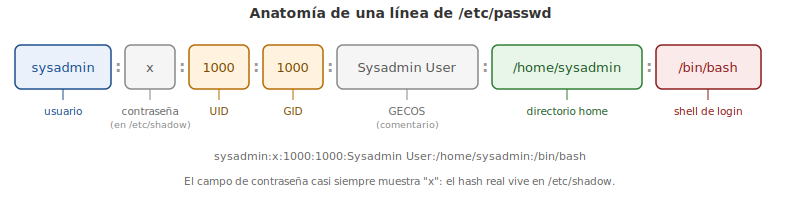

# Capítulo 13: Cuentas de Usuario y Grupos

## 13.1 Introducción

Las **cuentas de usuario** están diseñadas para proporcionar seguridad en un sistema operativo Linux. Cada persona en el sistema debe iniciar la sesión utilizando una cuenta de usuario, y la cuenta de usuario permite a la persona ya sea acceder a un directorio de archivos específico o niega dicho acceso. Esto se logra mediante los **permisos de archivo**, un tema del que hablaremos en un capítulo posterior.

Las cuentas de usuario también pertenecen a los **grupos**, que también pueden utilizarse para proporcionar acceso a los archivos o directorios. Cada usuario pertenece al menos a un grupo (a menudo muchos) para permitir más fácilmente que los usuarios compartan los datos almacenados en los archivos con otros usuarios.

Los datos de la cuenta de usuario y de grupo se almacenan en archivos de base de datos. Conocer el contenido de estos archivos es importante, ya que te permitirá entender mejor cuáles de los usuarios tienen acceso a los archivos y directorios en el sistema. Estos archivos de base de datos también contienen información de seguridad vital que puede afectar la capacidad de un usuario para acceder al sistema (login).

Hay varios comandos que te proporcionarán la capacidad de ver información de la cuenta de grupo y usuario, así como te permiten cambiar de una cuenta de usuario a otra (siempre que tengas la autorización para ello). Estos comandos son valiosos para revisar el uso del sistema, solucionar los problemas del sistema y controlar el acceso no autorizado al sistema.

> "No tengo ninguna experiencia de trabajo en Linux, entonces ¿cómo obtengo un trabajo?" Constatando tus habilidades obteniendo un certificado reconocido por la industria que demuestra a los empleadores que tienes las habilidades para hacer el trabajo. Puede ser una gran forma de entrar a la primera compañía para que puedas ganar valor con la experiencia en el trabajo.

## 13.2 Las Cuentas de Usuario

Hay varios archivos de texto en el directorio `/etc` que contienen los datos de la cuenta de los usuarios y grupos definidos en el sistema. Por ejemplo, si quisieras ver si está definida una cuenta de usuario específica en el sistema, el lugar para comprobar es el archivo `/etc/passwd`.

El archivo `/etc/passwd` define parte de la información de la cuenta para las cuentas de usuario. Curiosamente, las contraseñas para las cuentas no se almacenan en el archivo `/etc/passwd`, tal como lo indica el nombre del archivo, sino más bien en el archivo `/etc/shadow`.

### 13.2.1 El Archivo /etc/passwd

Cada línea del archivo `/etc/passwd` se refiere a una **cuenta de usuario**. El siguiente gráfico muestra las diez primeras líneas de un archivo `/etc/passwd` típico:

```bash
sysadmin@localhost:~$ head /etc/passwd
```
```
root:x:0:0:root:/root:/bin/bash
daemon:x:1:1:daemon:/usr/sbin:/bin/sh
bin:x:2:2:bin:/bin:/bin/sh
sys:x:3:3:sys:/dev:/bin/sh
sync:x:4:65534:sync:/bin:/bin/sync
games:x:5:60:games:/usr/games:/bin/sh
man:x:6:12:man:/var/cache/man:/bin/sh
lp:x:7:7:lp:/var/spool/lpd:/bin/sh
mail:x:8:8:mail:/var/mail:/bin/sh
news:x:9:9:news:/var/spool/news:/bin/sh
sysadmin@localhost:~$
```

Cada línea está dividida en campos por dos puntos. Los campos de izquierda a derecha son:

```
name:password placeholder:user id:primary group id:comment:home directory:shell
```

La siguiente tabla describe cada uno de estos campos en detalle, usando la primera línea de la salida del ejemplo anterior (`root:x:0:0:root:/root:/bin/bash`):

| Campo | Ejemplo | Descripción |
|---|---|---|
| `name` | `root` | Es el nombre de la cuenta. Este nombre lo utiliza una persona cuando inicia sesión en el sistema y cuando la propiedad del archivo viene proporcionada por el comando `ls -l`. Por lo general, el sistema utiliza el **ID de usuario** internamente y se proporciona el nombre de cuenta para que a los usuarios regulares se les haga más fácil referirse a la cuenta. Normalmente, la cuenta `root` es una cuenta administrativa especial. Sin embargo, es importante tener en cuenta que no todos los sistemas tienen una cuenta root, y en realidad, el ID de usuario 0 (cero) proporciona los privilegios administrativos en el sistema. |
| `password placeholder` | `x` | Antes, la contraseña se guardaba en esta ubicación; ahora se almacena en el archivo `/etc/shadow`. La `x` en el campo del marcador de posición de la contraseña indica al sistema que la contraseña no se almacena aquí, sino más bien en el archivo `/etc/shadow`. |
| `user id` | `0` | Cada cuenta tiene asignado un **ID de usuario** (**UID**, «User ID»). El UID es lo que realmente define la cuenta, ya que el nombre de usuario normalmente no es utilizado directamente por el sistema. Por ejemplo, los archivos son propiedad de los UID, no de los nombres de usuario. Algunos UID son especiales: el UID 0 le da a la cuenta de usuario privilegios administrativos. Los UID por debajo de 500 (en algunas distribuciones de Linux, 1.000) están reservados para las cuentas del sistema. |
| `primary group id` | `0` | Cada archivo y directorio es propiedad de una cuenta de usuario. Normalmente la persona que crea la cuenta posee el archivo. Además, cada archivo es propiedad de un grupo, normalmente del grupo primario del usuario. A los grupos se les asignan identificadores numéricos al igual que a los usuarios. Cuando un usuario crea un archivo, el archivo es propiedad del UID del usuario y también de un **ID de grupo** (**GID**, «Group ID»), el GID primario del usuario. Este campo define qué GID es el GID primario del usuario. Además, al proporcionar la propiedad del grupo por defecto en un archivo, este campo también indica que el usuario es miembro del grupo, lo que significa que el usuario tendrá permisos especiales en cualquier archivo que pertenezca a este grupo. |
| `comment` | `root` | Este campo puede contener cualquier información sobre el usuario, incluyendo su nombre real (completo) y otra información útil. Este campo también se llama el campo **GECOS** (General Electric Comprehensive Operating System), un formato predefinido usado raramente que define una lista de elementos separada por comas, incluyendo el nombre completo del usuario, ubicación de la oficina, número de teléfono e información adicional. El administrador puede modificar la información GECOS con el comando `chfn` y los usuarios pueden ver esta información con el comando `finger`. |
| `home directory` | `/root` | Este campo define la ubicación del **directorio home** del usuario. Para los usuarios regulares, esto sería normalmente `/home/username`, donde `username` se reemplaza con el nombre de usuario. Por ejemplo, un nombre de usuario `bob` tendría un directorio home `/home/bob`. El usuario root tiene normalmente una ubicación diferente: `/root`. Las cuentas del sistema raramente tienen directorios, ya que normalmente no se utilizan para crear o guardar archivos. |
| `shell` | `/bin/bash` | Aquí está ubicado el **shell** del inicio de sesión del usuario. De forma predeterminada, el usuario se "ubica en" este shell siempre que inicia la sesión en un entorno de línea de comandos o abre una ventana de terminal. El usuario luego puede pasar a un shell diferente escribiendo el nombre del shell, por ejemplo: `/bin/tcsh`. El shell `bash` (`/bin/bash`) es el más común para los usuarios de Linux. |

> Ten en cuenta que mientras que este capítulo describe el contenido de los archivos de grupo y usuario, el siguiente capítulo describirá los comandos y herramientas que se utilizan para modificar la información de la cuenta del usuario y de grupos.

<figure>

<figcaption>Anatomía de los siete campos de una línea de /etc/passwd.</figcaption>
</figure>

### 13.2.2 El Archivo /etc/shadow

Como se mencionó anteriormente, el archivo `/etc/shadow` contiene información de la cuenta relacionada con la contraseña del usuario. Un archivo `/etc/shadow` típico sería como el siguiente gráfico:

```bash
root@localhost:~# head /etc/shadow
```
```
root:$6$4Yga95H9$8HbxqsMEIBTZ0YomlMffYCV9VE1SQ4T2H3SHXw41M02SQtfAdDVE9mqGp2hr20q
.ZuncJpLyWkYwQdKlSJyS8.:16464:0:99999:7:::
daemon:*:16463:0:99999:7:::
bin:*:16463:0:99999:7:::
sys:*:16463:0:99999:7:::
sync:*:16463:0:99999:7:::
games:*:16463:0:99999:7:::
man:*:16463:0:99999:7:::
lp:*:16463:0:99999:7:::
mail:*:16463:0:99999:7:::
news:*:16463:0:99999:7:::
root@localhost:~#
```

Los campos del archivo `/etc/shadow` son:

```
name:password:last change:min:max:warn:inactive:expire:reserved
```

La siguiente tabla describe los campos del archivo `/etc/shadow` con más detalle, utilizando la siguiente cuenta, la cual describe a una cuenta de usuario típica:

```
sysadmin:$6$lS6WJ9O/fNmEzrIi$kO9NKRBjLJJTlZD.L1Dc2xwcuUYaYwCTS.gt4elijSQW8ZDp6GLYAx.TRNNpUdAgUXUrzDuAPsYs5YHZNAorI1:15020:5:30:7:60:15050:
```

| Campo | Ejemplo | Descripción |
|---|---|---|
| `name` | `sysadmin` | Este es el nombre de la cuenta, que coincide con el nombre de cuenta en el archivo `/etc/passwd`. |
| `password` | `$6$.........rI1` | El campo `password` contiene la **contraseña cifrada** de la cuenta. Esta cadena muy larga es un cifrado unidireccional, lo que significa que no puede "revertirse" para determinar la contraseña original. Mientras que los usuarios habituales tienen contraseñas encriptadas en este campo, las cuentas del sistema tendrán un carácter `*` en este campo. |
| `last change` | `15020` | Este campo contiene un número que representa la última vez que la contraseña fue cambiada. El número 15020 es el número de días desde el 01 de enero de 1970 (llamada la **Época**) y el último día en el que la contraseña de la cuenta fue cambiada. Este valor se genera automáticamente cuando se modifica la contraseña del usuario y es utilizado por la característica de **envejecimiento de la contraseña** proporcionada por el resto de los campos de este archivo. |
| `min` | `5` | Este es uno de los campos del envejecimiento de la contraseña; un valor distinto de cero en este campo indica que después de que un usuario cambiara su contraseña, la contraseña no se puede cambiar otra vez por un número específico de días (5 en este ejemplo). Un valor de cero en este campo significa que el usuario siempre puede cambiar su contraseña. |
| `max` | `5` | Este campo se utiliza para obligar a los usuarios a cambiar regularmente sus contraseñas. Un valor de 30 en este campo significa que el usuario debe cambiar su contraseña al menos cada 30 días para evitar que su cuenta quede «bloqueada». Ten en cuenta que si el campo `min` se establece en 0, el usuario puede restablecer inmediatamente su contraseña al valor original, anulando el propósito del campo `max`. Por ejemplo, un `min:max` de 5:60 se refiere a que el usuario debe cambiar su contraseña cada 60 días y, después de cambiarla, debe esperar 5 días antes de poder cambiarla otra vez. Si el campo `max` se establece a 99999 (el valor máximo posible), entonces el usuario esencialmente nunca debe cambiar su contraseña (porque 99999 días son aproximadamente 274 años). |
| `warn` | `7` | Si se establece el campo `max`, el campo `warn` indica que al usuario se le «advertirá» cuando se acerca el plazo máximo. Por ejemplo, si se establece `warn` a 7, entonces en cualquier momento durante los 7 días anteriores al plazo `max` se le advertirá al usuario que cambie su contraseña durante el proceso de inicio de sesión. El usuario sólo se advierte en el inicio de sesión, por lo que algunos administradores prefieren establecer el campo de advertencia a un valor alto. Si `max` se establece a 99999, el campo `warn` es esencialmente inútil. |
| `inactive` | `60` | Si el usuario hace caso omiso a las advertencias y se excede el plazo `max` para la contraseña, se bloqueará su cuenta. En tal caso, el campo `inactive` proporciona al usuario un período de «gracia» en el que puede cambiar su contraseña, pero sólo durante el proceso de inicio de sesión. Si el campo `inactive` viene establecido a un valor de 60, el usuario tiene 60 días de gracia para cambiar la contraseña a una nueva; si no lo hace, necesitará que el administrador restablezca la contraseña. |
| `expire` | `15050` | Este campo representa el número de días a partir del 01 de enero de 1970 y el día en el que la cuenta «vencerá». Una cuenta vencida se bloqueará, no se borra, lo que significa que el administrador puede restablecer la contraseña para desbloquear la cuenta. Las cuentas con fechas de vencimiento normalmente se ofrecen a los empleados temporales o contratistas. Cuando un administrador establece este campo, se utiliza una herramienta para convertir una fecha real en una fecha de «Época». |
| `reserved` | | Actualmente este campo no se utiliza y está reservado para su uso futuro. |

Los usuarios regulares no pueden ver el contenido del archivo `/etc/shadow` por razones de seguridad. Para ver el contenido de este archivo, debes iniciar la sesión como administrador (la cuenta root).

### 13.2.3 Visualizar la Información de la Cuenta

Una buena manera de visualizar la información de la cuenta del archivo `/etc/passwd` es usar el comando `grep` para dar salida solamente a la línea que contiene la cuenta que te interesa ver. Por ejemplo, para ver la información de la cuenta del nombre de usuario `sysadmin`, utiliza el comando `grep sysadmin /etc/passwd`:

```bash
sysadmin@localhost:~$ grep sysadmin /etc/passwd
```
```
sysadmin:x:1001:1001:System Administrator,,,,:/home/sysadmin:/bin/bash
sysadmin@localhost:~$
```

Otra técnica para recuperar la información del usuario que se encuentra normalmente en los archivos `/etc/passwd` y `/etc/shadow` es utilizar el comando `getent`. Una ventaja de usar el comando `getent` es que puede recuperar la información de la cuenta definida localmente (`/etc/passwd` y `/etc/shadow`) o en un servidor de directorio en la red.

La sintaxis general de un comando `getent` es: `getent database record`. Por ejemplo, el comando `getent passwd sysadmin` recuperaría la información passwd de la cuenta para el usuario sysadmin:

```bash
sysadmin@localhost:~$ getent passwd sysadmin
```
```
sysadmin:x:1001:1001:System Administrator,,,,:/home/sysadmin:/bin/bash
sysadmin@localhost:~$
```

### 13.2.4 Visualización de la Información del Inicio de Sesión

Si inicias sesión con diferentes cuentas, puede ser confuso saber con qué cuenta estás conectado. Para verificar tu identidad (ver qué cuenta estás usando actualmente) puedes ejecutar el comando `id`.

El comando `id` informará la identidad actual, tanto por nombre del usuario como por el identificador de usuario. Además de proporcionar la información de la cuenta de usuario, también se muestra la pertenencia a un grupo. Sin argumentos, el comando `id` mostrará tu identidad. Cuando un nombre de usuario viene como argumento, tal como `id root`, el comando muestra otra información de cuenta:

```bash
sysadmin@localhost:~$ id
```
```
uid=1001(sysadmin) gid=1001(sysadmin) groups=1001(sysadmin),4(adm),27(sudo) context=unconfined_u:unconfined_r:unconfined_t:s0-s0:c0.c1023
sysadmin@localhost:~$
```
```bash
sysadmin@localhost:~$ id root
```
```
uid=0(root) gid=0(root) groups=0(root)
sysadmin@localhost:~$
```

La salida incluye un contexto Linux mejorado de seguridad (**SELinux**), la parte `context=` de la salida, un tema que está fuera del alcance de este curso.

### 13.2.5 Las Cuentas de Sistema

Los usuarios iniciarán sesión en el sistema utilizando cuentas de usuario regulares. Normalmente, estas cuentas tienen valores UID superiores a 500 (en algunos sistemas 1000).

El usuario root tiene acceso especial al sistema. Como se mencionó anteriormente, este acceso especial en realidad se proporciona a la cuenta con el UID de 0.

Hay cuentas adicionales que no están diseñadas para que los usuarios inicien sesión. Estas cuentas, normalmente de UID 1 al UID 499, se llaman **cuentas del sistema** y están diseñadas para proporcionar cuentas para los servicios que se ejecutan en el sistema.

Las cuentas del sistema tienen algunos campos en los archivos `/etc/passwd` y `/etc/shadow` que son diferentes a otras cuentas. Por ejemplo, en el archivo `/etc/passwd`, las cuentas de sistema tendrán un programa de no iniciar sesión en el campo del «login shell»:

```
bin:x:1:1:bin:/bin:/sbin:/sbin/nologin
```

En el archivo `/etc/shadow`, las cuentas del sistema tendrán típicamente el carácter `*` en lugar del campo de contraseña:

```
bin:*:15513:0:99999:7:::
```

Hay algunas cosas importantes que debes recordar sobre las cuentas de sistema:

- La mayoría son necesarias para que el sistema funcione correctamente.
- No debes eliminar una cuenta del sistema a menos que estés absolutamente seguro de que eliminarla no causará problemas.
- Según vayas teniendo más experiencia, debes aprender lo que hace cada cuenta del sistema. Los administradores del sistema tienen la tarea de garantizar la seguridad en el sistema, lo que incluye asegurar correctamente las cuentas del sistema.

## 13.3 Cuentas de Grupo

Tu nivel de acceso a un sistema no está determinado únicamente por tu cuenta de usuario. Cada usuario puede ser miembro de uno o más **grupos**, lo que también puede afectar tu nivel de acceso al sistema.

Tradicionalmente, los sistemas UNIX limitaban a los usuarios para que pertenecieran a no más de un total de dieciséis grupos, pero los últimos núcleos de Linux soportan usuarios con más de sesenta y cinco mil membresías.

Como ya hemos visto, el archivo `/etc/passwd` define la pertenencia al **grupo primario** de un usuario. La pertenencia a un **grupo suplementario** (o grupo secundario), así como los propios grupos, se definen en el archivo `/etc/group`.

Para ver la información sobre un grupo específico, puede utilizarse el comando `grep` o `getent`. Por ejemplo, los siguientes comandos mostrarán la información de cuenta de grupo `mail`:

```bash
sysadmin@localhost:~$ grep mail /etc/group
```
```
mail:x:12:mail,postfix
```
```bash
sysadmin@localhost:~$ getent group mail
```
```
mail:x:12:mail,postfix
```

### 13.3.1 El Archivo /etc/group

El archivo `/etc/group` es un archivo delimitado por dos puntos con los siguientes campos:

```
group_name:password_placeholder:GID:user_list
```

La siguiente tabla describe los campos del archivo `/etc/group` con más detalle, utilizando una línea que describe a una cuenta de grupo típica: `mail:x:12:mail,postfix`

| Campo | Ejemplo | Descripción |
|---|---|---|
| `group_name` | `mail` | Este campo contiene el nombre del grupo. Igual que en el caso de los nombres de usuario, para las personas es más fácil recordar los nombres de grupo. El sistema utiliza típicamente **IDs de grupos** (GID) en lugar de nombres de grupo. |
| `password_placeholder` | `x` | Aunque hay contraseñas para grupos, raramente se utilizan en Linux. Si el administrador creara una contraseña de grupo, se almacenaría en un archivo diferente (`/etc/gshadow`), ya que la contraseña de grupo ya no se almacena en el archivo `/etc/group`. La `x` en este campo indica que la contraseña no se almacena en este archivo. |
| `GID` | `12` | Cada grupo está asociado con un **ID de grupo** único (GID) que se coloca en este campo. |
| `user_list` | `mail,postfix` | Este último campo se utiliza para indicar quién es miembro del grupo. Mientras que la pertenencia a un grupo primario se define en el archivo `/etc/passwd`, los usuarios que se asignan a los grupos adicionales tendrían su nombre de usuario en este campo del archivo `/etc/group`. En este caso, los usuarios `mail` y `postfix` son miembros secundarios del grupo `mail`. |

Es muy común que un nombre de usuario aparezca también como un nombre de grupo. También es común que un usuario pertenezca a un grupo con el mismo nombre.

### 13.3.2 Visualizando la Información del Grupo

Los grupos se utilizan principalmente para controlar el acceso a los archivos. De forma predeterminada, cualquier nuevo archivo que un usuario crea será propiedad del grupo primario del usuario. El comando `id` se puede utilizar para verificar el grupo primario del usuario:

```bash
sysadmin@localhost:~$ id -g
```
```
1001
```

Los usuarios también pueden acceder a los archivos y dispositivos si son miembros de los grupos secundarios. El comando `id` se puede utilizar también para verificar la pertenencia a los grupos secundarios del usuario:

```bash
sysadmin@localhost:~$ id -G
```
```
1001 4 27
```

Sin pasar opciones al comando, `id` listará tanto la pertenencia a los grupos primarios como a los grupos secundarios:

```bash
sysadmin@localhost:~$ id
```
```
uid=1001(sysadmin) gid=1001(sysadmin) groups=1001(sysadmin),4(adm),27(sudo)
```

Se puede agregar un nombre de usuario para determinar los grupos de un usuario específico:

```bash
sysadmin@localhost:~$ id sysadmin
```
```
uid=1001(sysadmin) gid=1001(sysadmin) groups=1001(sysadmin),4(adm),27(sudo)
```

Esto se alinea con el contenido del archivo `/etc/group`, cuando se revela la búsqueda para el sysadmin:

```bash
sysadmin@localhost:~$ cat /etc/group | grep sysadmin
```
```
adm:x:4:sysadmin
sudo:x:27:sysadmin
sysadmin:x:1001:
```

### 13.3.3 Cambiando la Propiedad de Grupo de un Archivo Existente

Para cambiar el grupo propietario de un archivo existente se puede utilizar el comando `chgrp group_name file`. Los usuarios sólo pueden cambiar la propiedad de los archivos que poseen. El nuevo grupo propietario del archivo también debe ser un grupo al que pertenece el usuario:

```bash
sysadmin@localhost:~$ touch sample
sysadmin@localhost:~$ ls -l sample
```
```
-rw-rw-r-- 1 sysadmin sysadmin 0 Dec 10 00:44 sample
```
```bash
sysadmin@localhost:~$ chgrp games sample
```
```
-rw-rw-r--. 1 sysadmin games 0 Oct 23 22:12 sample
sysadmin@localhost:~$
```

Para cambiar el grupo propietario de todos los archivos en una estructura de directorios, utiliza la opción `-R` para el comando `chgrp`. Por ejemplo, el comando `chgrp -R games test_dir` cambiaría la propiedad del grupo en el directorio `test_dir` y de todos los archivos y subdirectorios de ese directorio.

También existe un comando `chown` que se puede utilizar para cambiar el usuario propietario de un archivo o directorio. Sin embargo, este comando lo puede utilizar solamente el usuario root. Los usuarios normales no pueden «dar» sus archivos a otro usuario.

## 13.4 Iniciar Sesión como Root

Hay muchas formas de ejecutar un comando que requiere privilegios de administrador o root. Como ya se mencionó, iniciar sesión en el sistema como usuario root te permite ejecutar los comandos como administrador. Esto es potencialmente peligroso porque se te puede olvidar que estás registrado como root y ejecutar un comando que podría causar problemas en el sistema. Como resultado, se recomienda no iniciar sesión como usuario root directamente.

Porque usar la cuenta root es potencialmente peligroso, sólo debes ejecutar comandos como root si se necesitan privilegios administrativos. Si la cuenta root está desactivada, tal como sucede en la distribución de Ubuntu, entonces los comandos administrativos pueden ejecutarse utilizando el comando `sudo`. Si la cuenta de root está activada, un usuario normal puede ejecutar el comando `su` para cambiar a la cuenta root.

Cuando inicias sesión en el sistema directamente como root para ejecutar comandos, todo acerca de tu sesión se ejecuta como usuario root. Si utilizas el entorno gráfico, esto es especialmente peligroso ya que el proceso de inicio de sesión gráfico se compone de muchos ejecutables diferentes (programas que se ejecutan durante el inicio de sesión). Cada programa que se ejecuta como usuario root representa una amenaza mayor que un proceso ejecutado como un usuario estándar, ya que tales programas tendrían permisos para hacer casi cualquier cosa, mientras que los programas de usuario estándar son muy restringidos en lo que pueden hacer.

El otro peligro potencial con el inicio de sesión en el sistema como root es que una persona que hace esto puede olvidarse de cerrar la sesión para hacer su trabajo no administrativo. Esto significa que los programas como navegadores, clientes de correo electrónico, etc. se ejecutarían como usuario root sin restricciones en lo que podrían hacer. El hecho de que varias distribuciones de Linux, particularmente Ubuntu, no permitan a los usuarios iniciar sesión como usuario root debe ser una implicación suficiente de que ésta no es la forma preferida para realizar las tareas administrativas.

## 13.5 Usando el Comando su

El comando `su` te permite ejecutar el shell como un usuario diferente. Por defecto, si no se especifica una cuenta de usuario, el comando `su` abre un nuevo shell como usuario root. Aunque el comando `su` es más frecuentemente usado para cambiar al usuario root, también puede cambiar a otros usuarios.

Una opción común que se utiliza con el comando `su` es la opción `-l`, que hace que el nuevo shell sea un **shell de inicio de sesión**. Utilizar el comando `su` con una opción de shell de inicio de sesión es a menudo importante para asegurar que cualquier comando ejecutado se ejecute correctamente, ya que el shell de inicio de sesión configura totalmente el nuevo shell con la configuración del nuevo usuario. Un shell que no es de inicio de sesión (**non-login shell**) sólo cambia el UID, pero no conecta al usuario completamente. La opción `-l` puede abreviarse simplemente como `-` o deletrearse como `--login`.

Ya que la cuenta root se utiliza de forma predeterminada con el comando `su`, los siguientes dos comandos son maneras equivalentes de iniciar un shell como usuario root:

```bash
su - root
su -
```

Después de presionar Entrar para ejecutar uno de estos comandos, el usuario debe proporcionar la contraseña del usuario root para iniciar el shell como usuario root. Si no sabes la contraseña de la cuenta a la que te estás moviendo, entonces el comando `su` fallará.

Después de usar el shell iniciado con el comando `su` para realizar las tareas administrativas necesarias, vuelve a tu shell original (y a la cuenta de usuario original) mediante el comando `exit`:

```bash
sysadmin@localhost:~$ su -
```
```
Password:
```
```bash
root@localhost:~# id
```
```
uid=0(root) gid=0(root) groups=0(root)
```
```bash
root@localhost:~# exit
```
```
logout
```
```bash
sysadmin@localhost:~$ id
```
```
uid=1001(sysadmin) gid=1001(sysadmin) groups=1001(sysadmin),4(adm),27(sudo)
sysadmin@localhost:~$
```

## 13.6 Utilizando el Comando sudo

En las distribuciones que no permiten que el usuario root acceda directamente o a través del comando `su`, el proceso de instalación configura automáticamente una cuenta de usuario para poder utilizar el comando `sudo` para ejecutar los comandos como si fueran ejecutados por el usuario root.

Igual que el comando `su`, el comando `sudo` asume por defecto que la cuenta del usuario root debe utilizarse para ejecutar comandos; para especificar una cuenta de usuario diferente, utiliza la opción `-u`.

Cuando utilizas el comando `sudo` para ejecutar un comando como usuario root, el comando pedirá la contraseña del usuario (no la del usuario root). Esta es una característica de seguridad que impide el acceso root no autorizado si el usuario deja su computadora desatendida. El prompt de la contraseña no aparecerá de nuevo mientras el usuario continúa ejecutando comandos `sudo` con menos de cinco minutos de diferencia.

Utilizar el comando `sudo` para ejecutar un comando de administración resultará en una entrada en un **archivo de registro**. Esta entrada incluye el nombre de usuario que ejecuta el comando, el comando ejecutado y la fecha y hora en que se ejecutó el comando. Esto permite mayor rendición de cuentas en comparación con un sistema donde muchos usuarios saben la contraseña de root y pueden entrar directamente como root o usar el comando `su` para ejecutar los comandos como el usuario root.

Puedes utilizar el comando `sudo` para ejecutar un comando que requiera privilegios de root. Por ejemplo, es necesario ser un usuario root para poder ver el archivo `/etc/shadow`. El comando `sudo head /etc/shadow` ejecuta el comando `head` como un usuario root:

```bash
sysadmin@localhost:~$ head /etc/shadow
```
```
head: cannot open `/etc/shadow' for reading: Permission denied
```
```bash
sysadmin@localhost:~$ sudo head /etc/shadow
```
```
[sudo] password for sysadmin:
root:$6$4Yga95H9$8HbxqsMEIBTZ0YomlMffYCV9VE1SQ4T2H3SHXw41M02SQtfAdDVE9mqGp2hr20q
.ZuncJpLyWkYwQdKlSJyS8.:16464:0:99999:7:::
daemon:*:16463:0:99999:7:::
bin:*:16463:0:99999:7:::
sys:*:16463:0:99999:7:::
sync:*:16463:0:99999:7:::
games:*:16463:0:99999:7:::
man:*:16463:0:99999:7:::
lp:*:16463:0:99999:7:::
mail:*:16463:0:99999:7:::
news:*:16463:0:99999:7:::
sysadmin@localhost:~$
```

Una gran ventaja de usar `sudo` para ejecutar los comandos administrativos es que reduce el riesgo de que un usuario accidentalmente ejecute un comando como root. La intención de ejecutar un comando es clara: el comando se ejecuta como root si tiene como prefijo el comando `sudo`. De lo contrario, se ejecuta como un usuario normal.

### 13.6.1 Configurar el Comando sudo

Si el comando `sudo` no es configurado automáticamente durante la instalación, se puede configurar manualmente después de la instalación. Inicialmente, esto requerirá iniciar sesión como usuario root (o usar el comando `su` para cambiar a la cuenta de root), pero después de su configuración, los usuarios especificados podrán ejecutar los comandos `sudo`. Puedes configurar el acceso al comando `sudo` ejecutando el comando `visudo`.

El comando `visudo` te pasa al programa editor, por defecto el editor `vi` (o `vim`) en la mayoría de los sistemas, lo cual puede ser un reto para los usuarios principiantes de Linux. Para configurar otro editor, exporta la variable `EDITOR` con el valor del editor que prefieres. Por ejemplo, para usar el editor `gedit` en vez de `vi`/`vim`, ejecutarías el comando `export EDITOR=gedit` antes de ejecutar el comando `visudo`.

Utilizando el comando `visudo` se abrirá el archivo de configuración `/etc/sudoers` para editar. Configuraciones avanzadas del comando `sudo` se pueden realizar a través de este archivo, pero están más allá del alcance de este curso. Básicamente, en este archivo se realizan las entradas para especificar qué usuario(s) y en cuáles máquinas pueden utilizar el comando `sudo` para ejecutar los comandos como otro usuario.

Esta entrada predeterminada:

```
root	ALL=(ALL) 	ALL
```

...se puede leer como: «el usuario root puede actuar como TODOS los usuarios en TODAS las máquinas para ejecutar TODOS los comandos». Para que un usuario como `sysadmin` ejecute todos los comandos como todos los usuarios utilizando el comando `sudo`, podría añadirse una entrada similar a la siguiente:

```
sysadmin ALL=(ALL) ALL
```

## 13.7 Utilizando el Comando who

El comando `who` muestra una lista de usuarios que están conectados actualmente en el sistema, desde dónde están conectados y cuándo iniciaron sesión. Mediante el uso de opciones, este comando puede mostrar información como el **nivel de ejecución** actual (un estado funcional de la computadora) y la hora del arranque del sistema.

Por ejemplo:

```bash
sysadmin@localhost:~$ who
```
```
root     	tty2        2013-10-11 10:00
sysadmin	tty1        2013-10-11 09:58 (:0)
sysadmin 	pts/0       2013-10-11 09:59 (:0.0)
sysadmin 	pts/1       2013-10-11 10:00 (example.com)
```

La tabla siguiente describe la salida del comando `who`:

| Columna | Ejemplo | Descripción |
|---|---|---|
| `username` | `root` | Esta columna indica el nombre del usuario que inició la sesión. Por "sesión" nos referimos a «cualquier proceso de inicio de sesión y cualquier ventana de terminal abierta». |
| `terminal` | `tty2` | Esta columna indica en qué ventana de terminal está trabajando el usuario. Si el nombre de la terminal inicia con `tty`, esto es una indicación de un inicio de sesión local, una terminal de línea de comandos regular. Si el nombre de la terminal inicia con `pts`, esto indica que el usuario está usando una **pseudo terminal** o corriendo un proceso que actúa como la terminal; esto puede significar que el usuario tiene una aplicación de terminal corriendo en X Windows, como `gnome-terminal` o `xterm`, o que usó un protocolo de red para conectarse al sistema, como `ssh` o `telnet`. |
| `date` | `2013-10-11 10:00 (example.com)` | Esto indica cuándo inició sesión el usuario. Después de la fecha y hora, puede aparecer alguna información de localización. Si la información de localización contiene un nombre de host, nombre de dominio o dirección IP, entonces el usuario inició sesión remotamente. Si hay dos puntos y un número, esto indica que se hizo un inicio de sesión gráfico local. Si no se muestra información de localización, significa que el usuario inició sesión mediante un proceso de línea de comandos local. |

Si quieres visualizar la información sobre el estado del sistema, el comando `who` puede hacerlo utilizando varias opciones. Por ejemplo, la opción `-b` mostrará la última vez que el sistema se inició (fue arrancado) y la opción `-r` mostrará el momento en el cual el sistema haya alcanzado un cierto nivel de ejecución:

```bash
sysadmin@localhost:~$ who -b -r
```
```
         system boot  	2013-10-11 09:54
         run-level 5    2013-10-11 09:54
```

## 13.8 Usando el Comando w

El comando `w` proporciona una lista más detallada sobre los usuarios que actualmente están en el sistema que el comando `who`. También proporciona un resumen del estado del sistema. Por ejemplo:

```bash
sysadmin@localhost:~$ w
```
```
 10:44:03 up 50 min,  4 users,  load average: 0.78, 0.44, 0.19
USER     	TTY     FROM	    LOGIN@   IDLE  	JCPU   	PCPU    WHAT
root     	tty2    -           10:00    43:44 	0.01s  	0.01s   -bash
sysadmin 	tty1    :0          09:58    50:02	5.68s 	0.16s   pam: gdm-password
sysadmin	pts/0   :0.0        09:59    0.00s      0.14s  	0.13s   ssh 192.168.1.2
sysadmin 	pts/1   example.com 10:00    0.00s  	0.03s  	0.01s   w
```

La primera línea de la salida del comando `w` es idéntica a la del comando `uptime`. Muestra la hora actual, cuánto tiempo el sistema ha estado funcionando, el número total de inicios de sesión actuales (usuarios) y el promedio de carga en el sistema en los últimos 1, 5 y 15 minutos. El promedio de carga es el uso de la CPU donde un valor de 100 significaría un uso completo de la CPU durante ese periodo de tiempo.

La tabla siguiente describe el resto de la salida del comando `w`:

| Columna | Ejemplo | Descripción |
|---|---|---|
| `USER` | `root` | Esta columna indica el nombre del usuario que inició la sesión. |
| `TTY` | `tty2` | Esta columna indica en qué ventana de terminal el usuario está trabajando. |
| `FROM` | `example.com` | Desde dónde inició sesión el usuario. |
| `LOGIN@` | `10:00` | Cuándo inició sesión el usuario. |
| `IDLE` | `43:44` | Cuánto tiempo el usuario ha estado inactivo desde la ejecución del último comando. |
| `JCPU` | `0.01s` | El tiempo total de CPU (s=segundos) utilizado por todos los procesos (programas) ejecutados desde el inicio de sesión. |
| `PCPU` | `0.01s` | El tiempo total de CPU para el proceso actual. |
| `WHAT` | `-bash` | El proceso actual que está ejecutando el usuario. |

### Resumen del capítulo

- Las **cuentas de usuario** se definen en `/etc/passwd` (nombre, UID, GID primario, comentario GECOS, directorio home y shell), mientras que la contraseña cifrada y su información de envejecimiento (`min`, `max`, `warn`, `inactive`, `expire`) se almacenan por separado en `/etc/shadow`.
- Los comandos `grep`, `getent` e `id` permiten consultar la información de cuentas de usuario y su pertenencia a grupos, tanto localmente como en servidores de directorio en red.
- Las **cuentas del sistema** (típicamente UID 1-499) se diferencian de las cuentas regulares (UID superior a 500 o 1000) por tener `/sbin/nologin` como shell y un `*` en el campo de contraseña; no deben eliminarse sin certeza absoluta de que no romperán el sistema.
- Los **grupos**, definidos en `/etc/group` (nombre, marcador de contraseña, GID y lista de usuarios), permiten compartir el acceso a archivos; el comando `chgrp` cambia el grupo propietario de un archivo, mientras que `chown` (solo root) cambia el usuario propietario.
- Iniciar sesión directamente como root es peligroso; se recomienda usar `su` (para cambiar completamente de usuario, idealmente con `-` o `--login`) o `sudo` (para ejecutar comandos puntuales con la propia contraseña, dejando registro en un archivo de log), configurado mediante `visudo` sobre el archivo `/etc/sudoers`.
- Los comandos `who` y `w` muestran qué usuarios están conectados, desde dónde y desde cuándo, así como el estado general del sistema (nivel de ejecución, tiempo de actividad y promedio de carga).
