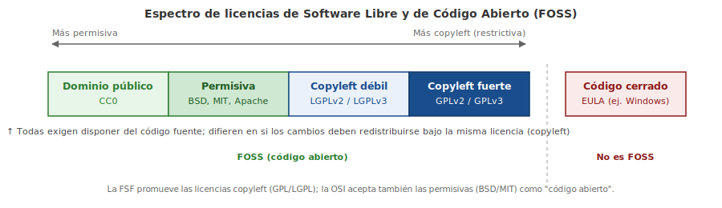

# Capítulo 2: Aplicaciones de Código Abierto y Licenciamiento de Software

## 2.1 Introducción

En este capítulo vamos a conocer varias herramientas y aplicaciones de **código abierto**. También vamos a hablar del software y la concesión de licencias de código abierto.

> **¿Lo sabía?** ¡Todas estas compañías ejecutan sobre Linux!

## 2.2 Las Principales Aplicaciones de Código Abierto

El **kernel** de Linux puede ejecutar una gran variedad de software a través de muchas plataformas de hardware. Una computadora puede actuar como un **servidor**, que significa que principalmente maneja datos en nombre de otro, o puede actuar como un **escritorio**, lo que significa que un usuario puede interactuar con él directamente. La máquina puede ejecutar el software o puede ser utilizada como máquina de desarrollo en el proceso de creación de software. Incluso puede ejecutar múltiples roles ya que no hay distinción en Linux en cuanto a la función de la máquina; es simplemente una cuestión de configurar cuáles de las aplicaciones se ejecutarán.

Una ventaja de esto es que se pueden simular casi todos los aspectos de un entorno de producción, desde el desarrollo a las pruebas y hasta la verificación en un hardware reducido, lo cual ahorra costos y tiempo. Como estudiante de Linux puedes ejecutar las mismas aplicaciones de servidor en tu escritorio o en un servidor virtual no muy costoso que funciona a través de un gran proveedor de servicios de Internet. Por supuesto no vas a poder manejar el mismo volumen que un proveedor de servicios grande, ya que éste posee un hardware mucho más caro. Sin embargo, vas a poder simular casi cualquier configuración sin necesidad de un hardware muy potente o un servidor de licencias.

El software de Linux cae generalmente en una de tres categorías:

- **Software de servidor** – software que no tiene ninguna interacción directa con el monitor y el teclado de la máquina en la que se ejecuta. Su propósito es servir información a otras computadoras llamadas clientes. A veces el software de servidor puede no interactuar con otros equipos, sin embargo, va a estar ahí sentado y "procesando" datos.
- **Software de escritorio** – un navegador web, editor de texto, reproductor de música u otro software con el que tú interactúas. En muchos casos, como un navegador web, el software consultará a un servidor en el otro extremo e interpretará los datos para ti. Aquí, el software de escritorio es el cliente.
- **Herramientas** – una categoría adicional de software que existe para que sea más fácil gestionar el sistema. Puedes tener una herramienta que te ayude a configurar la pantalla o algo que proporcione un shell de Linux, o incluso herramientas más sofisticadas que convierten el código fuente en algo que la computadora pueda ejecutar.

Adicionalmente, vamos a ver las aplicaciones móviles, principalmente para el beneficio del examen LPI. Una **aplicación móvil** es muy parecida a una aplicación de escritorio, pero se ejecuta en un teléfono o una tableta en lugar de una máquina de escritorio.

Cualquier tarea que quieras hacer en Linux probablemente pueda ser acomodada por cualquier número de aplicaciones. Hay muchos navegadores, muchos servidores web y muchos editores de texto (los beneficios de cada uno son objeto de muchas guerras santas de UNIX). Esto no es diferente al mundo de código cerrado. Sin embargo, una ventaja del código abierto es que si a alguien no le gusta la manera en la que funciona su servidor web, puede empezar a construir el suyo propio. Una cosa que aprenderás mientras vayas progresando con Linux es cómo evaluar el software: a veces querrás ir con el líder de la manada y otras veces querrás conocer la última vanguardia de la tecnología.

### 2.2.1 Aplicaciones de Servidor

Linux destaca en la ejecución de aplicaciones de servidor gracias a su confiabilidad y eficiencia. Cuando hablamos de software de servidor, la pregunta más importante es "¿Qué tipo de servicio estoy ejecutando?" ¡Si quieres proporcionar un servicio de páginas web necesitas un software de servidor web, no un servidor de correo!

Uno de los primeros usos de Linux era para **servidores web**. Un servidor web aloja contenido para páginas web a las que accede el navegador mediante el **Protocolo de Transferencia de Hipertexto** (`HTTP` - Hypertext Transfer Protocol) o su forma cifrada `HTTPS`. La propia página web puede ser **estática**, lo que significa que cuando el navegador solicita una página, el servidor web envía sólo el archivo tal y como aparece en el disco. El servidor también puede proporcionar contenido **dinámico**, es decir, el servidor web envía la solicitud a una aplicación que genera el contenido. WordPress es un ejemplo popular: los usuarios pueden desarrollar contenidos a través de su navegador en la aplicación de WordPress y el software lo convierte en un sitio web completamente funcional. Cada vez que realizas compras en línea estás viendo un sitio dinámico.

Hoy en día, **Apache** es el servidor web dominante. Apache fue originalmente un proyecto independiente, pero el grupo formó la Apache Software Foundation y mantiene más de cien proyectos de software de código abierto.

Otro servidor web es **nginx**, con su base en Rusia. Se centra en el rendimiento haciendo uso de kernels UNIX más modernos y sólo puede hacer un subconjunto de lo que Apache puede hacer. Más de un 65% de los sitios web funcionan mediante Apache o nginx.

El correo electrónico siempre ha sido un uso popular para servidores Linux. Cuando se habla de servidores de correo electrónico, siempre es útil considerar 3 funciones diferentes:

- **Agente de Transferencia de Correo** (`MTA` - Mail Transfer Agent) – decide qué servidor debe recibir el correo electrónico y utiliza el **Protocolo Simple de Transferencia de Correo** (`SMTP` - Simple Mail Transfer Protocol) para mover el correo electrónico hacia tal servidor. No es inusual que un correo electrónico dé varios "saltos" para llegar a su destino final, ya que una organización puede tener varios MTAs.
- **Agente de Entrega de Correo** (`MDA` - Mail Delivery Agent, también llamado Agente de Entrega Local) – se encarga de almacenar el correo electrónico en el buzón del usuario. Generalmente se invoca desde el MTA al final de la cadena.
- **Servidor POP/IMAP** – (Post Office Protocol e Internet Message Access Protocol) son dos protocolos de comunicación que permiten a un cliente de correo funcionando en tu computadora interactuar con un servidor remoto para recoger el correo electrónico.

A veces un software implementará varios componentes. En el mundo de código cerrado, Microsoft Exchange implementa todos los componentes, por lo que no hay opción para hacer selecciones individuales. En el mundo del código abierto hay muchas opciones. Algunos servidores POP/IMAP implementan su propio formato de base de datos de correo por rendimiento, por lo que también incluirán el MDA si se requiere una base de datos personalizada. Las personas que utilizan formatos de archivo estándar (como todos los correos en un archivo) pueden elegir cualquier MDA.

El MTA más conocido es **sendmail**. **Postfix** es otro MDA popular y pretende ser más simple y más seguro que sendmail. Si utilizas formatos de archivo estándar para guardar mensajes de correo electrónico, tu MTA también puede entregar el correo. Como alternativa, puedes usar algo como **procmail** que te permite definir filtros personalizados para procesar y filtrar el correo.

**Dovecot** es un servidor POP/IMAP popular gracias a su facilidad de uso y bajo mantenimiento. **Cyrus IMAP** es otra opción.

Para compartir archivos, **Samba** es el ganador sin duda. Samba permite que una máquina Linux se parezca a una máquina Windows para que pueda compartir archivos y participar en un dominio de Windows. Samba implementa los componentes del servidor, tales como archivos disponibles para compartir y ciertas funciones de servidor de Windows, así como el cliente para que una máquina Linux pueda consumir un recurso compartido de archivos de Windows.

Si tienes máquinas Apple en la red, el proyecto **Netatalk** permite que tu máquina Linux se comporte como un servidor de archivos de Apple.

El protocolo para compartir archivos nativo de UNIX se llama **Sistema de Archivos de Red** (`NFS` - Network File System). NFS es generalmente parte del kernel, lo que significa que un sistema de archivos remoto puede montarse como un disco regular, haciendo el acceso al archivo transparente para otras aplicaciones.

Al crecer tu red de computadoras, necesitarás implementar algún tipo de directorio. El directorio más antiguo se llama **Sistema de Nombres de Dominio** (`DNS`) y se utiliza para convertir un nombre como `http://www.linux.com` a una dirección IP como `192.168.100.100`, que es un identificador único de ese equipo en Internet. DNS contiene también información global, como la dirección del MTA para un nombre de dominio dado. Una organización puede ejecutar su propio servidor DNS para alojar sus nombres públicos y también para servir como directorio interno de servicios. El Consorcio de Software de Internet (Internet Software Consortium) mantiene el servidor DNS más popular, llamado simplemente `bind`, tras el nombre del proceso que ejecuta el servicio.

El DNS se centra en gran parte en nombres de equipos y direcciones IP y no es fácilmente accesible para otro tipo de información. Han surgido otros directorios para almacenar información distinta, tales como cuentas de usuario y roles de seguridad. El **Protocolo Ligero de Acceso a Directorios** (`LDAP` - Lightweight Directory Access Protocol) es el directorio más común, y también alimenta el Active Directory de Microsoft. En LDAP, un objeto se almacena en forma de árbol (ramificada), y la posición de tal objeto en el árbol puede utilizarse para obtener información sobre el objeto, además de lo que se almacena en el objeto en sí. Por ejemplo, un administrador de Linux puede almacenarse en una rama del árbol llamada "Departamento TI", que está debajo de una rama llamada "Operaciones". Así uno puede encontrar personal técnico buscando bajo la rama del Departamento TI. **OpenLDAP** es aquí el jugador dominante.

Una última pieza de la infraestructura de red se denomina **Protocolo de Configuración Dinámica de Host** (`DHCP` - Dynamic Host Configuration Protocol). Cuando un equipo arranca, necesita una dirección IP para la red local para poder identificarse de manera única. El trabajo de DHCP es identificar las solicitudes y asignar una dirección disponible del grupo DHCP. El Internet Software Consortium también mantiene el servidor ISC DHCP, que es el más común.

Una **base de datos** almacena la información y permite una recuperación y consulta fáciles. Las bases de datos más populares son **MySQL** y **PostgreSQL**. En la base de datos podrías ingresar datos de venta totales y luego usar un lenguaje llamado **Lenguaje de Consulta Estructurado** (`SQL` - Structured Query Language) para agregar ventas por producto y fecha con el fin de producir un informe.

### 2.2.2 Aplicaciones de Escritorio

El ecosistema de Linux tiene una amplia variedad de aplicaciones de escritorio. Puedes encontrar juegos, aplicaciones de productividad, herramientas creativas y mucho más. Esta sección es un mero estudio de lo que existe, centrándose en lo que LPI considera más importante.

Antes de considerar las aplicaciones individuales, es útil conocer el entorno de escritorio. Un escritorio de Linux ejecuta un sistema llamado **X Window**, también conocido como **X11**. Un servidor Linux X11 es **X.org**, que hace que el software opere en modo gráfico y acepte la entrada de un teclado y un ratón. Otro software controla las ventanas y los iconos, y se llama **administrador de ventanas** o **entorno de escritorio**. El administrador de ventanas es una versión más simple del entorno de escritorio, ya que sólo proporciona el código para dibujar menús y gestionar las ventanas de las aplicaciones en la pantalla. Los entornos de escritorio añaden niveles de funciones como pantallas de inicio de sesión, sesiones, administrador de archivos y otras utilidades. En resumen, una estación de trabajo Linux de sólo texto se convierte en un escritorio gráfico con la adición de X-Windows y un entorno de escritorio o un administrador de ventanas.

Los administradores de ventanas incluyen: **Compiz**, **FVWM** y **Enlightenment**, aunque hay muchos más. Los entornos de escritorio principales son **KDE** y **GNOME**, los cuales tienen sus propios administradores de ventanas. KDE y GNOME son proyectos maduros con una cantidad increíble de utilidades construidas, y la elección es a menudo una cuestión de preferencia personal.

Las aplicaciones de productividad básicas, tales como un procesador de textos, hoja de cálculo y paquete de presentación, son muy importantes. Se les conoce como **suite ofimática**, en gran parte debido a que Microsoft Office es el jugador dominante en el mercado.

**OpenOffice** (a veces llamado OpenOffice.org) y **LibreOffice** ofrecen una suite ofimática completa, incluyendo una herramienta de dibujo, que busca la compatibilidad con Microsoft Office tanto en términos de características como de formatos de archivo. Estos dos proyectos también sirven de gran ejemplo de cómo influir en la política de código abierto.

En 1999 Sun Microsystems adquirió una compañía alemana relativamente desconocida que estaba haciendo una suite ofimática para Linux llamada StarOffice. Poco después, Sun cambió la marca a OpenOffice y la había liberado bajo una licencia de código abierto. Para complicar más las cosas, StarOffice siguió siendo un producto propietario separado de OpenOffice. En 2010 Sun fue adquirida por Oracle, que más tarde entregó el proyecto a la fundación Apache.

Oracle ha tenido una historia pobre de soporte a los proyectos de código abierto que va adquiriendo, así que poco después de la adquisición el proyecto se bifurcó para convertirse en **LibreOffice**. En ese momento se crearon dos grupos de personas desarrollando la misma pieza de software. La mayor parte del impulso fue al proyecto LibreOffice, razón por la cual se incluye por defecto en muchas distribuciones de Linux.

Para navegar por la web, los dos principales contendientes son **Firefox** y **Google Chrome**. Ambos son navegadores rápidos de código abierto, ricos en funciones y con un soporte excelente para desarrolladores web. Estos dos paquetes son un buen ejemplo de cómo la diversidad es buena para el código abierto: las mejoras de uno dan estímulo al otro equipo para tratar de mejorar el suyo. Como resultado, Internet tiene dos navegadores excelentes que empujan los límites de lo que se puede hacer en la web a través de una variedad de plataformas.

El proyecto Mozilla ha sacado también **Thunderbird**, un cliente integral de correo electrónico de escritorio. Thunderbird se conecta a un servidor POP o IMAP, muestra el correo electrónico localmente y envía el correo a través de un servidor SMTP externo.

Otros clientes de correo electrónico notables son **Evolution** y **KMail**, clientes de correo de los proyectos GNOME y KDE respectivamente. La estandarización de formatos a través de POP, IMAP y correo local significa que es fácil cambiar entre clientes de correo sin perder datos. El correo electrónico basado en web también es otra opción.

Para los tipos creativos existen **Blender**, **GIMP** y **Audacity**, que controlan la creación de películas 3D, manipulación de imágenes 2D y edición de audio respectivamente. Han tenido diversos grados de éxito en los mercados profesionales. Blender se utiliza para todo, desde películas independientes hasta películas de Hollywood, por ejemplo.

### 2.2.3 Herramientas de Consola

La historia del desarrollo de UNIX muestra una considerable superposición entre las habilidades de administración de sistemas y desarrollo de software. Las herramientas que te permiten administrar el sistema tienen funciones de lenguajes de programación, tales como ciclos (loops), y algunos lenguajes de programación se utilizan extensivamente en la automatización de las tareas de administración de sistemas. Por lo tanto, uno debe considerar estas habilidades complementarias.

En el nivel básico, interactúas con un sistema Linux a través de un **shell**, sin importar si te conectas de forma remota o desde un teclado local. El trabajo del shell consiste en aceptar comandos, como manipulación de archivos e inicio de aplicaciones, y pasarlos al kernel de Linux para su ejecución. A continuación se muestra una interacción típica con el shell de Linux:

```bash
sysadmin@localhost:~$ ls -l /tmp/*.gz
-rw-r--r-- 1 sean root 246841 Mar 5 2013 /tmp/fdboot.img.gz
sysadmin@localhost:~$ rm /tmp/fdboot.img.gz
```

El usuario recibe un mensaje (prompt) que normalmente termina en un signo de dólar `$` para indicar una cuenta sin privilegios. Cualquier cosa antes del símbolo, en este caso `sysadmin@localhost:~`, es un indicador configurable que proporciona información extra al usuario. En el ejemplo anterior, `sysadmin` es el nombre del usuario actual, `localhost` es el nombre del servidor, y `~` es el directorio actual (en UNIX, el símbolo de tilde es una forma corta para el directorio home del usuario). Los comandos de Linux se tratarán con más detalle más adelante, pero para terminar la explicación: el primer comando muestra los archivos con el comando `ls`, recibe información sobre el archivo y luego elimina ese archivo con el comando `rm`.

El shell de Linux proporciona un rico lenguaje para iterar sobre los archivos y personalizar el entorno, todo sin salir del shell. Por ejemplo, es posible escribir una sola línea de comando que encuentre archivos con un contenido que corresponda a cierto patrón, extraiga la información del archivo, y luego copie la nueva información en un archivo nuevo.

Linux ofrece una variedad de shells para elegir, que difieren sobre todo en cómo y qué se puede personalizar y en la sintaxis del lenguaje de "script" incorporado. Las dos familias principales son **Bourne shell** y **C shell**. Bourne shell recibió su nombre de su creador, y C shell porque su sintaxis viene prestada del lenguaje C. Como ambos shells fueron inventados en la década de 1970, existen versiones más modernas: el **Bourne Again Shell** (`bash`) y `tcsh` (tee-cee-shell). Bash es el shell por defecto en la mayoría de los sistemas, aunque casi puedes estar seguro de que tcsh también está disponible si lo prefieres.

Otras personas tomaron sus características favoritas de Bash y tcsh y crearon otros shells, como el **Korn shell** (`ksh`) y `zsh`. La elección de shell es sobre todo personal. Si estás cómodo con Bash entonces puedes operar eficazmente en la mayoría de los sistemas Linux. Después de eso puedes explorar otras vías y probar nuevos shells para ver si ayudan a tu productividad.

Aún más dividida que la selección de shells está la elección de **editores de texto**. Un editor de texto se utiliza en la consola para editar archivos de configuración. Los dos campos principales son `vi` (o el más moderno `vim`) y `emacs`. Ambos son herramientas extraordinariamente poderosas para editar archivos de texto, que se diferencian en el formato de los comandos y la manera de escribir plugins para ellos. Los plugins podrían ser cualquier cosa, desde resaltado de sintaxis de proyectos de software hasta calendarios integrados.

Tanto `vim` como `emacs` son complejos y tienen una curva de aprendizaje extensa. Esto no es útil si lo que necesitas es editar un pequeño archivo de texto simple. Por lo tanto `pico` y `nano` están disponibles en la mayoría de los sistemas (el último es un derivado del primero) y ofrecen edición de texto muy básica.

Incluso si decides no usar `vi`, debes esforzarte por ganar cierta familiaridad básica porque el `vi` básico está en todos los sistemas Linux. Si vas a restaurar un sistema Linux dañado ejecutando el modo de recuperación de la distribución, seguramente tendrás un `vi` disponible.

Si tienes un sistema Linux necesitarás agregar, quitar y actualizar el software. En cierto momento esto significaba descargar el código fuente, configurarlo, construirlo y copiar los archivos en cada sistema. Afortunadamente, las distribuciones crearon **paquetes**, es decir copias comprimidas de la aplicación. Un **administrador de paquetes** se encarga de hacer el seguimiento de qué archivos pertenecen a qué paquete, e incluso de descargar actualizaciones desde un servidor remoto llamado **repositorio**. En los sistemas Debian las herramientas incluyen `dpkg`, `apt-get` y `apt-cache`. En los sistemas derivados de Red Hat se utilizan `rpm` y `yum`. Veremos más sobre paquetes en un capítulo posterior.

### 2.2.4 Herramientas de Desarrollo

No es una sorpresa que, siendo un software construido sobre las contribuciones de programadores, Linux tenga un soporte excelente para el desarrollo de software. Los shells se construyen para ser programables y existen editores potentes incluidos en cada sistema. También hay disponibles muchas herramientas de desarrollo, y muchos lenguajes modernos tratan a Linux como un ciudadano de primera clase.

Los lenguajes informáticos proporcionan una manera para que un programador ingrese instrucciones en un formato más legible por el ser humano, para que tales instrucciones sean eventualmente traducidas en algo que la computadora entiende. Los lenguajes pertenecen a uno de dos campos: **interpretado** o **compilado**. Un lenguaje interpretado traduce el código a código de máquina mientras se ejecuta el programa; un lenguaje compilado se traduce todo de una vez, antes de ejecutarse.

Linux fue escrito en un lenguaje compilado llamado **C**. El beneficio principal de C es que el lenguaje en sí es similar al código de máquina generado, por lo que un programador experto puede escribir código pequeño y eficiente. Cuando la memoria del equipo se medía en kilobytes, esto era muy importante. Hoy, incluso con tamaños de memoria de gran capacidad, C sigue siendo útil para escribir código que debe ejecutarse rápidamente, como un sistema operativo.

C se ha ampliado durante los años. Existe **C++**, que añade soporte de objetos a C (un estilo diferente de programación), y **Objective-C**, que tomó otro rumbo y se usa mucho en productos de Apple.

El lenguaje **Java** toma un rumbo diferente al enfoque compilado. En lugar de compilar a código máquina, Java primero imagina un hipotético CPU llamado la **Máquina Virtual de Java** (`JVM` - Java Virtual Machine) y compila todo el código para ésta. Cada equipo host entonces corre el software JVM para traducir las instrucciones de JVM (llamadas **bytecode**) en instrucciones nativas.

La traducción adicional con Java podría hacer pensar que sería lento. Sin embargo, la JVM es bastante simple, por lo que se puede implementar de manera rápida y confiable en cualquier cosa, desde un equipo potente hasta un dispositivo de baja potencia que se conecta a un televisor. ¡Un archivo compilado de Java también se puede ejecutar en cualquier equipo que implemente la JVM!

Otra ventaja de compilar hacia un objetivo intermedio es que la JVM puede proporcionar servicios a la aplicación que normalmente no estarían disponibles en una CPU. Asignar memoria a un programa es un problema complejo, pero esto está integrado dentro de la JVM. Esto también significa que los fabricantes de la JVM pueden enfocar sus mejoras en la JVM como un todo, así cualquier mejora está inmediatamente disponible para las aplicaciones.

Por otra parte, los **lenguajes interpretados** se traducen a código máquina a medida que se van ejecutando. La potencia extra del equipo consumida para esta tarea a menudo puede ser recuperada por el aumento de la productividad del programador, quien gana al no tener que dejar de trabajar para compilar. Los lenguajes interpretados también suelen ofrecer más funciones que los lenguajes compilados, lo que significa que a menudo se necesita menos código. ¡El intérprete del lenguaje generalmente está escrito en otro lenguaje, tal como C, y a veces incluso en Java! Esto significa que un lenguaje interpretado puede ejecutarse en la JVM, que se traduce en tiempo de ejecución al código máquina.

- **Perl** es un lenguaje interpretado. Fue desarrollado originalmente para realizar manipulación de texto. Con los años, se ganó su lugar entre los administradores de sistemas y todavía sigue siendo mejorado y utilizado en todo, desde la automatización hasta la construcción de aplicaciones web.
- **PHP** es un lenguaje que fue construido originalmente para crear páginas web dinámicas. Un archivo PHP es leído por un servidor web como Apache. Etiquetas especiales en el archivo indican qué partes del código deben ser interpretadas como instrucciones. El servidor web reúne las diferentes partes del archivo y lo envía al navegador web. Las ventajas principales de PHP son que es fácil de aprender y está disponible en casi cualquier sistema. Debido a esto, muchos proyectos populares se construyen en PHP, como WordPress (blogging), cacti (monitoreo) e incluso partes de Facebook.
- **Ruby** es otro lenguaje influenciado por Perl y Shell, junto con muchos otros lenguajes. Convierte tareas de programación complejas en algo relativamente fácil, y con la inclusión del framework **Ruby on Rails**, es una opción popular para crear aplicaciones web complejas. Ruby es también el lenguaje que potencia muchas de las principales herramientas de automatización como **Chef** y **Puppet**, que facilitan mucho la gestión de un gran número de sistemas Linux.
- **Python** es otro lenguaje de desarrollo de uso común. Al igual que Ruby, facilita tareas complejas y tiene un framework llamado **Django** que facilita la construcción de aplicaciones web. Python tiene capacidades de procesamiento estadístico excelentes y es una de las herramientas favoritas en el mundo académico.

Un lenguaje es una herramienta que te ayuda a decirle al equipo lo que quieres hacer. Una **librería** empaqueta tareas comunes en un paquete distinto que puede ser utilizado por el desarrollador. **ImageMagick** es una librería que permite a los programadores manipular imágenes en código, e incluye algunas herramientas de línea de comandos que permiten procesar imágenes desde un shell aprovechando las capacidades de scripting.

**OpenSSL** es una librería criptográfica que se utiliza en todo, desde servidores web hasta la línea de comandos. Proporciona una interfaz estándar para agregar criptografía en tu programa, por ejemplo uno escrito en Perl.

En un nivel mucho más bajo está la **librería de C**, que proporciona un conjunto básico de funciones para leer y escribir archivos y pantallas, utilizadas por las aplicaciones y otros lenguajes por igual.

## 2.3 Entendiendo el Software de Código Abierto y el Licenciamiento

Cuando nos referimos a la adquisición de un software hay tres componentes distintos:

1. **Propiedad** – ¿Quién es el dueño de la propiedad intelectual detrás del software?
2. **Transferencia de dinero** – ¿Cómo pasa el dinero por diferentes manos, si es que pasa?
3. **Concesión de licencias** – ¿Qué obtienes? ¿Qué puedes hacer con el software? ¿Puedes utilizarlo sólo en un equipo? ¿Puedes dárselo a otra persona?

En la mayoría de los casos la propiedad intelectual del software permanece con la persona o empresa que lo creó. Los usuarios sólo obtienen una **concesión de licencia** para utilizar el software; se trata de una cuestión de derecho de autor. La transferencia de dinero depende del modelo de negocio del creador. Es la concesión de licencias lo que realmente distingue un software de código abierto de un software de código cerrado.

Dos ejemplos contrastantes nos ayudarán a empezar:

- **Microsoft Corporation** posee la propiedad intelectual de Microsoft Windows. La licencia, el **CLUF** - Contrato de Licencia de Usuario Final (`EULA` - End User License Agreement), es un documento legal personalizado que debes leer y aceptar con un clic para poder instalar el software. Microsoft posee el código fuente y distribuye sólo copias binarias a través de canales autorizados. La mayoría de los productos de consumo autorizan una instalación de software en una computadora y no permiten hacer otras copias del disco que no sea una copia de seguridad. No puedes revertir el software a código fuente mediante ingeniería inversa. Pagas por una copia del software con la que obtienes actualizaciones menores, pero no las actualizaciones mayores.
- **Linux** pertenece a Linus Torvalds. Él ha colocado el código bajo una licencia **GNU Public License versión 2** (`GPLv2`). Esta licencia, entre otras cosas, dice que el código fuente debe hacerse disponible a quien lo pida y que puedes hacer cualquier cambio que desees. Una salvedad es que si haces cambios y los distribuyes, debes poner tus cambios bajo la misma licencia para que otros puedan beneficiarse. GPLv2 dice también que no puedes cobrar por distribuir el código fuente a menos que sean tus costos reales de hacerlo (por ejemplo, copiar a medios extraíbles).

En general, si creas algo también obtienes el derecho a decidir cómo se utiliza y distribuye. **Software Libre y de Código Abierto** (`FOSS` - Free and Open Source Software) se refiere a un tipo de software donde este derecho ha sido liberado y tienes permiso para ver el código fuente y redistribuirlo. Linus Torvalds ha hecho eso con Linux: aunque él creó Linux, no puede decirte que no lo puedes utilizar en tu equipo, porque liberó tal derecho a través de la licencia GPLv2.

La concesión de licencias de software es una cuestión política, y no debería sorprendernos que haya muchas opiniones diferentes. Las organizaciones han creado su propia licencia que incorpora su particular punto de vista, ya que es más fácil escoger una licencia existente que idear la propia. Por ejemplo, universidades como el Instituto Tecnológico de Massachusetts (MIT) y la Universidad de California han sacado sus propias licencias, al igual que proyectos como la Apache Foundation. Además, grupos como la Free Software Foundation han creado sus propias licencias para promover su agenda.

### 2.3.1 La Free Software Foundation y el Open Source Initiative

Existen dos grupos considerados con la mayor fuerza de influencia en el mundo del código abierto: la **Free Software Foundation** (`FSF`) y el **Open Source Initiative** (`OSI`).

La **Free Software Foundation** fue fundada en 1985 por Richard Stallman (RMS). El objetivo de la FSF es promover el **Software Libre**. El software libre no se refiere al precio, sino a la libertad de compartir, estudiar y modificar el código fuente subyacente. La visión de la FSF es que el software propietario (distribuido bajo una licencia de código cerrado) es malo. La FSF también defiende que las licencias de software deben preservar la apertura de las modificaciones: si modificas el software libre debes compartir tus cambios. Esta filosofía específica se llama **copyleft**.

La FSF también lucha contra las patentes de software y actúa como un perro guardián para las organizaciones de normativa, señalando cuando una norma propuesta pudiera violar los principios del software libre mediante la inclusión de elementos como la **Administración de Derechos Digitales** (`DRM` - Digital Rights Management), que pudieran restringir lo que podrías hacer con el software.

La FSF ha desarrollado su propio sistema de licencias, como la `GPLv2` y `GPLv3`, y las versiones "menores" `LGPLv2` y `LGPLv3` (Lesser GPL). Las licencias "menores" (lesser) son muy similares a las licencias regulares excepto que tienen disposiciones para enlazarlas contra software no libre. Por ejemplo, bajo la licencia GPLv2 no puedes redistribuir software que utiliza una librería de código cerrado (como un controlador de hardware), pero la variante menor sí permite esa acción.

Los cambios entre las versiones 2 y 3 se centran en gran parte en el uso de software libre en un dispositivo con hardware cerrado, un fenómeno acuñado como **Tivoización**. TiVo es una empresa que construye un grabador de vídeo digital de televisión en su propio hardware y utiliza Linux como base para su software. Mientras que TiVo había liberado el código fuente para su versión de Linux, como requería la GPLv2, el hardware no ejecutaría ningún binario modificado. A los ojos de la FSF esto fue contra el espíritu de la GPLv2, por lo que añadió una cláusula específica a la versión 3 de la licencia. Linus Torvalds está de acuerdo con TiVo en este asunto y ha elegido quedarse con GPLv2.

La **Open Source Initiative** fue fundada en 1998 por Bruce Perens y Eric Raymond (ESR). Creían que el Software Libre había sido politizado en exceso y que eran necesarias licencias menos extremas, particularmente en torno a los aspectos de copyleft de las licencias de la FSF. OSI cree que no sólo la fuente debe estar disponible libremente, sino que también deben aplicarse cero restricciones sobre el uso del software, sin importar el uso previsto. A diferencia de la FSF, OSI no tiene su propio conjunto de licencias; en cambio, tiene un conjunto de principios y agrega otras licencias a esa lista si cumplen con tales principios, llamadas **licencias de código abierto**. El software que se ajusta a una licencia de Código Abierto es, por lo tanto, un **Software de Código Abierto**.

Algunas de las licencias de código abierto pertenecen a la familia **BSD** de licencias, mucho más simples que la GPL: simplemente dicen que puedes redistribuir la fuente y los binarios mientras respetes los derechos de autor y no impliques que el creador original aprueba tu versión. En otras palabras: "haz lo que quieras con este software, pero no digas que lo escribiste tú". La licencia **MIT** tiene mucho del mismo espíritu, con diferente redacción.

Las licencias de la FSF, como la GPLv2, también son licencias de código abierto. Sin embargo, muchas licencias de software libre como BSD y MIT no contienen las disposiciones de copyleft y por lo tanto no son aceptables para la FSF. Estas licencias se llaman **licencias de software libre permisivas**, porque son permisivas en cómo puedes redistribuir el software. Puedes tomar un software bajo la licencia BSD e incluirlo en un producto de software cerrado siempre que le des la atribución adecuada.

<figure>

<figcaption>Espectro de licencias FOSS: de lo más permisivo (dominio público, BSD/MIT) a lo más restrictivo (copyleft con GPL), frente al software de código cerrado.</figcaption>
</figure>

### 2.3.2 Más Términos para lo Mismo

En lugar de afligirse por los puntos más sensibles del código abierto frente al Software Libre, la comunidad ha comenzado a referirse a este concepto como **Software Libre y de Código Abierto** (`FOSS`). La palabra "libre" puede significar "gratuito como un almuerzo" (sin costo) o "libre como un discurso" (sin restricciones). Esta ambigüedad ha llevado a incluir la palabra "libre" (*libre*, en inglés) para referirse específicamente a este último concepto. De esta manera tenemos el término **Software Gratuito/Libre/de Código Abierto** (`FLOSS` - Free/Libre/Open Source Software).

Tales términos son convenientes, pero esconden las diferencias entre las dos escuelas de pensamiento. Por lo menos, si utilizas software FOSS sabes que no tienes que pagar por él y puedes redistribuirlo como quieras.

### 2.3.3 Otros Esquemas de Concesión de Licencias

Las licencias FOSS están relacionadas sobre todo con el software. Se han hecho trabajos como dibujos y planos bajo licencias FOSS, pero esa no era la intención original.

Cuando se coloca un software en el **dominio público**, el autor abandona todos los derechos, incluyendo los derechos de autor sobre la obra. En algunos países, esto es un valor predeterminado si el trabajo lo ha realizado una agencia gubernamental. En algunos países, el trabajo con derechos de autor se convierte en dominio público después de que el autor haya muerto y haya transcurrido un largo período de espera.

La organización **Creative Commons** (`CC`) ha creado las **Licencias de Creative Commons**, que tratan de satisfacer las intenciones detrás de las licencias de software libre para entidades no relacionadas con software. Las licencias CC también pueden utilizarse para restringir el uso comercial si tal es el deseo del titular de los derechos de autor. Las licencias CC son:

| Licencia | Descripción |
|---|---|
| **Attribution** (`CC BY`) | Al igual que la licencia BSD, puedes utilizar el contenido para cualquier uso, pero debes acreditar al titular de los derechos de autor. |
| **Attribution ShareAlike** (`CC BY-SA`) | Versión copyleft de la licencia de atribución. Los trabajos derivados deben compartirse bajo la misma licencia, al estilo de los ideales del Software Libre. |
| **Attribution No-Derivs** (`CC BY-ND`) | Puedes redistribuir el contenido bajo las mismas condiciones que CC-BY, pero no lo puedes cambiar. |
| **Attribution-NonCommercial** (`CC BY-NC`) | Al igual que CC BY, pero no lo puedes utilizar con fines comerciales. |
| **Attribution-NonCommercial-ShareAlike** (`CC-BY-NC-SA`) | Se basa en CC BY-NC, pero requiere que los cambios se compartan bajo la misma licencia. |
| **Attribution-NonCommercial-No-Derivs** (`CC-BY-NC-ND`) | Compartes el contenido para uso no comercial, pero la gente no puede cambiarlo. |
| **No Rights Reserved** (`CC0`) | Es la versión de Creative Commons equivalente al dominio público. |

Las licencias anteriores se pueden resumir según si exigen o no **ShareAlike** (compartir igual) y si permiten o no el **uso comercial** o las **derivaciones**.

### 2.3.4 Los Modelos del Negocio de Código Abierto

Si estás regalando tu software gratuitamente, ¿cómo puedes ganar dinero?

- **Vender soporte o garantía** para el software. Puedes ganar dinero instalando el software para las personas, ayudándolas cuando tienen problemas o corrigiendo errores a cambio de dinero. En realidad, eres un consultor.
- **Cobrar por un servicio o suscripción** que mejora el software. El proyecto de grabadora de vídeo digital de código abierto **MythTV** es un excelente ejemplo: el software es gratuito, pero puedes pagar por conectarlo a un servicio de TV para saber la hora concreta de algún programa de televisión.
- **Empaquetar hardware** o agregar software de código cerrado adicional para su venta junto con el software libre. Los dispositivos y sistemas integrados que utilizan Linux pueden desarrollarse y venderse así; muchos firewalls para consumidores y dispositivos de entretenimiento siguen este modelo.
- **Desarrollar software de código abierto como parte de tu trabajo.** Si creas una herramienta para hacer tu vida más fácil en tu trabajo regular, puedes convencer a tu empleador de dejarte liberar la fuente. Puede haber una situación en la que trabajas en un software cobrando un salario, pero las licencias de código abierto permiten que tu trabajo ayude a otros, o incluso que otras personas contribuyan a resolver el mismo problema.

En la década de 1990, Gerald Combs trabajaba en un proveedor de servicios de Internet y comenzó a escribir su propia herramienta de análisis de red porque las herramientas similares eran muy caras en aquel entonces. Hasta hoy, más de 600 personas han contribuido al proyecto llamado **Wireshark**. Ahora a menudo se considera mejor que la oferta comercial, y gracias a ello Gerald formó una empresa para dar soporte a Wireshark y vender productos y apoyo que facilitan su uso. Más adelante la empresa fue comprada por un importante proveedor de red que apoya su desarrollo.

Otras compañías obtienen un valor tan inmenso del software de código abierto que consideran eficaz contratar personas para trabajar en el software a tiempo completo. El motor de búsqueda de Google contrató al creador del lenguaje Python, e incluso Linus Torvalds fue contratado por la Linux Foundation para trabajar en Linux. La compañía telefónica estadounidense AT&T obtiene tal valor de los proyectos Ruby y Rails para sus Páginas Amarillas que tiene un empleado que no hace nada más que trabajar en estos proyectos.

La última manera en la que la gente hace dinero indirectamente a través del código abierto es que constituye una forma abierta de calificar las propias habilidades. Una cosa es decir que realizas ciertas tareas en tu trabajo, pero mostrar tu capacidad de creación y compartirla con el mundo permite a los empleadores potenciales ver la calidad de tu trabajo. Del mismo modo, las empresas se han dado cuenta de que liberar como código abierto las partes no críticas de su software interno atrae el interés de gente de mayor calibre.

### Resumen del capítulo

- El software de Linux se agrupa en **software de servidor** (web, correo, archivos, directorio, DHCP, bases de datos), **software de escritorio** (ofimática, navegadores, correo, herramientas creativas) y **herramientas** (shells, editores, gestores de paquetes).
- Apache y nginx dominan los servidores web; sendmail/Postfix y Dovecot/Cyrus cubren el correo (MTA, MDA, POP/IMAP); Samba y NFS cubren el uso compartido de archivos; DNS, LDAP y DHCP forman la infraestructura de red básica.
- El escritorio Linux se construye sobre **X11/X.org**, con un administrador de ventanas o un entorno de escritorio completo (KDE, GNOME) encima; LibreOffice, Firefox/Chrome y Thunderbird son las suites de productividad, navegación y correo más comunes.
- Bash es el shell por defecto más común; `vi`/`vim` y `emacs` son los editores de consola dominantes, con `nano` como alternativa simple; los administradores de paquetes (`dpkg`/`apt-get`, `rpm`/`yum`) gestionan la instalación de software.
- Los lenguajes de programación se dividen en **compilados** (C, C++, Java vía JVM) e **interpretados** (Perl, PHP, Ruby, Python), cada uno con distintos compromisos entre rendimiento y productividad.
- La concesión de licencias distingue el código abierto del código cerrado: la **FSF** promueve el software libre y el **copyleft** (GPL/LGPL), mientras que la **OSI** promueve licencias permisivas (BSD, MIT); Creative Commons extiende ideas similares a obras no relacionadas con software.
- Los modelos de negocio de código abierto incluyen vender soporte, servicios de suscripción, hardware empaquetado, financiar el desarrollo como parte de un empleo, y usar el trabajo de código abierto como carta de presentación profesional.
