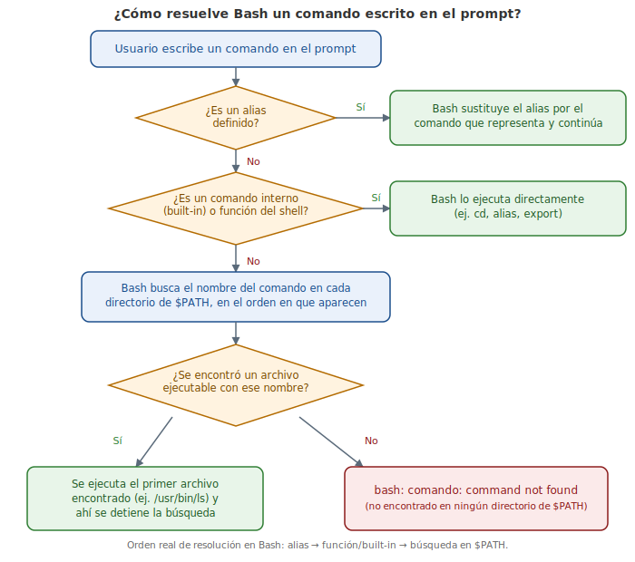

# Capítulo 4: La Interfaz de Línea de Comandos (CLI) y el Shell Bash

## 4.1 Introducción

Si eres como la mayoría de las personas, probablemente estés familiarizado con el uso de la **Interfaz Gráfica de Usuario (GUI - Graphical User Interface)** para controlar tu computadora. Fue introducida a las masas por Apple en la computadora Macintosh y popularizada por Microsoft. La GUI proporciona una forma fácil de descubrir y administrar tu sistema. Sin una GUI, algunas herramientas para gráficos y video no serían prácticas.

Antes de la popularidad de la GUI, la **Interfaz de Línea de Comandos (CLI - Command Line Interface)** era la forma preferida para controlar una computadora. La CLI se basa únicamente en la entrada por teclado. Todo lo que quieres que tu computadora haga se retransmite escribiendo comandos en lugar de ir haciendo clics en los iconos.

Si nunca has usado una CLI, al principio puede resultar difícil porque requiere de memorizar comandos y sus opciones. Sin embargo, la CLI proporciona un control más preciso, una mayor velocidad y capacidad para automatizar fácilmente las tareas a través del **scripting**. Aunque Linux tiene muchos entornos GUI, podrás controlar Linux mucho más eficazmente mediante la Interfaz de Línea de Comandos.

> **Para considerar:** ¿Por qué conocer la línea de comandos es importante? ¡Flexibilidad y Movilidad! Mediante la comprensión de los fundamentos de Linux, tienes la capacidad de trabajar en CUALQUIER distribución de Linux. Esto podría significar una compañía con ambiente mixto o una nueva empresa con una distribución Linux diferente.

## 4.2 Interfaz de Línea de Comandos (CLI)

La Interfaz de Línea de Comandos (CLI) es una interfaz basada en texto para la computadora, donde el usuario introduce un comando y la computadora lo ejecuta. El entorno de la CLI es proporcionado por una aplicación en la computadora conocida como **terminal**.

La terminal acepta lo que el usuario escribe y lo pasa a un **shell**. El shell interpreta lo que el usuario ha introducido en las instrucciones que se pueden ejecutar con el sistema operativo. Si el comando produce una salida, entonces se muestra este texto en la terminal. Si surgen problemas con el comando, se muestra un mensaje de error.

## 4.3 Acceso a la Terminal

Hay muchas maneras de acceder a la ventana de la terminal. Algunos sistemas arrancarán directamente a la terminal. Este suele ser el caso de los servidores, ya que una interfaz gráfica de usuario (GUI) puede requerir muchos recursos que no son necesarios para realizar operaciones basadas en servidores.

Un buen ejemplo de un servidor que no requiere una GUI es un servidor web. Los servidores web deben correr tan rápido como sea posible, y una GUI sólo haría lento el sistema.

En los sistemas que arrancan con una GUI, hay comúnmente dos formas de acceder a una terminal:

- **Terminal de GUI**: un programa dentro del entorno de una GUI que emula la ventana de la terminal. Las terminales de GUI pueden accederse a través del sistema de menú. Por ejemplo, en una máquina CentOS, puedes hacer clic en Applications ("Aplicaciones"), luego en System Tools ("Herramientas de Sistema") y, finalmente, en Terminal.
- **Terminal virtual**: puede ejecutarse al mismo tiempo que una GUI, pero requiere que el usuario se conecte o inicie sesión a través de la terminal virtual antes de poder ejecutar comandos (como lo haría antes de acceder a la interfaz GUI). La mayoría de los sistemas tienen múltiples terminales virtuales que se pueden acceder pulsando una combinación de teclas, por ejemplo: `Ctrl-Alt-F1`.

### 4.3.1 Prompt

Una ventana de terminal muestra un **prompt** ("símbolo" o "aviso"); el prompt aparece cuando no se ejecuta ningún comando y cuando la salida completa del comando se ha desplegado en la pantalla. El prompt está diseñado para decirle al usuario que introduzca un comando.

La estructura del prompt puede variar entre las distribuciones, pero por lo general contiene información sobre el usuario y el sistema. A continuación se muestra una estructura común de un prompt:

```bash
sysadmin@localhost:~$
```

El prompt anterior proporciona el nombre del usuario registrado (`sysadmin`), el nombre del sistema (`localhost`) y el directorio actual (`~`). El símbolo `~` se utiliza como abreviación para el directorio principal del usuario (el directorio principal del usuario viene bajo el directorio `/home` -"inicio"- y con el nombre de la cuenta de usuario, por ejemplo: `/home/sysadmin`).

### 4.3.2 El Shell

Un **shell** es el intérprete que traduce los comandos introducidos por un usuario en acciones a realizar por el sistema operativo. El entorno Linux proporciona muchos tipos diferentes de shells, algunos de los cuales han existido por muchos años.

El shell más comúnmente utilizado para las distribuciones de Linux se llama el **shell BASH**. Es un shell que ofrece muchas funciones avanzadas, tales como el **historial de comandos**, que te permite fácilmente volver a ejecutar comandos previamente ejecutados.

El shell BASH tiene también otras funciones populares:

- **Scripting**: la capacidad de colocar los comandos en un archivo y ejecutar el archivo, resultando en que todos los comandos sean ejecutados. Esta función también tiene algunas características de programación, tales como las instrucciones condicionales y la habilidad de crear funciones (también conocidas como subrutinas).
- **Los alias**: la habilidad de crear "nicknames" ("sobrenombres") cortos para comandos más largos.
- **Las variables**: se utilizan para almacenar información para el shell BASH. Estas variables pueden utilizarse para modificar cómo trabajan las funciones y los comandos, y proporcionan información vital sobre el sistema.

Nota: la lista anterior es sólo un breve resumen de algunas de las muchas funciones proporcionadas por el shell BASH.

### 4.3.3 Los Comandos de Formato

Muchos comandos se pueden utilizar por sí mismos sin más entradas. Algunos comandos requieren entradas adicionales para funcionar correctamente. Esta entrada adicional viene en dos formas: **opciones** y **argumentos**.

El formato típico de un comando es el siguiente:

```
comando [opciones] [argumentos]
```

Las opciones se utilizan para modificar el comportamiento básico de un comando, y los argumentos se utilizan para proporcionar información adicional (tal como un nombre de archivo o un nombre de usuario). Cada opción y argumento vienen normalmente separados por un espacio, aunque las opciones pueden a menudo ser combinadas.

> **Para considerar:** Recuerda que Linux es sensible a mayúsculas y minúsculas (**case-sensitive**). Comandos, opciones, argumentos, variables y nombres de archivos deben introducirse exactamente como se muestra.

El comando `ls` proporciona ejemplos útiles. Por sí mismo, el comando `ls` listará los archivos y directorios contenidos en el directorio de trabajo actual:

```bash
sysadmin@localhost:~$ ls
Desktop  Documents  Downloads  Music  Pictures  Public  Templates   Videos
sysadmin@localhost:~$
```

Sobre el comando `ls` hablaremos en detalle en un capítulo posterior. El propósito de introducir este comando ahora es demostrar cómo funcionan los argumentos y las opciones. En este punto no te debes preocupar de cuál es la salida del comando, sino más bien centrarte en comprender qué es un argumento y qué es una opción.

Un argumento se le puede pasar también al comando `ls` para especificar el contenido de qué directorio hay que listar. Por ejemplo, el comando `ls /etc/ppp` listará el contenido del directorio `/etc/ppp` en lugar del directorio actual:

```bash
sysadmin@localhost:~$ ls /etc/ppp
ip-down.d  ip-up.d
sysadmin@localhost:~$
```

Puesto que el comando `ls` acepta múltiples argumentos, puede listar el contenido de varios directorios a la vez, introduciendo el comando `ls /etc/ppp /etc/ssh`:

```bash
sysadmin@localhost:~$ ls /etc/ppp /etc/ssh
/etc/ppp:
ip-down.d  ip-up.d
/etc/ssh:
moduli               ssh_host_dsa_key.pub     ssh_host_rsa_key      sshd_config  ssh_config
ssh_host_ecdsa_key   ssh_host_rsa_key.pub
ssh_host_dsa_key     ssh_host_ecdsa_key.pub   ssh_import_id
sysadmin@localhost:~$
```

### 4.3.4 Trabajando con las Opciones

Las opciones pueden utilizarse con comandos para ampliar o modificar el comportamiento de un comando. Las opciones son a menudo de una letra; sin embargo, a veces serán "palabras". Por lo general, los comandos viejos utilizan una letra, mientras los comandos nuevos utilizan palabras completas para las opciones. Las opciones de una letra son precedidas por un único guión `-`. Las opciones de palabra completa son precedidas por dos guiones `--`.

Por ejemplo, puedes utilizar la opción `-l` con el comando `ls` para ver más información sobre los archivos que se listan. El comando `ls -l` lista los archivos contenidos dentro del directorio actual y proporciona información adicional, tal como los permisos, el tamaño del archivo y otra información:

```bash
sysadmin@localhost:~$ ls -l
total 0
drwxr-xr-x 1 sysadmin sysadmin 0 Jan 29  2015 Desktop
drwxr-xr-x 1 sysadmin sysadmin 0 Jan 29  2015 Documents
drwxr-xr-x 1 sysadmin sysadmin 0 Jan 29  2015 Downloads
drwxr-xr-x 1 sysadmin sysadmin 0 Jan 29  2015 Music
drwxr-xr-x 1 sysadmin sysadmin 0 Jan 29  2015 Pictures
drwxr-xr-x 1 sysadmin sysadmin 0 Jan 29  2015 Public
drwxr-xr-x 1 sysadmin sysadmin 0 Jan 29  2015 Templates
drwxr-xr-x 1 sysadmin sysadmin 0 Jan 29  2015 Videos
sysadmin@localhost:~$
```

En la mayoría de los casos, las opciones pueden utilizarse conjuntamente con otras opciones. Por ejemplo, los comandos `ls -l -h` o `ls -lh` listarán los archivos con sus detalles, pero se mostrará el tamaño de los archivos en formato de legibilidad humana en lugar del valor predeterminado (bytes):

```bash
sysadmin@localhost:~$ ls -l /usr/bin/perl
-rwxr-xr-x 2 root root 10376 Feb  4  2014 /usr/bin/perl
sysadmin@localhost:~$ ls -lh /usr/bin/perl
-rwxr-xr-x 2 root root 11K Feb  4  2014 /usr/bin/perl
sysadmin@localhost:~$
```

Nota que el ejemplo anterior también demostró cómo se pueden combinar opciones de una letra: `-lh`. El orden de las opciones combinadas no es importante.

La opción `-h` también tiene la forma de una palabra completa: `--human-readable`.

Las opciones a menudo pueden utilizarse con un argumento. De hecho, algunas de las opciones requieren sus propios argumentos. Puedes utilizar argumentos y opciones con el comando `ls` para listar el contenido de otro directorio al ejecutar el comando `ls -l /etc/ppp`:

```bash
sysadmin@localhost:~$ ls -l /etc/ppp
total 0
drwxr-xr-x 1 root root 10 Jan 29  2015 ip-down.d
drwxr-xr-x 1 root root 10 Jan 29  2015 ip-up.d
sysadmin@localhost:~$
```

## 4.4 Historial de los Comandos

Al ejecutar un comando en una terminal, el comando se almacena en la **"history list"** ("lista de historial"). Esto está diseñado para que más adelante puedas ejecutar el mismo comando más fácilmente, puesto que no necesitarás volver a introducir el comando entero.

Para ver la lista de historial de una terminal, utiliza el comando `history` ("historial"):

```bash
sysadmin@localhost:~$ date
Sun Nov  1 00:40:28 UTC 2015
sysadmin@localhost:~$ ls
Desktop  Documents  Downloads  Music  Pictures  Public  Templates  Videos
sysadmin@localhost:~$ cal 5 2015
    May 2015
Su Mo Tu We Th Fr Sa
                1  2
 3  4  5  6  7  8  9
10 11 12 13 14 15 16
17 18 19 20 21 22 23
24 25 26 27 28 29 30
31
sysadmin@localhost:~$ history
    1  date
    2  ls
    3  cal 5 2015
    4  history
sysadmin@localhost:~$
```

Pulsando la tecla de Flecha Hacia Arriba `↑` se mostrará el comando anterior en tu línea de prompt. Puedes presionar arriba repetidas veces para moverte a través del historial de comandos que hayas ejecutado. Presionando la tecla Entrar se ejecutará de nuevo el comando visualizado.

Cuando encuentres el comando que quieres ejecutar, puedes utilizar las teclas de Flecha Hacia Izquierda `←` y Flecha Hacia Derecha `→` para colocar el cursor para edición. Otras teclas útiles para edición incluyen Inicio, Fin, Retroceso y Suprimir.

Si ves un comando que quieres ejecutar en la lista que haya generado el comando `history`, puedes ejecutar este comando introduciendo el signo de exclamación y luego el número al lado del comando, por ejemplo `!3`:

```bash
sysadmin@localhost:~$ history
    1  date
    2  ls
    3  cal 5 2015
    4  history
sysadmin@localhost:~$ !3
cal 5 2015
     May 2015
Su Mo Tu We Th Fr Sa
                1  2
 3  4  5  6  7  8  9
10 11 12 13 14 15 16
17 18 19 20 21 22 23
24 25 26 27 28 29 30
                  31
sysadmin@localhost:~$
```

Algunos ejemplos adicionales del comando `history`:

| Ejemplo | Significado |
|---|---|
| `history 5` | Muestra los últimos cinco comandos de la lista del historial |
| `!!` | Ejecuta el último comando otra vez |
| `!-5` | Ejecuta el quinto comando desde la parte inferior de la lista de historial |
| `!ls` | Ejecuta el comando `ls` más reciente |

## 4.5 Introduciendo las variables del shell BASH

Una **variable del shell BASH** es una función que te permite a ti o al shell almacenar datos. Esta información puede utilizarse para proporcionar información crítica del sistema o para cambiar el comportamiento del funcionamiento del shell BASH (u otros comandos).

Las variables reciben nombres y se almacenan temporalmente en la memoria. Al cerrar una ventana de la terminal o shell, todas las variables se pierden. Sin embargo, el sistema automáticamente recrea muchas de estas variables cuando se abre un nuevo shell.

Para mostrar el valor de una variable, puedes utilizar el comando `echo` ("eco"). El comando `echo` se utiliza para mostrar la salida en la terminal; en el ejemplo siguiente, el comando mostrará el valor de la variable `HISTSIZE`:

```bash
sysadmin@localhost:~$ echo $HISTSIZE
1000
sysadmin@localhost:~$
```

La variable `HISTSIZE` define cuántos comandos anteriores se pueden almacenar en la lista del historial. Para mostrar el valor de la variable debes utilizar el carácter del signo de dólar `$` antes del nombre de la variable. Para modificar el valor de la variable, no se utiliza el carácter `$`:

```bash
sysadmin@localhost:~$ HISTSIZE=500
sysadmin@localhost:~$ echo $HISTSIZE
500
sysadmin@localhost:~$
```

Hay muchas variables del shell que están disponibles para el shell BASH, así como variables que afectarán a los diferentes comandos de Linux. No todas las variables del shell están cubiertas por este capítulo; sin embargo, conforme avance este curso hablaremos de más variables del shell.

## 4.6 La Variable PATH

Una de las variables del shell BASH más importantes que hay que entender es la variable **PATH**.

El término **path** ("ruta") se refiere a una lista que define en qué directorios el shell buscará los comandos. Si introduces un comando y recibes el error `command not found` ("comando no encontrado"), es porque el shell BASH no pudo localizar un comando con ese nombre en ninguno de los directorios de la ruta. El comando siguiente muestra la ruta del shell actual:

```bash
sysadmin@localhost:~$ echo $PATH
/home/sysadmin/bin:/usr/local/sbin:/usr/local/bin:/usr/sbin:/usr/bin:/sbin:/bin:/usr/games
sysadmin@localhost:~$
```

Basado en la salida anterior, cuando intentas ejecutar un comando, el shell primero busca el comando en el directorio `/home/sysadmin/bin`. Si el comando se encuentra en ese directorio, entonces se ejecuta. Si no es encontrado, el shell buscará en el directorio `/usr/local/sbin`.

Si el comando no se encuentra en ningún directorio listado en la variable PATH, entonces recibirás un error `command not found`:

```bash
sysadmin@localhost:~$ zed
-bash: zed: command not found
sysadmin@localhost:~$
```

Si en tu sistema tienes instalado un software personalizado, puede que necesites modificar la ruta PATH para que sea más fácil ejecutar estos comandos. Por ejemplo, el siguiente comando agregará el directorio `/usr/bin/custom` a la variable PATH:

```bash
sysadmin@localhost:~$ PATH=/usr/bin/custom:$PATH
sysadmin@localhost:~$ echo $PATH
/usr/bin/custom:/home/sysadmin/bin:/usr/local/sbin:/usr/local/bin:/usr/sbin:/usr/bin:/sbin:/bin:/usr/games
sysadmin@localhost:~$
```

<figure>

<figcaption>Orden de resolución de un comando en Bash: alias → built-in/función del shell → búsqueda en $PATH.</figcaption>
</figure>

## 4.7 Comando export

Hay dos tipos de **variables** utilizadas en el shell BASH: la **local** y la de **entorno**. Las variables de entorno, como `PATH` y `HOME`, las utiliza BASH al interpretar los comandos y realizar las tareas. Las variables locales son a menudo asociadas con las tareas del usuario y son minúsculas por convención. Para crear una variable local, simplemente introduce:

```bash
sysadmin@localhost:~$ variable1='Something'
```

Para ver el contenido de la variable, te puedes referir a ella iniciando con el signo `$`:

```bash
sysadmin@localhost:~$ echo $variable1
Something
```

Para ver las variables de entorno, utiliza el comando `env` (la búsqueda a través de la salida usando `grep`, tal como se muestra aquí, se tratará en capítulos posteriores). En este caso, la búsqueda de `variable1` en las variables de entorno resultará en una salida nula:

```bash
sysadmin@localhost:~$ env | grep variable1
sysadmin@localhost:~$
```

Después de exportar, `variable1` llegará a ser una variable de entorno. Observa que esta vez se encuentra en la búsqueda a través de las variables de entorno:

```bash
sysadmin@localhost:~$ export variable1
sysadmin@localhost:~$ env | grep variable1
variable1=Something
```

El comando `export` también puede utilizarse para hacer una variable de entorno en el momento de su creación:

```bash
sysadmin@localhost:~$ export variable2='Else'
sysadmin@localhost:~$ env | grep variable2
variable2=Else
```

Para cambiar el valor de una variable de entorno, simplemente omite el `$` al hacer referencia a tal valor:

```bash
sysadmin@localhost:~$ variable1=$variable1' '$variable2
sysadmin@localhost:~$ echo $variable1
Something Else
```

Las variables exportadas pueden eliminarse con el comando `unset`:

```bash
sysadmin@localhost:~$ unset variable2
```

## 4.8 Comando which

Puede haber situaciones donde diferentes versiones del mismo comando se instalan en un sistema, o donde los comandos son accesibles para algunos usuarios y para otros no. Si un comando no se comporta como se esperaba o si un comando no está accesible pero debería estarlo, puede ser beneficioso saber dónde el shell encuentra tal comando o qué versión está utilizando.

Sería tedioso tener que buscar manualmente en cada directorio que se muestra en la variable PATH. En su lugar, puedes utilizar el comando `which` ("cuál") para mostrar la ruta completa del comando en cuestión:

```bash
sysadmin@localhost:~$ which date
/bin/date
sysadmin@localhost:~$ which cal
/usr/bin/cal
sysadmin@localhost:~$
```

El comando `which` busca la ubicación de un comando buscando en la variable PATH.

## 4.9 Comando type

El comando `type` puede utilizarse para determinar información acerca de varios comandos. Algunos comandos se originan de un archivo específico:

```bash
sysadmin@localhost:~$ type which
which is hashed (/usr/bin/which)
```

Esta salida sería similar a la salida del comando `which` (tal como se explica en el apartado anterior, que muestra la ruta completa del comando):

```bash
sysadmin@localhost:~$ which which
/usr/bin/which
```

El comando `type` también puede identificar comandos integrados en el shell BASH (u otro):

```bash
sysadmin@localhost:~$ type echo
echo is a shell builtin
```

En este caso, la salida es significativamente diferente de la salida del comando `which`:

```bash
sysadmin@localhost:~$ which echo
/bin/echo
```

Usando la opción `-a`, el comando `type` también puede revelar la ruta de otro comando:

```bash
sysadmin@localhost:~$ type -a echo
echo is a shell builtin
echo is /bin/echo
```

El comando `type` también puede identificar los alias de otros comandos:

```bash
sysadmin@localhost:~$ type ll
ll is aliased to `ls -alF'
sysadmin@localhost:~$ type ls
ls is aliased to `ls --color=auto'
```

La salida de estos comandos indica que `ll` es un alias para `ls -alF`, e incluso `ls` es un alias para `ls --color=auto`. Una vez más, la salida es significativamente diferente del comando `which`:

```bash
sysadmin@localhost:~$ which ll
sysadmin@localhost:~$ which ls
/bin/ls
```

El comando `type` soporta otras opciones y puede buscar varios comandos al mismo tiempo. Para mostrar sólo una sola palabra que describa a `echo`, `ll` y `which`, utiliza la opción `-t`:

```bash
sysadmin@localhost:~$ type -t echo ll which
builtin
alias
file
```

## 4.10 Los Alias

Un **alias** puede utilizarse para asignar comandos más largos a secuencias más cortas. Cuando el shell ve un alias ejecutado, sustituye la secuencia más larga antes de proceder a interpretar los comandos.

Por ejemplo, el comando `ls -l` comúnmente tiene un alias `l` o `ll`. Ya que estos comandos más pequeños son más fáciles de introducir, también es más rápido ejecutar la línea de comandos `ls -l`.

Puedes determinar qué alias se definen en el shell con el comando `alias`:

```bash
sysadmin@localhost:~$ alias
alias alert='notify-send —urgency=low -i "$([ $? = 0 ] && echo terminal || echo error)" "$(history|tail -n1|sed -e '\''s/^\s*[0-9]\+\s*//;s/[;&|]\s*alert$//'\'')"'
alias egrep='egrep --color=auto'
alias fgrep='fgrep --color=auto'
alias grep='grep --color=auto'
alias l='ls -CF'
alias la='ls -A'
alias ll='ls -alF'
alias ls='ls --color=auto'
```

Los alias que ves en los ejemplos anteriores fueron creados por los archivos de inicialización. Estos archivos están diseñados para automatizar el proceso de creación de alias. Hablaremos sobre ellos con más detalle en un capítulo posterior.

Los nuevos alias se pueden crear introduciendo `alias nombre=comando`, donde `nombre` es el nombre que quieres dar al alias y `comando` es el comando que quieres que se ejecute cuando se ejecuta el alias.

Por ejemplo, puedes crear un alias de tal manera que `lh` muestre una lista larga de archivos, ordenados por tamaño con un tamaño "human friendly" ("amigable para el usuario"), con el comando `alias lh='ls -Shl'`. Introducir `lh` debe ahora dar lugar a la misma salida que introducir el comando `ls -Shl`:

```bash
sysadmin@localhost:~$ alias lh='ls -Shl'
sysadmin@localhost:~$ lh /etc/ppp
total 0
drwxr-xr-x 1 root root 10 Jan 29  2015 ip-down.d
drwxr-xr-x 1 root root 10 Jan 29  2015 ip-up.d
```

Los alias creados de esta manera sólo persistirán mientras el shell esté abierto. Una vez que el shell es cerrado, los nuevos alias que hayas creado se perderán. Además, cada shell posee sus propios alias, así que si creas un alias en un shell y luego abres otro shell, no verás el alias en el nuevo shell.

## 4.11 Globbing

Los caracteres de **globbing** se denominan a menudo "comodines" (**wildcards**). Estos son símbolos que tienen un significado especial para el shell.

A diferencia de los comandos que ejecutará el shell, u opciones y argumentos que el shell pasará a los comandos, los comodines son interpretados por el mismo shell antes de que intente ejecutar cualquier comando. Esto significa que los comodines pueden utilizarse con cualquier comando.

Los comodines son poderosos porque permiten especificar patrones que coinciden con los nombres de archivo en un directorio, así que en lugar de manipular un solo archivo a la vez, puedes fácilmente ejecutar comandos que afectarán a muchos archivos. Por ejemplo, utilizando comodines es posible manipular todos los archivos con una cierta extensión o con una longitud de nombre de archivo determinada.

Ten en cuenta que estos comodines pueden utilizarse con cualquier comando, ya que es el shell, no el comando, el que se expande con los comodines a la coincidencia de nombres de archivo. Los ejemplos proporcionados en este capítulo utilizan el comando `echo` para demostración.

### 4.11.1 Asterisco (*)

El **asterisco** (`*`) se utiliza para representar cero o más de cualquier carácter en un nombre de archivo. Por ejemplo, supongamos que quieres visualizar todos los archivos en el directorio `/etc` que empiecen con la letra `t`:

```bash
sysadmin@localhost:~$ echo /etc/t*
/etc/terminfo /etc/timezone
sysadmin@localhost:~$
```

El patrón `t*` significa "cualquier archivo que comienza con el carácter t y tiene cero o más de cualquier carácter después de la letra t".

Puedes usar el asterisco en cualquier lugar dentro del patrón del nombre de archivo. El siguiente ejemplo coincidirá con cualquier nombre de archivo en el directorio `/etc` que termina con `.d`:

```bash
sysadmin@localhost:~$ echo /etc/*.d
/etc/apparmor.d /etc/bash_completion.d  /etc/cron.d /etc/depmod.d   /etc/fstab.d /etc/init.d /etc/insserv.conf.d /etc/ld.so.conf.d /etc/logrotate.d /etc/modprobe.d /etc/pam.d /etc/profile.d /etc/rc0.d /etc/rc1.d /etc/rc2.d /etc/rc3.d /etc/rc4.d /etc/rc5.d /etc/rc6.d /etc/rcS.d /etc/rsyslog.d /etc/sudoers.d /etc/sysctl.d  /etc/update-motd.d
```

En el ejemplo siguiente se mostrarán todos los archivos en el directorio `/etc` que comienzan con la letra `r` y terminan con `.conf`:

```bash
sysadmin@localhost:~$ echo /etc/r*.conf
/etc/resolv.conf /etc/rsyslog.conf
```

### 4.11.2 Signo de Interrogación (?)

El **signo de interrogación** (`?`) representa cualquier carácter único. Cada carácter de signo de interrogación coincide con exactamente un carácter, nada más y nada menos.

Supongamos que quieres visualizar todos los archivos en el directorio `/etc` que comienzan con la letra `t` y que tienen exactamente 7 caracteres después de la `t`:

```bash
sysadmin@localhost:~$ echo /etc/t???????
/etc/terminfo /etc/timezone
sysadmin@localhost:~$
```

Los comodines pueden utilizarse juntos para encontrar patrones más complejos. El comando `echo /etc/*????????????????????` imprimirá sólo los archivos del directorio `/etc` con veinte o más caracteres en el nombre del archivo:

```bash
sysadmin@localhost:~$ echo /etc/*????????????????????
/etc/bindresvport.blacklist /etc/ca-certificates.conf
sysadmin@localhost:~$
```

El asterisco y el signo de interrogación también podrían usarse juntos para buscar archivos con extensiones de tres letras ejecutando el comando `echo /etc/*.???`:

```bash
sysadmin@localhost:~$ echo /etc/*.???
/etc/blkid.tab /etc/issue.net
sysadmin@localhost:~$
```

### 4.11.3 Corchetes [ ]

Los **corchetes** (`[ ]`) se utilizan para coincidir con un carácter único representando un intervalo de caracteres que pueden coincidir. Por ejemplo, `echo /etc/[gu]*` imprimirá cualquier archivo que comienza con el carácter `g` o `u` y contiene cero o más caracteres adicionales:

```bash
sysadmin@localhost:~$ echo /etc/[gu]*
/etc/gai.conf /etc/groff /etc/group /etc/group- /etc/gshadow /etc/gshadow- /etc/ucf.conf /etc/udev /etc/ufw /etc/update-motd.d /etc/updatedb.conf
sysadmin@localhost:~$
```

Los corchetes también pueden ser utilizados para representar un intervalo de caracteres. Por ejemplo, el comando `echo /etc/[a-d]*` mostrará todos los archivos que comiencen con cualquier letra entre `a` y `d`, incluyéndolas:

```bash
sysadmin@localhost:~$ echo /etc/[a-d]*
/etc/adduser.conf /etc/adjtime /etc/alternatives /etc/apparmor.d
/etc/apt /etc/bash.bashrc /etc/bash_completion.d /etc/bind /etc/bindresvport.blacklist /etc/blkid.conf /etc/blkid.tab /etc/ca-certificates /etc/ca-certificates.conf /etc/calendar /etc/cron.d /etc/cron.daily /etc/cron.hourly /etc/cron.monthly /etc/cron.weekly /etc/crontab /etc/dbus-1 /etc/debconf.conf /etc/debian_version /etc/default
/etc/deluser.conf /etc/depmod.d /etc/dpkg
sysadmin@localhost:~$
```

El comando `echo /etc/*[0-9]*` mostrará todos los archivos que contienen al menos un número:

```bash
sysadmin@localhost:~$ echo /etc/*[0-9]*
/etc/dbus-1 /etc/iproute2 /etc/mke2fs.conf /etc/python2.7 /etc/rc0.d
/etc/rc1.d /etc/rc2.d /etc/rc3.d /etc/rc4.d /etc/rc5.d /etc/rc6.d
sysadmin@localhost:~$
```

El intervalo se basa en la tabla de texto **ASCII**. Esta tabla define una lista de caracteres dispuestos en un orden estándar específico. Si proporcionas un orden inválido, no se registrará ninguna coincidencia:

```bash
sysadmin@localhost:~$ echo /etc/*[9-0]*
/etc/*[9-0]*
sysadmin@localhost:~$
```

### 4.11.4 Signo de Exclamación (!)

El **signo de exclamación** (`!`) se utiliza en conjunto con los corchetes para negar un intervalo. Por ejemplo, el comando `echo [!DP]*` mostrará cualquier archivo que no comience con `D` o `P`.

## 4.12 Las Comillas

Hay tres tipos de comillas que tienen significado especial para el shell Bash: **comillas dobles** `"`, **comillas simples** `'` y **comilla invertida** `` ` ``. Cada conjunto de comillas indica al shell que debe tratar el texto dentro de las comillas de una manera distinta a la normal.

### 4.12.1 Comillas Dobles

Las **comillas dobles** detendrán al shell de la interpretación de algunos **metacaracteres**, incluyendo los comodines. Dentro de las comillas dobles, el asterisco es sólo un asterisco, un signo de interrogación es sólo un signo de interrogación y así sucesivamente. Esto significa que cuando se utiliza el segundo comando `echo` a continuación, el shell BASH no convierte el patrón de globbing en nombres de archivos que coinciden con el patrón:

```bash
sysadmin@localhost:~$ echo /etc/[DP]*
/etc/DIR_COLORS /etc/DIR_COLORS.256color /etc/DIR_COLORS.lightbgcolor /etc/PackageKit
sysadmin@localhost:~$ echo "/etc/[DP]*"
/etc/[DP]*
sysadmin@localhost:~$
```

Esto es útil cuando quieres mostrar algo en la pantalla que suele ser un carácter especial para el shell:

```bash
sysadmin@localhost:~$ echo "The glob characters are *, ? and [ ]"
The glob characters are *, ? and [ ]
sysadmin@localhost:~$
```

Las comillas dobles todavía permiten la **sustitución de comando** (se tratará más adelante en este capítulo), la sustitución de variable, y permiten algunos metacaracteres de shell sobre los que aún no hemos hablado. Por ejemplo, en la siguiente demostración notarás que el valor de la variable PATH es desplegado:

```bash
sysadmin@localhost:~$ echo "The path is $PATH"
The path is /usr/bin/custom:/home/sysadmin/bin:/usr/local/sbin:/usr/local/bin:/usr/sbin:/usr/bin:/sbin:/bin:/usr/games
sysadmin@localhost:~$
```

### 4.12.2 Comillas Simples

Las **comillas simples** evitan que el shell interprete algunos caracteres especiales. Esto incluye comodines, variables, sustitución de comando y otros metacaracteres que aún no hemos visto.

Por ejemplo, si quieres que el carácter `$` simplemente signifique un `$`, en lugar de actuar como un indicador del shell para buscar el valor de una variable, puedes ejecutar el segundo comando que se muestra a continuación:

```bash
sysadmin@localhost:~$ echo The car costs $100
The car costs 00
sysadmin@localhost:~$ echo 'The car costs $100'
The car costs $100
sysadmin@localhost:~$
```

### 4.12.3 Barra Diagonal Inversa (\)

Puedes utilizar una técnica alternativa a las comillas simples para citar un carácter: la **barra diagonal inversa** (`\`). Por ejemplo, supón que quieres imprimir lo siguiente: "The services costs $100 and the path is $PATH". Si pones esto entre comillas dobles, `$1` y `$PATH` se consideran variables. Si lo pones entre comillas simples, `$1` y `$PATH` no son variables. Pero ¿qué pasa si quieres tener `$PATH` tratado como una variable y no `$1`?

Si colocas una barra diagonal inversa `\` antes de un carácter, éste se tratará como si estuviera entre "comillas simples". El tercer comando a continuación muestra cómo utilizar el carácter `\`, mientras que los otros dos muestran cómo se tratarían las variables si las pones entre comillas dobles y simples:

```bash
sysadmin@localhost:~$ echo "The service costs $100 and the path is $PATH"
The service costs 00 and the path is /usr/bin/custom:/home/sysadmin/bin:/usr/local/sbin:/usr/local/bin:/usr/sbin:/usr/bin:/sbin:/bin:/usr/games
sysadmin@localhost:~$ echo 'The service costs $100 and the path is $PATH'
The service costs $100 and the path is $PATH
sysadmin@localhost:~$ echo The service costs \$100 and the path is $PATH
The service costs $100 and the path is /usr/bin/custom:/home/sysadmin/bin:/usr/local/sbin:/usr/local/bin:/usr/sbin:/usr/bin:/sbin:/bin:/usr/games
sysadmin@localhost:~$
```

### 4.12.4 Comilla Invertida

Las **comillas invertidas** (`` ` ``) se utilizan para especificar un comando dentro de otro comando, un proceso llamado **sustitución de comando**. Esto permite un uso muy potente y sofisticado de los comandos.

Aunque puede sonar confuso, un ejemplo debe hacer las cosas más claras. Para empezar, fíjate en la salida del comando `date`:

```bash
sysadmin@localhost:~$ date
Mon Nov  2 03:35:50 UTC 2015
```

Ahora fíjate en la salida de la línea de comandos `echo Today is date`:

```bash
sysadmin@localhost:~$ echo Today is date
Today is date
sysadmin@localhost:~$
```

En el comando anterior, la palabra `date` ("fecha") es tratada como texto normal y el shell simplemente pasa `date` al comando `echo`. Pero, probablemente quieras ejecutar el comando `date` y tener la salida de ese comando enviada al comando `echo`. Para lograr esto, deberás ejecutar la línea de comandos `` echo Today is `date` ``:

```bash
sysadmin@localhost:~$ echo Today is `date`
Today is Mon Nov 2 03:40:04 UTC 2015
sysadmin@localhost:~$
```

## 4.13 Instrucciones de Control

Las **instrucciones de control** te permiten utilizar varios comandos a la vez o ejecutar comandos adicionales, dependiendo del éxito de un comando anterior. Normalmente estas instrucciones de control se utilizan en scripts o secuencias de comandos, pero también pueden ser utilizadas en la línea de comandos.

### 4.13.1 Punto y Coma

El **punto y coma** (`;`) puede utilizarse para ejecutar varios comandos, uno tras otro. Cada comando se ejecuta de forma independiente y consecutiva; no importa el resultado del primer comando, el segundo comando se ejecutará una vez que el primero haya terminado, luego el tercero, y así sucesivamente.

Por ejemplo, si quieres imprimir los meses de enero, febrero y marzo de 2015, puedes ejecutar `cal 1 2015; cal 2 2015; cal 3 2015` en la línea de comandos:

```bash
sysadmin@localhost:~$ cal 1 2015; cal 2 2015; cal 3 2015
    January 2015
Su Mo Tu We Th Fr Sa
             1  2  3
 4  5  6  7  8  9 10
11 12 13 14 15 16 17
18 19 20 21 22 23 24
25 26 27 28 29 30 31

    February 2015
Su Mo Tu We Th Fr Sa
 1  2  3  4  5  6  7
 8  9 10 11 12 13 14
15 16 17 18 19 20 21
22 23 24 25 26 27 28

     March 2015
Su Mo Tu We Th Fr Sa
 1  2  3  4  5  6  7
 8  9 10 11 12 13 14
15 16 17 18 19 20 21
22 23 24 25 26 27 28
29 30 31
```

### 4.13.2 Ampersand Doble (&&)

El símbolo de **ampersand doble** (`&&`) actúa como un operador "y" lógico. Si el primer comando tiene éxito, entonces el segundo comando (a la derecha de `&&`) también se ejecutará. Si el primer comando falla, entonces el segundo comando no se ejecutará.

Para entender mejor cómo funciona esto, consideremos primero el concepto de fracaso y éxito para los comandos. Los comandos tienen éxito cuando algo funciona bien y fallan cuando algo sale mal. Por ejemplo, considera la línea de comandos `ls /etc/xml`. El comando tendrá éxito si el directorio `/etc/xml` es accesible y fallará cuando no lo sea.

Por ejemplo, el primer comando tendrá éxito porque el directorio `/etc/xml` existe y es accesible, mientras que el segundo comando fallará porque no hay un directorio `/junk`:

```bash
sysadmin@localhost:~$ ls /etc/xml
catalog  catalog.old  xml-core.xml  xml-core.xml.old
sysadmin@localhost:~$ ls /etc/junk
ls: cannot access /etc/junk: No such file or directory
sysadmin@localhost:~$
```

La manera en que usarías el éxito o fracaso del comando `ls` junto con `&&` sería ejecutando una línea de comandos como la siguiente:

```bash
sysadmin@localhost:~$ ls /etc/xml && echo success
catalog  catalog.old  xml-core.xml  xml-core.xml.old
success
sysadmin@localhost:~$ ls /etc/junk && echo success
ls: cannot access /etc/junk: No such file or directory
sysadmin@localhost:~$
```

En el primer ejemplo, el comando `echo` fue ejecutado porque el comando `ls` tuvo éxito. En el segundo ejemplo, el comando `echo` no fue ejecutado debido a que el comando `ls` falló.

### 4.13.3 Línea Vertical Doble

La **línea vertical doble** (`||`) es un operador lógico "o". Funciona de manera similar a `&&`; dependiendo del resultado del primer comando, el segundo comando se ejecutará o será omitido.

Con la línea vertical doble, si el primer comando se ejecuta con éxito, el segundo comando es omitido. Si el primer comando falla, entonces se ejecutará el segundo comando. En otras palabras, esencialmente estás diciendo al shell: "O bien ejecuta este primer comando o bien el segundo".

En el ejemplo siguiente, el comando `echo` se ejecutará sólo si falla el comando `ls`:

```bash
sysadmin@localhost:~$ ls /etc/xml || echo failed
catalog  catalog.old  xml-core.xml  xml-core.xml.old
sysadmin@localhost:~$ ls /etc/junk || echo failed
ls: cannot access /etc/junk: No such file or directory
failed
sysadmin@localhost:~$
```

### Resumen del capítulo

- La **CLI** (Interfaz de Línea de Comandos) es una interfaz de texto donde el usuario escribe comandos que una **terminal** pasa a un **shell** (comúnmente **BASH**) para su interpretación y ejecución; ofrece mayor precisión, velocidad y capacidad de automatización (scripting) que la GUI.
- Un comando sigue el formato `comando [opciones] [argumentos]`; las opciones (una letra con `-` o palabra completa con `--`) modifican el comportamiento, mientras los argumentos aportan datos adicionales, como en `ls -lh /etc/ppp`.
- El shell BASH guarda un **historial de comandos** (`history`) navegable con las flechas y reejecutable con `!n`, `!!`, `!-n` o `!comando`; también maneja **variables** (locales y de entorno, como `PATH`, gestionadas con `=`, `echo $VAR`, `export` y `unset`).
- Comandos como `which` y `type` permiten identificar el origen de un comando (archivo, alias, función o builtin del shell), y los **alias** (`alias nombre=comando`) permiten crear atajos para comandos frecuentes.
- El **globbing** (comodines `*`, `?`, `[ ]`, `!`) permite que el shell expanda patrones de nombres de archivo antes de ejecutar un comando, mientras que las **comillas** (dobles, simples, invertidas) y la barra diagonal inversa (`\`) controlan cuándo el shell interpreta o ignora esos caracteres especiales, incluyendo la sustitución de variables y de comandos.
- Las **instrucciones de control** (`;`, `&&`, `||`) permiten encadenar varios comandos en una sola línea, ejecutándolos secuencialmente, condicionados al éxito, o como alternativa en caso de fallo.
