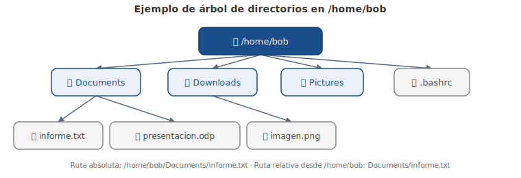

# Capítulo 6: Gestión de Archivos y Directorios

## 6.1 Introducción

Cuando trabajes en un sistema operativo Linux, necesitarás saber cómo manipular los archivos y los directorios. Algunas distribuciones de Linux tienen aplicaciones basadas en GUI que permiten gestionar los archivos, pero es importante saber cómo realizar estas operaciones a través de la línea de comandos.

La línea de comandos dispone de una amplia colección de comandos que permiten administrar los archivos. En este capítulo aprenderás cómo listar los archivos en un directorio, así como cómo copiar, mover y eliminar los archivos.

Los conceptos básicos enseñados en este capítulo se ampliarán en los capítulos posteriores al ir cubriendo más comandos de manipulación de archivos, tales como los comandos para ver archivos, comprimir archivos y establecer permisos de archivo.

«¿Quién más usa Linux en sus productos y servicios?»

## 6.2 Comprender los Archivos y los Directorios

Los **archivos** se utilizan para almacenar datos tales como texto, gráficos y programas. Los **directorios** (también conocidos como «carpetas») se utilizan para proporcionar una estructura de organización jerárquica. Esta estructura es algo diferente a la que puedes estar acostumbrado si previamente trabajaste en los sistemas de Microsoft Windows.

En un sistema Windows, el nivel superior de la estructura de directorios se llama Este Equipo. Cada dispositivo físico (disco duro, unidad de DVD, unidad USB, unidad de red, etc.) aparece en Este Equipo, cada uno asignado a una letra de unidad como `C:` o `D:`.

> Las estructuras de directorio que se muestran a continuación sirven solamente como ejemplos. Estos directorios pueden no estar presentes dentro del entorno de la máquina virtual de este curso.

Igual que Windows, la estructura de directorios de Linux tiene un nivel superior, sin embargo no se llama Este Equipo, sino **directorio raíz** y su símbolo es el carácter `/`. También, en Linux no hay unidades; cada dispositivo físico es accesible bajo un directorio, no una letra de unidad.

La mayoría de los usuarios de Linux denominan esta estructura de directorios el **sistema de archivos**.

Para ver el sistema de archivos raíz, introduce `ls /`:

```bash
sysadmin@localhost:~$ ls /
bin   dev  home  lib    media  opt   root  sbin     selinux  sys  usr
boot  etc  init  lib64  mnt    proc  run   sbin???  srv   tmp  var
```

Observa que hay muchos directorios descriptivos incluyendo `/boot`, que contiene los archivos para arrancar la computadora.

### 6.2.1 El Directorio Path

Usando el gráfico en la sección anterior como un punto de referencia, verás que hay un directorio llamado `sound` bajo el directorio llamado `etc`, que se encuentra bajo el directorio `/`. Una manera más fácil de decir esto es refiriéndose a la **ruta**.

> **Para considerar:** El directorio `/etc` originalmente significaba "etcetera" en la documentación temprana de Bell Labs y solía contener archivos que no pertenecían a ninguna ubicación. En las distribuciones modernas de Linux, el directorio `/etc` por lo general contiene los archivos de configuración estática como lo define el **Estándar de Jerarquía de Archivos** (o «FHS», del inglés «Files Hierarchy Standard»).

Una **ruta de acceso** te permite especificar la ubicación exacta de un directorio. Para el directorio `sound` la ruta de acceso sería `/etc/sound`. El primer carácter `/` representa el directorio root (o «raíz» en español), mientras que cada siguiente carácter `/` se utiliza para separar los nombres de directorio.

Este tipo de ruta se llama la **ruta absoluta** (o «absolute path» en inglés). Con una ruta absoluta, siempre proporcionas direcciones a un directorio (o un archivo) a partir de la parte superior de la estructura de directorios, el directorio root. Más adelante en este capítulo cubriremos un tipo diferente de ruta llamada la **ruta relativa** (o «relative path» en inglés).

### 6.2.2 El Directorio Home

El término **home directory** (o «directorio de inicio» en español) a menudo causa confusión a los usuarios principiantes de Linux. Para empezar, en la mayoría de las distribuciones de Linux hay un directorio llamado `home` bajo el directorio root: `/home`.

Bajo este directorio `/home` hay un directorio para cada usuario del sistema. El nombre del directorio será el mismo que el nombre del usuario, por lo que un usuario llamado «bob» tendría un directorio home llamado `/home/bob`.

Tu directorio home es un directorio muy importante. Para empezar, cuando abres un shell automáticamente te ubicarás en tu directorio home, en donde harás la mayor parte de tu trabajo.

Además, el directorio home es uno de los pocos directorios donde tienes el control total para crear y eliminar los archivos adicionales. La mayor parte de otros directorios en un sistema de archivos de Linux están protegidos con **file permissions** (o «permisos de archivos» en español), un tema que se tratará a detalle en un capítulo posterior.

En la mayoría de las distribuciones de Linux, los únicos usuarios que pueden acceder a los archivos en tu directorio home eres tú y el administrador del sistema (el usuario root). Esto se puede cambiar utilizando los permisos de archivo.

Tu directorio tiene incluso un símbolo especial que puedes usar para representarlo: `~`. Si tu directorio home es `/home/sysadmin`, puedes simplemente introducir `~` en la línea de comandos en lugar de `/home/sysadmin`. También puedes referirte al directorio home de otro usuario usando la notación `~usuario`, donde `usuario` es el nombre de la cuenta de usuario cuyo directorio home quieres consultar. Por ejemplo, `~bob` sería igual a `/home/bob`. Aquí, vamos a cambiar al directorio home del usuario:

```bash
sysadmin@localhost:~$ cd ~
sysadmin@localhost:~$ ls
Desktop  Documents  Downloads  Music  Pictures  Public  Templates
Videos
sysadmin@localhost:~$
```

Ten en cuenta que un listado revela los subdirectorios contenidos en el directorio home. Cambiar directorios requiere atención al detalle:

```bash
sysadmin@localhost:~$ cd downloads
-bash: cd: downloads: No such file or directory
sysadmin@localhost:~$
```

¿Por qué el comando anterior resultó en un error? Eso es porque los entornos de Linux son **sensibles a mayúsculas y minúsculas**. Cambiarnos al directorio `Downloads` requiere que la ortografía sea correcta, incluyendo la letra D mayúscula:

```bash
sysadmin@localhost:~$ cd Downloads
sysadmin@localhost:~/Downloads$
```

### 6.2.3 Directorio Actual

Tu **directorio actual** es el directorio donde estás trabajando actualmente en una terminal. Cuando primero abres una terminal, el directorio actual debe ser tu directorio home, pero esto puede cambiar mientras vas explorando el sistema de archivos y cambias a otros directorios.

Mientras estás en un entorno de línea de comandos, puedes determinar el directorio actual mediante el comando `pwd`:

```bash
sysadmin@localhost:~$ pwd
/home/sysadmin
sysadmin@localhost:~$
```

Adicionalmente, la mayoría de los sistemas tiene un prompt que visualiza el directorio actual del usuario por defecto:

```
[sysadmin@localhost ~]$
```

En el gráfico anterior, el carácter `~` indica el directorio actual. Como se mencionó anteriormente, el carácter `~` representa el directorio home.

Normalmente el sistema sólo muestra el nombre del directorio actual, no la ruta completa del directorio raíz hacia abajo. En otras palabras, si estuvieras en el directorio `/usr/share/doc`, tu prompt probablemente te proporcionará solamente el nombre `doc` como el directorio actual. Si quieres la ruta completa, utiliza el comando `pwd`.

### 6.2.4 Cambio de Directorios

Si te quieres cambiar a un directorio diferente, utiliza el comando `cd` (cambiar directorio). Por ejemplo, el siguiente comando cambiará el directorio actual a un directorio llamado `/etc/sound/events`:

```bash
sysadmin@localhost:~$ cd /etc/sound/events
sysadmin@localhost:/etc/sound/events$
```

Ten en cuenta que no vas a obtener salida si el comando `cd` tiene éxito. Este caso es uno de los de "ninguna noticia es buena noticia". Si tratas de cambiar a un directorio que no existe, recibirás un mensaje de error:

```bash
sysadmin@localhost:/etc/sound/events$ cd /etc/junk
-bash: cd: /etc/junk: No such file or directory
sysadmin@localhost:/etc/sound/events$
```

Si quieres volver a tu directorio home, puedes introducir el comando `cd` sin argumentos o usar el comando `cd` con el carácter `~` como argumento:

```bash
sysadmin@localhost:/etc/sound/events$ cd
sysadmin@localhost:~$ pwd
/home/sysadmin
sysadmin@localhost:~$ cd /etc
sysadmin@localhost:/etc$ cd ~
sysadmin@localhost:~$ pwd
/home/sysadmin
sysadmin@localhost:~$
```

### 6.2.5 Nombres de Ruta Absoluta versus Relativa

Hay que recordar que una ruta de acceso es esencialmente una descripción de la ubicación de un archivo o un directorio en el sistema de archivos. Una ruta de acceso también se puede entender como las direcciones que indican al sistema dónde se encuentra un archivo o un directorio. Por ejemplo, el comando `cd /etc/perl/Net` significa "cambiar al directorio Net, que encontrarás bajo el directorio perl, que encontrarás bajo el directorio etc, que encontrarás bajo el directorio /".

Cuando das un nombre de ruta que comienza en el directorio raíz, se llama **ruta absoluta**. En muchos casos, proporcionar una ruta de acceso absoluta tiene sentido. Por ejemplo, si estás en tu directorio home y quieres ir al directorio `/etc/perl/Net`, entonces proporcionar una ruta de acceso absoluta al comando `cd` tiene sentido:

```bash
sysadmin@localhost:~$ cd /etc/perl/Net
sysadmin@localhost:/etc/perl/Net$
```

Sin embargo, ¿qué pasa si estás en el directorio `/etc/perl` y quieres ir al directorio `/etc/perl/Net`? Sería tedioso introducir la ruta completa para llegar a un directorio que es sólo un nivel más abajo de tu ubicación actual. En una situación como ésta, vas a utilizar una **ruta relativa**:

```bash
sysadmin@localhost:/etc/perl$ cd Net
sysadmin@localhost:/etc/perl/Net$
```

Una ruta de acceso relativa proporciona direcciones usando tu ubicación actual como un punto de referencia. Recuerda que esto es diferente de las rutas absolutas, que siempre requieren que utilices el directorio raíz como punto de referencia.

Existe una técnica útil de ruta de acceso relativa que se puede utilizar para subir un nivel en la estructura de directorios: el directorio `..`. Sin importar en qué directorio estás, `..` siempre representa un directorio arriba del directorio actual (con la excepción de cuando estás en el directorio `/`):

```bash
sysadmin@localhost:/etc/perl/Net$ pwd
/etc/perl/Net
sysadmin@localhost:/etc/perl/Net$ cd ..
sysadmin@localhost:/etc/perl$ pwd
/etc/perl
sysadmin@localhost:/etc/perl$
```

A veces usar las rutas de acceso relativas es una mejor opción que rutas de acceso absolutas, sin embargo esto no siempre es el caso. ¿Qué pasa si estás en el directorio `/etc/perl/Net` y quieres ir al directorio `/usr/share/doc`? Utilizando una ruta absoluta, se ejecutaría el comando `cd /usr/share/doc`. Utilizando una ruta relativa, se ejecutaría el comando `cd ../../../usr/share/doc`:

```bash
sysadmin@localhost:/etc/perl/Net$ cd
sysadmin@localhost:~$ cd /etc/perl/Net
sysadmin@localhost:/etc/perl/Net$ cd ../../../usr/share/doc
sysadmin@localhost:/usr/share/doc$ pwd
/usr/share/doc
sysadmin@localhost:/usr/share/doc$
```

> **Nota:** Las rutas relativas y absolutas no sólo sirven para el comando `cd`. Siempre que especificas un archivo o un directorio, puedes utilizar las rutas de acceso relativas o absolutas.

Mientras que el doble punto (`..`) se utiliza para referirse al directorio arriba del directorio actual, el punto solo (`.`) se usa para referirse al directorio actual. No tendría sentido para un administrador moverse al directorio actual introduciendo `cd .` (aunque en realidad funciona). Es más útil referirse a un elemento en el directorio actual usando la notación `./`. Por ejemplo:

```bash
sysadmin@localhost:~$ pwd
/home/sysadmin
sysadmin@localhost:~$ cd ./Downloads/
sysadmin@localhost:~/Downloads$ pwd
/home/sysadmin/Downloads
sysadmin@localhost:~/Downloads$ cd ..
sysadmin@localhost:~$ pwd
/home/sysadmin
sysadmin@localhost:~$
```

> **Nota:** Este uso del punto solo (`.`), como punto de referencia, no se debe confundir con su uso al principio de un nombre de archivo. Leer más sobre los archivos ocultos en la sección 6.3.2.

<figure>

<figcaption>Ejemplo de árbol de directorios y su relación con las rutas absolutas y relativas.</figcaption>
</figure>

## 6.3 Listado de los Archivos en un Directorio

Ahora que te puedes mover de un directorio a otro, querrás visualizar el contenido de estos directorios. El comando `ls` (abreviatura de "listar") puede utilizarse para mostrar el contenido de un directorio, así como toda la información sobre los archivos que están dentro de un directorio.

Por sí mismo, el comando `ls` listará los archivos en el directorio actual:

```bash
sysadmin@localhost:~$ ls
Desktop  Documents  Downloads  Music  Pictures  Public  Templates
Videos
sysadmin@localhost:~$
```

### 6.3.1 Lista de Colores

Hay muchos tipos de archivos en Linux. Según vayas aprendiendo más sobre Linux, descubrirás muchos de estos tipos. A continuación tenemos un breve resumen de algunos de los tipos de archivo más comunes:

| Tipo | Descripción |
|---|---|
| **plain file** (archivo simple) | Un archivo que no es un tipo de archivo especial; también se llama un archivo normal. |
| **directory** (directorio) | Un directorio de archivos (contiene otros archivos). |
| **executable** (ejecutable) | Un archivo que se puede ejecutar como un programa. |
| **symbolic link** (enlace simbólico) | Un archivo que apunta a otro archivo. |

En muchas distribuciones de Linux, las cuentas de usuario regulares son modificadas de tal manera que el comando `ls` muestre los nombres de archivo codificados por colores según el tipo de archivo. Por ejemplo, los directorios pueden aparecer en azul, archivos ejecutables pueden verse en verde, y enlaces simbólicos pueden ser visualizados en cian (azul claro).

Esto no es un comportamiento normal del comando `ls`, sino algo que sucede cuando se utiliza la opción `--color` para el comando `ls`. La razón por la que el comando `ls` parece realizar automáticamente estos colores es que hay un **alias** para el comando `ls` para que se ejecute con la opción `--color`:

```bash
sysadmin@localhost:~$ alias
alias egrep='egrep --color=auto'
alias fgrep='fgrep --color=auto'
alias grep='grep --color=auto'
alias l='ls -CF'
alias la='ls -A'
alias ll='ls -alF'
alias ls='ls --color=auto'
sysadmin@localhost:~$
```

Como puedes ver en la salida anterior, cuando se ejecuta el comando `ls`, en realidad se ejecuta el comando `ls --color=auto`.

En algunos casos, puede que no quieras ver todos los colores (a veces te pueden distraer un poco). Para evitar el uso de los alias, coloca un carácter de barra invertida `\` antes de tu comando:

```bash
sysadmin@localhost:~$ ls
Desktop  Documents  Downloads  Music  Pictures  Public  Templates
Videos
sysadmin@localhost:~$ \ls
Desktop  Documents  Downloads  Music  Pictures  Public  Templates
Videos
sysadmin@localhost:~$
```

### 6.3.2 Lista de los Archivos Ocultos

Cuando utilizas el comando `ls` para mostrar el contenido de un directorio, no todos los archivos se muestran automáticamente. El comando `ls` no muestra los **archivos ocultos** de manera predeterminada. Un archivo oculto es cualquier archivo (o directorio) que comienza con un punto `.`.

Para mostrar todos los archivos, incluyendo los archivos ocultos, utiliza la opción `-a` para el comando `ls`:

```bash
sysadmin@localhost:~$ ls -a
.             .bashrc   .selected_editor  Downloads  Public
..            .cache    Desktop           Music      Templates
.bash_logout  .profile  Documents         Pictures   Videos
```

¿Por qué los archivos están ocultos en primer lugar? La mayoría de los archivos ocultos son archivos de personalización, diseñados para personalizar la forma en la que Linux, el shell o los programas funcionan. Por ejemplo, el archivo `.bashrc` en tu directorio home personaliza las características del shell, tales como la creación o modificación de las variables y los alias.

Estos archivos de personalización no son con los que regularmente trabajas. Hay muchos de ellos, como puedes ver, y visualizarlos hará más difícil encontrar los archivos con los que regularmente trabajas. Así que, el hecho de que estén ocultos es para tu beneficio.

### 6.3.3 Listado con Visualización Larga

Existe información sobre cada archivo, llamada **metadata** (o «metadatos» en español), y visualizarla a veces resulta útil. Esto puede incluir datos de quién es el dueño de un archivo, el tamaño de un archivo y la última vez que se modificó el contenido de un archivo. Puedes visualizar esta información mediante el uso de la opción `-l` para el comando `ls`:

```bash
sysadmin@localhost:~$ ls -l
total 0
drwxr-xr-x 1 sysadmin sysadmin 0 Jan 29  2015 Desktop
drwxr-xr-x 1 sysadmin sysadmin 0 Jan 29  2015 Documents
drwxr-xr-x 1 sysadmin sysadmin 0 Jan 29  2015 Downloads
drwxr-xr-x 1 sysadmin sysadmin 0 Jan 29  2015 Music
drwxr-xr-x 1 sysadmin sysadmin 0 Jan 29  2015 Pictures
drwxr-xr-x 1 sysadmin sysadmin 0 Jan 29  2015 Public
drwxr-xr-x 1 sysadmin sysadmin 0 Jan 29  2015 Templates
drwxr-xr-x 1 sysadmin sysadmin 0 Jan 29  2015 Videos
sysadmin@localhost:~$
```

En la salida anterior, cada línea describe metadatos sobre un solo archivo. A continuación se describe cada uno de los campos de datos que verás en la salida del comando `ls -l`:

- **Tipo de archivo**: el primer carácter de cada línea de salida indica el tipo de archivo. Tipos de archivo comunes incluyen `d` = directorio, `-` = archivo simple, `l` = enlace simbólico.
- **Permisos**: los próximos diez caracteres demuestran los permisos del archivo. Los permisos se utilizan para determinar quién tiene acceso al archivo. Esto será cubierto a detalle en un capítulo posterior.
- **Conteo de enlaces físicos**: demuestra cuántos enlaces físicos hacia este archivo existen. Los enlaces son más que nada un tema de administrador por lo que no son cubiertos en este curso.
- **Usuario propietario**: cada archivo es propiedad de una cuenta de usuario. Esto es importante porque el propietario tiene los derechos para establecer permisos en un archivo y el propietario tiene sus propios permisos en el archivo.
- **Grupo propietario**: cada archivo es propiedad de un grupo. Esto es importante porque cualquier miembro de este grupo tendrá acceso especial al archivo basado en los permisos de grupo del archivo.
- **Tamaño de archivo**: describe el tamaño de un archivo en bytes. Nota: en el caso de los directorios, este valor no describe el tamaño total del directorio, más bien cuántos bytes están reservados para mantenerse al corriente con los nombres de archivo en el directorio (ignora este campo en los directorios).
- **Hora de modificación**: indica la última hora en la que el contenido del archivo fue modificado. En el caso de los directorios, indica la última vez que se agregó o eliminó un archivo dentro del directorio.
- **Nombre**: el último campo es el nombre del archivo o directorio.

#### 6.3.3.1 Tamaños Legibles

Cuando visualizas los tamaños de los archivos con la opción `-l` del comando `ls` obtienes los tamaños de los archivos en bytes. Para archivos de texto, un byte es 1 carácter.

Para archivos más pequeños, los tamaños en bytes están bien. Sin embargo, para los archivos más grandes es difícil comprender qué tan grande es el archivo. Por ejemplo, considera la salida del siguiente comando:

```bash
sysadmin@localhost:~$ ls -l /usr/bin/omshell
-rwxr-xr-c 1 root root 1561400 Oct 9 2012 /usr/bin/omshell
sysadmin@localhost:~$
```

Como puedes ver, es difícil determinar el tamaño del archivo en bytes. ¿Un archivo de 1561400 es grande o pequeño? Parece bastante grande, pero es difícil de determinar su tamaño utilizando los bytes.

Piénsalo de esta manera: si alguien diera la distancia entre Boston y Nueva York utilizando centímetros, ese valor esencialmente no tendría sentido porque una distancia como ésta la piensas en términos de kilómetros.

Sería mejor si el tamaño del archivo fuese presentado en un tamaño más fácilmente legible, tal como megabytes o gigabytes. Para lograr esto, añade la opción `-h` al comando `ls`:

```bash
sysadmin@localhost:~$ ls -lh /usr/bin/omshell
-rwxr-xr-c 1 root root 1.5M Oct 9 2012 /usr/bin/omshell
sysadmin@localhost:~$
```

> **Importante:** Debes utilizar la opción `-h` junto con la opción `-l`.

### 6.3.4 Lista de Directorios

Cuando se utiliza el comando `ls -d`, se refiere al directorio actual y no al contenido dentro de él. Sin otras opciones, es algo sin sentido, aunque es importante tener en cuenta que al directorio actual siempre se refiere con un solo punto (`.`):

```bash
sysadmin@localhost:~$ ls -d
.
```

Para utilizar el comando `ls -d` de una manera significativa tienes que añadir la opción `-l`. En este caso, ten en cuenta que el primer comando muestra los detalles de los contenidos en el directorio `/home/sysadmin`, mientras que el segundo lista el directorio `/home/sysadmin`.

```bash
sysadmin@localhost:~$ ls -l
total 0
drwxr-xr-x 1 sysadmin sysadmin   0 Apr 15  2015 Desktop
drwxr-xr-x 1 sysadmin sysadmin   0 Apr 15  2015 Documents
drwxr-xr-x 1 sysadmin sysadmin   0 Apr 15  2015 Downloads
drwxr-xr-x 1 sysadmin sysadmin   0 Apr 15  2015 Music
drwxr-xr-x 1 sysadmin sysadmin   0 Apr 15  2015 Pictures
drwxr-xr-x 1 sysadmin sysadmin   0 Apr 15  2015 Public
drwxr-xr-x 1 sysadmin sysadmin   0 Apr 15  2015 Templates
drwxr-xr-x 1 sysadmin sysadmin   0 Apr 15  2015 Videos
drwxr-xr-x 1 sysadmin sysadmin 420 Apr 15  2015 test
sysadmin@localhost:~$ ls -ld
drwxr-xr-x 1 sysadmin sysadmin 224 Nov  7 17:07 .
sysadmin@localhost:~$
```

Observa el punto solo al final de la segunda lista larga. Esto indica que el directorio actual está en la lista y no el contenido.

### 6.3.5 Listado Recursivo

Habrá momentos cuando quieras visualizar todos los archivos en un directorio, así como todos los archivos en todos los subdirectorios bajo un directorio. Esto se llama **listado recursivo**.

Para realizar un listado recursivo, utiliza la opción `-R` para el comando `ls`:

> **Nota:** La salida que se muestra a continuación variará de los resultados que verás si ejecutas el comando en el entorno de la máquina virtual de este curso.

```bash
sysadmin@localhost:~$ ls -R /etc/ppp
/etc/ppp:
chap-secrets   ip-down.ipv6to4    ip-up.ipv6to4    ipv6-up    pap-secrets
ip-down        ip-up              ipv6-down        options    peers

/etc/ppp/peers:
sysadmin@localhost:~$
```

Ten en cuenta que en el ejemplo anterior, los archivos en el directorio `/etc/ppp` se listaron primero. Después de eso, se listan los archivos en el directorio `/etc/ppp/peers` (no hubo ningún archivo en este caso, pero si hubiera encontrado cualquier archivo en este directorio, se habría visualizado).

Ten cuidado con esta opción; por ejemplo, ejecutando el comando `ls -R /` se listarían todos los archivos del sistema de archivos, incluyendo todos los archivos de cualquier dispositivo USB y DVD en el sistema. Limita el uso de la opción `-R` para estructuras de directorio más pequeñas.

### 6.3.6 Ordenar un Listado

De forma predeterminada, el comando `ls` ordena los archivos alfabéticamente por nombre de archivo. A veces, puede ser útil ordenar los archivos utilizando diferentes criterios.

Para ordenar los archivos por tamaño, podemos utilizar la opción `-S`. Observa la diferencia en la salida de los dos siguientes comandos:

```bash
sysadmin@localhost:~$ ls /etc/ssh
moduli           ssh_host_dsa_key.pub    ssh_host_rsa_key     sshd_confi
ssh_config        ssh_host_ecdsa_key      ssh_host_rsa_key.pub
ssh_host_dsa_key  ssh_host_ecdsa_key.pub  ssh_import_id
sysadmin@localhost:~$ ls -S /etc/ssh
moduli            ssh_host_dsa_key      ssh_host_ecdsa_key
sshd_config       ssh_host_dsa_key.pub  ssh_host_ecdsa_key.pub
ssh_host_rsa_key  ssh_host_rsa_key.pub
ssh_config        ssh_import_id
sysadmin@localhost:~$
```

Aparecen los mismos archivos y directorios, pero en un orden diferente. Mientras que la opción `-S` trabaja por sí misma, realmente no puedes decir que la salida está ordenada por tamaño, por lo que es más útil cuando se utiliza con la opción `-l`. El siguiente comando listará los archivos del mayor al menor y mostrará el tamaño real del archivo.

```bash
sysadmin@localhost:~$ ls -lS /etc/ssh
total 160
-rw-r--r-- 1 root root 125749 Apr 29  2014 moduli
-rw-r--r-- 1 root root   2489 Jan 29  2015 sshd_config
-rw------- 1 root root   1675 Jan 29  2015 ssh_host_rsa_key
-rw-r--r-- 1 root root   1669 Apr 29  2014 ssh_config
-rw------- 1 root root    668 Jan 29  2015 ssh_host_dsa_key
-rw-r--r-- 1 root root    607 Jan 29  2015 ssh_host_dsa_key.pub
-rw-r--r-- 1 root root    399 Jan 29  2015 ssh_host_rsa_key.pub
-rw-r--r-- 1 root root    302 Jan 10  2011 ssh_import_id
-rw------- 1 root root    227 Jan 29  2015 ssh_host_ecdsa_key
-rw-r--r-- 1 root root    179 Jan 29  2015 ssh_host_ecdsa_key.pub
sysadmin@localhost:~$
```

También puede ser útil usar la opción `-h` para mostrar los tamaños de los archivos de una manera legible:

```bash
sysadmin@localhost:~$ ls -lSh /etc/ssh
total 160K
-rw-r--r-- 1 root root 123K Apr 29  2014 moduli
-rw-r--r-- 1 root root 2.5K Jan 29  2015 sshd_config
-rw------- 1 root root 1.7K Jan 29  2015 ssh_host_rsa_key
-rw-r--r-- 1 root root 1.7K Apr 29  2014 ssh_config
-rw------- 1 root root  668 Jan 29  2015 ssh_host_dsa_key
-rw-r--r-- 1 root root  607 Jan 29  2015 ssh_host_dsa_key.pub
-rw-r--r-- 1 root root  399 Jan 29  2015 ssh_host_rsa_key.pub
-rw-r--r-- 1 root root  302 Jan 10  2011 ssh_import_id
-rw------- 1 root root  227 Jan 29  2015 ssh_host_ecdsa_key
-rw-r--r-- 1 root root  179 Jan 29  2015 ssh_host_ecdsa_key.pub
sysadmin@localhost:~$
```

También es posible ordenar los archivos según el momento en que se modificaron. Puedes hacer esto mediante la opción `-t`.

La opción `-t` listará los archivos modificados más recientemente en primer lugar. Esta opción puede utilizarse sola, pero otra vez, es generalmente más útil cuando se combina con la opción `-l`:

```bash
sysadmin@localhost:~$ ls -tl /etc/ssh
total 160
-rw------- 1 root root    668 Jan 29  2015 ssh_host_dsa_key
-rw-r--r-- 1 root root    607 Jan 29  2015 ssh_host_dsa_key.pub
-rw------- 1 root root    227 Jan 29  2015 ssh_host_ecdsa_key
-rw-r--r-- 1 root root    179 Jan 29  2015 ssh_host_ecdsa_key.pub
-rw------- 1 root root   1675 Jan 29  2015 ssh_host_rsa_key
-rw-r--r-- 1 root root    399 Jan 29  2015 ssh_host_rsa_key.pub
-rw-r--r-- 1 root root   2489 Jan 29  2015 sshd_config
-rw-r--r-- 1 root root 125749 Apr 29  2014 moduli
-rw-r--r-- 1 root root   1669 Apr 29  2014 ssh_config
-rw-r--r-- 1 root root    302 Jan 10  2011 ssh_import_id
sysadmin@localhost:~$
```

Es importante recordar que la fecha de modificación de los directorios representa la última vez que un archivo se agregó o se eliminó del directorio.

Si los archivos en un directorio se modificaron hace muchos días o meses, puede ser más difícil decir exactamente cuándo fueron modificados, ya que para los archivos más antiguos sólo se proporciona la fecha. Para una información más detallada de la hora de modificación puedes utilizar la opción `--full-time` que visualiza la fecha y la hora completas (incluyendo horas, minutos, segundos...):

```bash
sysadmin@localhost:~$ ls -t --full-time /etc/ssh
total 160
-rw------- 1 root root    668 2015-01-29 03:17:33.000000000 +0000 ssh_host_dsa_key
-rw-r--r-- 1 root root    607 2015-01-29 03:17:33.000000000 +0000 ssh_host_dsa_key.pub
-rw------- 1 root root    227 2015-01-29 03:17:33.000000000 +0000 ssh_host_ecdsa_key
-rw-r--r-- 1 root root    179 2015-01-29 03:17:33.000000000 +0000 ssh_host_ecdsa_key.pub
-rw------- 1 root root   1675 2015-01-29 03:17:33.000000000 +0000 ssh_host_rsa_key
-rw-r--r-- 1 root root    399 2015-01-29 03:17:33.000000000 +0000 ssh_host_rsa_key.pub
-rw-r--r-- 1 root root   2489 2015-01-29 03:17:33.000000000 +0000 sshd_config
-rw-r--r-- 1 root root 125749 2014-04-29 23:58:51.000000000 +0000 moduli
-rw-r--r-- 1 root root   1669 2014-04-29 23:58:51.000000000 +0000 ssh_config
-rw-r--r-- 1 root root    302 2011-01-10 18:48:29.000000000 +0000 ssh_import_id
sysadmin@localhost:~$
```

La opción `--full-time` asumirá automáticamente la opción `-l`.

Es posible realizar una ordenación inversa con las opciones `-S` o `-t` mediante la opción `-r`. El siguiente comando ordena los archivos por tamaño, de menor a mayor:

```bash
sysadmin@localhost:~$ ls -lrS /etc/ssh
total 160
-rw-r--r-- 1 root root    179 Jan 29  2015 ssh_host_ecdsa_key.pub
-rw------- 1 root root    227 Jan 29  2015 ssh_host_ecdsa_key
-rw-r--r-- 1 root root    302 Jan 10  2011 ssh_import_id
-rw-r--r-- 1 root root    399 Jan 29  2015 ssh_host_rsa_key.pub
-rw-r--r-- 1 root root    607 Jan 29  2015 ssh_host_dsa_key.pub
-rw------- 1 root root    668 Jan 29  2015 ssh_host_dsa_key
-rw-r--r-- 1 root root   1669 Apr 29  2014 ssh_config
-rw------- 1 root root   1675 Jan 29  2015 ssh_host_rsa_key
-rw-r--r-- 1 root root   2489 Jan 29  2015 sshd_config
-rw-r--r-- 1 root root 125749 Apr 29  2014 moduli
sysadmin@localhost:~$
```

El siguiente comando listará los archivos por fecha de modificación, de la más antigua a la más reciente:

```bash
sysadmin@localhost:~$ ls -lrt /etc/ssh
total 160
-rw-r--r-- 1 root root    302 Jan 10  2011 ssh_import_id
-rw-r--r-- 1 root root   1669 Apr 29  2014 ssh_config
-rw-r--r-- 1 root root 125749 Apr 29  2014 moduli
-rw-r--r-- 1 root root   2489 Jan 29  2015 sshd_config
-rw-r--r-- 1 root root    399 Jan 29  2015 ssh_host_rsa_key.pub
-rw------- 1 root root   1675 Jan 29  2015 ssh_host_rsa_key
-rw-r--r-- 1 root root    179 Jan 29  2015 ssh_host_ecdsa_key.pub
-rw------- 1 root root    227 Jan 29  2015 ssh_host_ecdsa_key
-rw-r--r-- 1 root root    607 Jan 29  2015 ssh_host_dsa_key.pub
-rw------- 1 root root    668 Jan 29  2015 ssh_host_dsa_key
sysadmin@localhost:~$
```

### 6.3.7 Listado con Globs

En un capítulo anterior, vimos el uso de los **globs** para los archivos, para buscar coincidencias de los nombres de archivo utilizando los caracteres comodín. Por ejemplo, hemos visto que puedes listar todos los archivos en el directorio `/etc` que comienzan con la letra `e` utilizando el siguiente comando:

```bash
sysadmin@localhost:~$ echo /etc/e*
/etc/encript.cfg /etc/environment /etc/ethers /etc/event.d /etc/exports
sysadmin@localhost:~$
```

Ahora que sabes que el comando `ls` se utiliza normalmente para listar los archivos en un directorio, el uso del comando `echo` puede parecer una elección extraña. Sin embargo, hay algo sobre el comando `ls` que pudo haber causado confusión mientras hablamos sobre los globs. Esta «función» también puede causar problemas cuando intentas listar los archivos utilizando los patrones glob.

Ten en cuenta que es el **shell**, no los comandos `echo` o `ls`, el que expande el patrón glob a los nombres de archivo correspondientes. En otras palabras, cuando introduces el comando `echo /etc/e*`, lo que el shell hizo antes de ejecutar el comando `echo` fue reemplazar `e*` por todos los archivos y directorios dentro del directorio `/etc` que coinciden con el patrón.

Por lo tanto, si ejecutaras el comando `ls /etc/e*`, lo que el shell realmente haría sería lo siguiente:

```bash
ls /etc/encript.cfg /etc/environment /etc/ethers /etc/event.d /etc/exports
```

Cuando el comando `ls` ve varios argumentos, realiza una operación de listado en cada elemento por separado. En otras palabras, el comando `ls /etc/encript.cfg /etc/environment` es esencialmente igual a `ls /etc/encript.cfg; ls /etc/environment`.

Ahora considera lo que sucede cuando se ejecuta el comando `ls` en un archivo, tal como `encript.cfg`:

```bash
sysadmin@localhost:~$ ls /etc/enscript.cfg
/etc/enscript.cfg
sysadmin@localhost:~$
```

Como puedes ver, ejecutando el comando `ls` en un solo archivo se imprime el nombre del archivo. Generalmente esto es útil si quieres ver los detalles acerca de un archivo mediante la opción `-l` del comando `ls`:

```bash
sysadmin@localhost:~$ ls -l /etc/enscript.cfg
-r--r--r--. 1 root root 4843 Nov 11 2010 /etc/enscript.cfg
sysadmin@localhost:~$
```

Sin embargo, ¿qué ocurre si el comando `ls` recibe un nombre de directorio como argumento? En este caso, la salida del comando es diferente a que si el argumento es un nombre de archivo:

```bash
sysadmin@localhost:~$ ls /etc/event.d
ck-log-system-restart  ck-log-system-start  ck-log-system-stop
sysadmin@localhost:~$
```

Si proporcionas un nombre de directorio como argumento del comando `ls`, el comando mostrará el contenido del directorio (los nombres de los archivos en el directorio), y no sólo proporcionará el nombre del directorio. Los nombres de los archivos que se ven en el ejemplo anterior son los nombres de los archivos en el directorio `/etc/event.d`.

¿Por qué esto es un problema al utilizar los globs? Considera el siguiente resultado:

```bash
sysadmin@localhost:~$ ls /etc/e*
/etc/encript.cfg /etc/environment /etc/ethers /etc/event.d /etc/exports

/etc/event.d:
ck-log-system-restart  ck-log-system-start  ck-log-system-stop
sysadmin@localhost:~$
```

Como puedes ver, cuando el comando `ls` ve un nombre de archivo como argumento, sólo muestra el nombre del archivo. Sin embargo, para cualquier directorio, mostrará el contenido del directorio, y no sólo el nombre del directorio.

Esto se vuelve aún más confuso en una situación como la siguiente:

```bash
sysadmin@localhost:~$ ls /etc/ev*
ck-log-system-restart  ck-log-system-start  ck-log-system-stop
sysadmin@localhost:~$
```

En el ejemplo anterior, parece que el comando `ls` es simplemente incorrecto. Pero lo que realmente sucedió es que lo único que coincide con el glob `/etc/ev*` es el directorio `/etc/event.d`. Por lo tanto, el comando `ls` muestra sólo los archivos en ese directorio.

Hay una solución simple a este problema: al utilizar los argumentos glob con el comando `ls`, utiliza siempre la opción `-d`. Cuando utilizas la opción `-d`, el comando `ls` no muestra el contenido de un directorio, sino más bien el nombre del directorio:

```bash
sysadmin@localhost:~$ ls -d /etc/e*
/etc/encript.cfg /etc/environment /etc/ethers /etc/event.d /etc/exports
sysadmin@localhost:~$
```

## 6.4 Copiar los Archivos

El comando `cp` se utiliza para copiar los archivos. Requiere especificar un origen y un destino. La estructura del comando es la siguiente:

```bash
cp [fuente] [destino]
```

La **fuente** («source» en inglés) es el archivo que quieres copiar. El **destino** («destination» en inglés) es la ubicación en donde quieres poner la copia. Cuando el comando es exitoso, el comando `cp` no tendrá ninguna salida (ninguna noticia es buena noticia). El siguiente comando copiará el archivo `/etc/hosts` a tu directorio home:

```bash
sysadmin@localhost:~$ cp /etc/hosts ~
sysadmin@localhost:~$ ls
Desktop    Downloads  Pictures  Templates  hosts
Documents  Music      Public    Videos
sysadmin@localhost:~$
```

Recuerda: el carácter `~` representa el directorio home.

### 6.4.1 El Modo Verbose

La opción `-v` hará que el comando `cp` produzca la salida en caso de ser exitoso. La opción `-v` se refiere al modo **verbose**:

```bash
sysadmin@localhost:~$ cp -v /etc/hosts ~
`/etc/hosts' -> `/home/sysadmin/hosts'
sysadmin@localhost:~$
```

Cuando el destino es un directorio, el nuevo archivo resultante tendrá el mismo nombre que el archivo original. Si quieres que el nuevo archivo tenga un nombre diferente, debes proporcionar el nuevo nombre como parte del destino:

```bash
sysadmin@localhost:~$ cp /etc/hosts ~/hosts.copy
sysadmin@localhost:~$ ls
Desktop    Downloads  Pictures  Templates  hosts
Documents  Music      Public    Videos     hosts.copy
sysadmin@localhost:~$
```

### 6.4.2 Evitar Sobrescribir los Datos

El comando `cp` puede ser destructivo para los datos si el archivo de destino ya existe. En el caso donde el archivo de destino existe, el comando `cp` sobreescribe el contenido del archivo existente con el contenido del archivo fuente. Para ilustrar este problema, primero se crea un nuevo archivo en el directorio home de sysadmin copiando un archivo existente:

```bash
sysadmin@localhost:~$ cp /etc/skel/.bash_logout ~/example.txt
sysadmin@localhost:~$
```

Visualiza la salida del comando `ls` para ver el archivo y visualiza el contenido del archivo utilizando el comando `more`:

```bash
sysadmin@localhost:~$ cp /etc/skel/.bash_logout ~/example.txt
sysadmin@localhost:~$ ls -l example.txt
-rw-rw-r--. 1 sysadmin sysadmin 18 Sep 21 15:56 example.txt
sysadmin@localhost:~$ more example.txt
# ~/.bash_logout: executed by bash(1) when login shell exits.

sysadmin@localhost:~$ cp -i /etc/hosts ~/example.txt
cp: overwrite `/home/sysadmin/example.txt'? n
sysadmin@localhost:~$ ls -l example.txt
-rw-rw-r--. 1 sysadmin sysadmin 18 Sep 21 15:56 example.txt
sysadmin@localhost:~$ more example.txt
# ~/.bash_logout: executed by bash(1) when login shell exits.

sysadmin@localhost:~$
```

En el siguiente ejemplo verás que el comando `cp` destruye el contenido original del archivo `example.txt`. Observa que una vez finalizado el comando `cp`, el tamaño del archivo es diferente (158 bytes en lugar de 18) del original y los contenidos también son diferentes:

```bash
sysadmin@localhost:~$ cp /etc/hosts ~/example.txt
sysadmin@localhost:~$ ls -l example.txt
-rw-rw-r--. 1 sysadmin sysadmin 158 Sep 21 14:11 example.txt
sysadmin@localhost:~$ cat example.txt
127.0.0.1  localhost localhost.localdomain localhost4 localhost4.localdomain4
::1        localhost localhost.localdomain localhost6 localhost6.localdomain6
sysadmin@localhost:~$
```

Hay dos opciones que pueden utilizarse para asegurarnos contra sobreescrituras accidentales de los archivos. Con la opción `-i` (interactivo), el comando `cp` emitirá un prompt antes de sobrescribir un archivo. El siguiente ejemplo demostrará esta opción, primero restaurando el contenido del archivo original:

```bash
sysadmin@localhost:~$ cp /etc/skel/.bash_logout ~/example.txt
sysadmin@localhost:~$ ls -l example.txt
-rw-r--r-- 1 sysadmin sysadmin 18 Sep 21 15:56 example.txt
sysadmin@localhost:~$ more example.txt
# ~/.bash_logout: executed by bash(1) when login shell exits.

sysadmin@localhost:~$ cp -i /etc/hosts ~/example.txt
cp: overwrite `/home/sysadmin/example.txt'? n
sysadmin@localhost:~$ ls -l example.txt
-rw-r--r-- 1 sysadmin sysadmin 18 Sep  21 15:56 example.txt
sysadmin@localhost:~$ more example.txt
# ~/.bash_logout: executed by bash(1) when login shell exits.

sysadmin@localhost:~$
```

Observa que puesto que el valor de `n` (no) se dio al emitir un prompt de sobrescritura del archivo, no se hicieron cambios en el archivo. Si se da un valor de `y` (sí), entonces resultará en un proceso de copiado.

La opción `-i` requiere respuesta `y` o `n` para cada copia que podría sobrescribir el contenido de un archivo existente. Esto puede ser tedioso cuando se sobrescribe un grupo, como se muestra en el siguiente ejemplo:

```bash
sysadmin@localhost:~$ cp -i /etc/skel/.* ~
cp: omitting directory `/etc/skel/.'
cp: omitting directory `/etc/skel/..'
cp: overwrite `/home/sysadmin/.bash_logout'? n
cp: overwrite `/home/sysadmin/.bashrc'? n
cp: overwrite `/home/sysadmin/.profile'? n
cp: overwrite `/home/sysadmin/.selected_editor'? n
sysadmin@localhost:~$
```

Como puedes ver en el ejemplo anterior, el comando `cp` intentó sobrescribir los cuatro archivos existentes, obligando al usuario a responder a cuatro prompts. Si esta situación ocurriera para 100 archivos, puede resultar muy molesto rápidamente.

Si quieres contestar automáticamente `n` para cada prompt, utiliza la opción `-n`. En esencia, significa «sin sobreescribir».

### 6.4.3 Copiar los Directorios

En un ejemplo anterior se dieron mensajes de error cuando el comando `cp` intentó copiar los directorios:

```bash
sysadmin@localhost:~$ cp -i /etc/skel/.* ~
cp: omitting directory `/etc/skel/.'
cp: omitting directory `/etc/skel/..'
cp: overwrite `/home/sysadmin/.bash_logout'? n
cp: overwrite `/home/sysadmin/.bashrc'? n
cp: overwrite `/home/sysadmin/.profile'? n
cp: overwrite `/home/sysadmin/.selected_editor'? n
sysadmin@localhost:~$
```

Donde la salida dice `...omitting directory...` (o «omitiendo directorio» en español), el comando `cp` está diciendo que no puede copiar este elemento porque el comando no copia los directorios por defecto. Sin embargo, la opción `-r` del comando `cp` copiará tanto los archivos como los directorios.

Ten cuidado con esta opción: se copiará la estructura completa del directorio. ¡Esto podría resultar en copiar muchos archivos y directorios!

## 6.5 Mover los Archivos

Para mover un archivo, utiliza el comando `mv`. La sintaxis del comando `mv` es muy parecida a la del comando `cp`:

```bash
mv [fuente] [destino]
```

En el ejemplo siguiente, el archivo `hosts` que se generó anteriormente se mueve desde el directorio actual al directorio `Videos`:

```bash
sysadmin@localhost:~$ ls
Desktop    Downloads  Pictures  Templates  example.txt  hosts.copy
Documents  Music      Public    Videos     hosts
sysadmin@localhost:~$ mv hosts Videos
sysadmin@localhost:~$ ls
Desktop    Downloads  Pictures  Templates  example.txt
Documents  Music      Public    Videos     hosts.copy
sysadmin@localhost:~$ ls Videos
hosts
sysadmin@localhost:~$
```

Cuando se mueve un archivo, el archivo se elimina de la ubicación original y se coloca en una ubicación nueva. Esto puede ser algo complicado en Linux porque los usuarios necesitan permisos específicos para quitar archivos de un directorio. Si no tienes los permisos correctos, recibirás un mensaje de error «Permission denied» (o «Permiso denegado» en español):

```bash
sysadmin@localhost:~$ mv /etc/hosts .
mv: cannot move `/etc/hosts' to `./hosts': Permission denied
sysadmin@localhost:~$
```

En un capítulo posterior se ofrece una descripción detallada de los permisos.

## 6.6 Mover los Archivos Mientras se Cambia el Nombre

Si el destino del comando `mv` es un directorio, el archivo se moverá al directorio especificado. El nombre del archivo cambiará sólo si también se especifica un nombre de archivo destino.

Si no se especifica un directorio destino, el archivo será renombrado con el nombre de archivo destino y permanecerá en el directorio origen.

```bash
sysadmin@localhost:~$ ls
Desktop    Downloads  Pictures  Templates  example.txt
Documents  Music      Public    Videos
sysadmin@localhost:~$ mv example.txt Videos/newexample.txt
sysadmin@localhost:~$ ls
Desktop    Downloads  Pictures  Templates
Documents  Music      Public    Videos
sysadmin@localhost:~$ ls Videos
hosts  newexample.txt
sysadmin@localhost:~$
```

### 6.6.1 Renombrar los Archivos

El comando `mv` no sólo se utiliza para mover un archivo, sino también para cambiar el nombre de un archivo. Por ejemplo, los siguientes comandos cambiarán el nombre del archivo `newexample.txt` a `myexample.txt`:

```bash
sysadmin@localhost:~$ cd Videos
sysadmin@localhost:~/Videos$ ls
hosts  newexample.txt
sysadmin@localhost:~/Videos$ mv newexample.txt myexample.txt
sysadmin@localhost:~/Videos$ ls
hosts  myexample.txt
sysadmin@localhost:~/Videos$
```

Piensa en el ejemplo anterior del `mv` como que significa «mover el archivo `newexample.txt` desde el directorio actual de regreso al directorio actual y denominar el nuevo archivo como `myexample.txt`».

### 6.6.2 Opciones Adicionales del mv

Igual que el comando `cp`, el comando `mv` proporciona las siguientes opciones:

| Opción | Significado |
|---|---|
| `-i` | Movimiento interactivo: pregunta si un archivo debe sobrescribirse. |
| `-n` | No sobrescribir el contenido de los archivos de destino. |
| `-v` | Verbose: muestra el movimiento resultante. |

> **Importante:** Aquí no hay ninguna opción `-r`, ya que el comando `mv` moverá los directorios de forma predeterminada.

## 6.7 Crear Archivos

Hay varias maneras de crear un nuevo archivo, incluyendo el uso de un programa diseñado para editar un archivo (un **editor de texto**). En un capítulo posterior, se cubrirán los editores de texto.

También existe una manera de simplemente crear un archivo que puede rellenarse con datos en un momento posterior. Esto es útil puesto que, por algunas características del sistema operativo, la existencia de un archivo podría alterar la forma de funcionamiento de un comando o de un servicio. También es útil crear un archivo como un «indicador» («placeholder» en inglés) para recordarte que debes crear el contenido del archivo en un momento posterior.

Para crear un archivo vacío, utiliza el comando `touch` (o «tocar» en español) como se muestra a continuación:

```bash
sysadmin@localhost:~$ ls
Desktop  Documents  Downloads  Music  Pictures  Public  Templates
Videos
sysadmin@localhost:~$ touch sample
sysadmin@localhost:~$ ls -l sample
-rw-rw-r-- 1 sysadmin sysadmin 0 Nov  9 16:48 sample
sysadmin@localhost:~$
```

Fíjate que el tamaño del archivo nuevo es 0 bytes. Como ya se mencionó anteriormente, el comando `touch` no añade ningún dato al archivo nuevo.

## 6.8 Eliminar los Archivos

Para borrar un archivo, utiliza el comando `rm`:

```bash
sysadmin@localhost:~$ ls
Desktop    Downloads  Pictures  Templates  sample
Documents  Music      Public    Videos
sysadmin@localhost:~$ rm sample
sysadmin@localhost:~$ ls
Desktop  Documents  Downloads  Music  Pictures  Public  Templates
Videos
sysadmin@localhost:~$
```

Ten en cuenta que el archivo fue borrado sin hacer preguntas. Esto podría causar problemas al borrar varios archivos usando los caracteres glob, por ejemplo: `rm *.txt`. Ya que estos archivos son borrados sin proporcionar una pregunta, un usuario podría llegar a borrar archivos que no quería eliminar.

Además, los archivos se eliminan **permanentemente**. No hay ningún comando para recuperar un archivo y no hay «papelera de reciclaje» («trash can» en inglés) desde la que puedas recuperar los archivos eliminados. Como precaución, los usuarios deben utilizar la opción `-i` al eliminar varios archivos:

```bash
sysadmin@localhost:~$ touch sample.txt example.txt test.txt
sysadmin@localhost:~$ ls
Desktop    Downloads  Pictures  Templates  example.txt  test.txt
Documents  Music      Public    Videos     sample.txt
sysadmin@localhost:~$ rm -i *.txt
rm: remove regular empty file `example.txt'? y
rm: remove regular empty file `sample.txt'? n
rm: remove regular empty file `test.txt'? y
sysadmin@localhost:~$ ls
Desktop    Downloads  Pictures  Templates  sample.txt
Documents  Music      Public    Videos
sysadmin@localhost:~$
```

## 6.9 Eliminar los Directorios

Puedes borrar los directorios con el comando `rm`. Sin embargo, si utilizas el comando `rm` por defecto (sin opciones), éste no eliminará un directorio:

```bash
sysadmin@localhost:~$ rm Videos
rm: cannot remove `Videos': Is a directory
sysadmin@localhost:~$
```

Si quieres eliminar un directorio, utiliza la opción `-r` con el comando `rm`:

```bash
sysadmin@localhost:~$ ls
Desktop    Downloads  Pictures  Templates  sample.txt
Documents  Music      Public    Videos
sysadmin@localhost:~$ rm -r Videos
sysadmin@localhost:~$ ls
Desktop  Documents  Downloads  Music  Pictures  Public  Templates
sample.txt
sysadmin@localhost:~$
```

> **Importante:** Cuando un usuario elimina un directorio, todos los archivos y subdirectorios se eliminan sin proporcionar pregunta interactiva. Lo mejor es utilizar la opción `-i` con el comando `rm`.

También puedes borrar un directorio con el comando `rmdir`, pero sólo si el directorio está vacío.

## 6.10 Crear Directorios

Para crear un directorio, utiliza el comando `mkdir`:

```bash
sysadmin@localhost:~$ ls
Desktop  Documents  Downloads  Music  Pictures  Public  Templates
sample.txt
sysadmin@localhost:~$ mkdir test
sysadmin@localhost:~$ ls
Desktop    Downloads  Pictures  Templates   test
Documents  Music      Public    sample.txt
sysadmin@localhost:~$
```

### Resumen del capítulo

- La estructura de directorios de Linux parte de un único **directorio raíz** (`/`), sin letras de unidad; cada archivo o directorio se ubica mediante una **ruta absoluta** (desde `/`) o una **ruta relativa** (desde el directorio actual, usando `.` y `..`).
- El **directorio home** (`/home/usuario`, representado por `~`) es el espacio de trabajo principal del usuario, donde tiene control total sobre sus archivos; el **directorio actual** se consulta con `pwd` y se cambia con `cd`.
- El comando `ls` lista archivos y admite numerosas opciones: `-a` (ocultos), `-l` (formato largo con metadatos), `-h` (tamaños legibles), `-d` (el directorio en sí, no su contenido), `-R` (recursivo), `-S`/`-t` (ordenar por tamaño/fecha) y `-r` (orden inverso); al combinarse con globs conviene usar `-d` para evitar listar el contenido de subdirectorios coincidentes.
- Los comandos `cp` (copiar) y `mv` (mover/renombrar) comparten opciones como `-i` (interactivo, pregunta antes de sobrescribir), `-v` (verbose) y `-n` (no sobrescribir); `cp` requiere `-r` para copiar directorios, mientras que `mv` mueve directorios por defecto.
- Los archivos se crean vacíos con `touch`, se eliminan con `rm` (con `-r` para directorios) y los directorios vacíos también pueden eliminarse con `rmdir`; no existe papelera de reciclaje, por lo que el borrado es permanente y se recomienda usar `-i` como precaución.
- Los directorios se crean con `mkdir`, y Linux es siempre sensible a mayúsculas y minúsculas en nombres de archivos, directorios y comandos.
