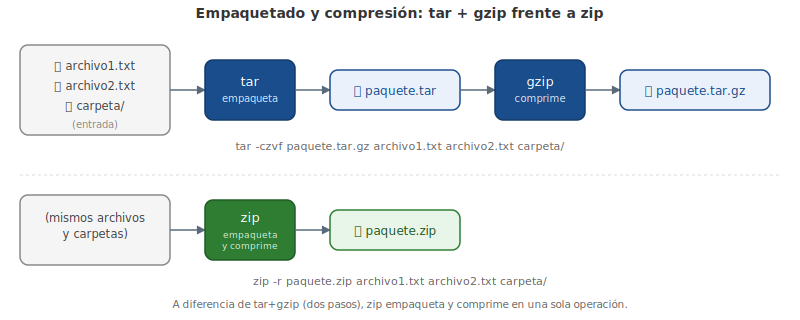

# Capítulo 7: Compresión y Empaquetado de Archivos

## 7.1 Introducción

En este capítulo vamos a hablar de cómo gestionar los archivos en la línea de comandos.

El **empaquetamiento de archivos** se utiliza cuando uno o más archivos se tienen que transmitir o almacenar lo más eficientemente posible. Hay dos aspectos:

- **El empaquetamiento**: combina varios archivos en uno solo, lo que elimina la sobrecarga en archivos individuales y los hace más fáciles de transmitir.
- **Compresión**: hace los archivos más pequeños mediante la eliminación de información redundante.

Puedes realizar empaquetamiento de varios archivos en un solo archivo y luego comprimirlo, o puedes comprimir un archivo individual. La primera opción se conoce todavía como empaquetamiento de archivos, mientras que la última se llama sólo compresión. Cuando tomas un archivo empaquetado, lo descomprimes y extraes uno o más archivos, lo estás **desempaquetando**.

A pesar de que el espacio en disco es relativamente barato, el empaquetamiento y la compresión aún tienen su valor:

- Si quieres que un gran número de archivos esté disponible, tales como el código fuente de una aplicación o un conjunto de documentos, es más fácil para las personas descargar un archivo empaquetado que descargar los archivos individuales.
- Los archivos de registro tienen la costumbre de llenar los discos, por lo que es útil dividirlos por fecha y comprimir las versiones más antiguas.
- Cuando haces copias de seguridad de los directorios, es más fácil mantenerlos todos en un archivo empaquetado que crear una versión de cada archivo.
- Algunos dispositivos de transmisión, como cintas, se desempeñan mejor enviando una transmisión en secuencia de datos en lugar de los archivos individuales.
- A menudo puede ser más rápido comprimir un archivo antes de enviarlo a una unidad de cinta o a una red más lenta, y descomprimir en el otro extremo, en vez de enviarlo descomprimido.

Como administrador de Linux, debes familiarizarte con las herramientas para el empaquetamiento y compresión de archivos.

## 7.2 Comprimir los Archivos

**Comprimir** los archivos los hace más pequeños eliminando la duplicación en un archivo y guardándolo de tal manera que el archivo se pueda restaurar. Un archivo de texto legible podría reemplazar palabras usadas con frecuencia por algo más pequeño, o una imagen con un fondo sólido podría representar manchas de ese color por un código. Generalmente no usas la versión comprimida del archivo, más bien lo descomprimes antes de usar. El **algoritmo de compresión** es un procedimiento con el que la computadora codifica el archivo original y como resultado lo hace más pequeño. Los científicos informáticos investigan estos algoritmos y elaboran mejores versiones, que pueden trabajar más rápido o hacer más pequeño el archivo de entrada.

Cuando se habla de compresión, existen dos tipos:

- **Lossless** (o «sin pérdida» en español): no se elimina ninguna información del archivo. Comprimir un archivo y descomprimirlo deja algo idéntico al original.
- **Lossy** (o «con pérdida» en español): información podría ser retirada del archivo cuando se comprime, de modo que al descomprimir el archivo se obtiene un archivo un poco diferente del original. Por ejemplo, una imagen con dos tonos de verde sutilmente diferentes podría hacerse más pequeña tratando esos dos tonos como uno solo; de todos modos, el ojo no puede reconocer la diferencia.

Generalmente los ojos y oídos humanos no notan imperfecciones leves en las imágenes y el audio, especialmente cuando se muestran en un monitor o suenan a través de los altavoces. La compresión con pérdida a menudo beneficia a los medios digitales ya que los tamaños de los archivos son más pequeños y las personas no pueden notar la diferencia entre el original y la versión con los datos cambiados. Cosas que deben permanecer intactas, como los documentos, los registros y el software, necesitan una compresión sin pérdida.

La mayoría de los formatos de imágenes, como GIF, PNG y JPEG, implementan algún tipo de compresión con pérdida. Generalmente puedes decidir cuánta calidad quieres conservar. Una calidad inferior resultará en un archivo más pequeño, pero después de la descompresión puedes notar resultados no deseados tales como bordes ásperos o decoloraciones. Una calidad alta se parecerá mucho a la imagen original, pero el tamaño del archivo será más cercano al original.

Comprimir un archivo ya comprimido no lo hará más pequeño. Esto a menudo se olvida cuando se trata de imágenes, puesto que ya se almacenan en un formato comprimido. Con la compresión sin pérdida esta compresión múltiple no es un problema, pero si se comprime y descomprime un archivo varias veces mediante un algoritmo con pérdida obtendrás algo que es irreconocible.

Linux proporciona varias herramientas para comprimir los archivos, la más común es `gzip`. A continuación te mostraremos un archivo de registro antes y después de la compresión.

```bash
bob:tmp $ ls -l access_log*
-rw-r--r-- 1 sean sean 372063 Oct 11 21:24 access_log
bob:tmp $ gzip access_log
bob:tmp $ ls -l access_log*
-rw-r--r-- 1 sean sean 26080 Oct 11 21:24 access_log.gz
```

En el ejemplo anterior hay un archivo llamado `access_log` que tiene 372,063 bytes. El archivo se comprime invocando el comando `gzip` con el nombre del archivo como el único argumento. Al finalizar el comando su tarea, el archivo original desaparece y una versión comprimida con una extensión de archivo `.gz` se queda en su lugar. El tamaño del archivo es ahora 26,080 bytes, dando una relación de compresión de 14:1, que es común en el caso de los archivos de registro.

El comando `gzip` te dará esta información si se lo pides utilizando el parámetro `-l` tal como se muestra aquí:

```bash
bob:tmp $ gzip -l access_log.gz
      compressed     uncompressed  ratio uncompressed_name
           26080           372063  93.0% access_log
```

Aquí puedes ver que se da el porcentaje de compresión de 93%, lo inverso de la relación 14:1, es decir, 13/14. Además, cuando el archivo se descomprime, se llamará `access_log`.

```bash
bob:tmp $ gunzip access_log.gz
bob:tmp $ ls -l access_log*
-rw-r--r-- 1 sean sean 372063 Oct 11 21:24 access_log
```

Lo contrario del comando `gzip` es el comando `gunzip`. Por otra parte, `gzip -d` hace la misma cosa (`gunzip` es sólo un script que invoca el comando `gzip` con los parámetros correctos). Cuando el comando `gunzip` termine su tarea, podrás ver que el archivo `access_log` vuelve a su tamaño original.

`gzip` puede también actuar como un **filtro** que no lee ni escribe nada en el disco, sino que recibe datos a través de un canal de entrada y los escribe a un canal de salida. Aprenderás más sobre cómo funciona esto en el siguiente capítulo, por lo que el ejemplo siguiente sólo te da una idea de lo que puedes hacer al comprimir una secuencia.

```bash
bob:tmp $ mysqldump -A | gzip > database_backup.gz
bob:tmp $ gzip -l database_backup.gz
         compressed        uncompressed  ratio uncompressed_name
              76866             1028003  92.5% database_backup
```

El comando `mysqldump -A` da salida a los contenidos de las bases de datos de MySQL locales a la consola. El carácter `|` (barra vertical) dice "redirigir la salida del comando anterior a la entrada del siguiente". El programa que recibe la salida es `gzip`, que reconoce que no se dieron nombres de archivo por lo que debe funcionar en modo de barra vertical. Por último, `> database_backup.gz` significa "redirigir la salida del comando anterior a un archivo llamado `database_backup.gz`". La inspección de este archivo con `gzip -l` muestra que la versión comprimida es un 7.5% del tamaño original, con la ventaja agregada de que el archivo más grande jamás tuvo que ser escrito a disco.

Hay otro par de comandos que operan prácticamente de manera idéntica a `gzip` y `gunzip`. Éstos son `bzip2` y `bunzip2`. Las utilidades de `bzip` utilizan un algoritmo de compresión diferente (llamado bloque de clasificación de **Burrows-Wheeler** frente a la codificación **Lempel-Ziv** que utiliza `gzip`) que puede comprimir los archivos más pequeños que `gzip` a costa de más tiempo de CPU. Puedes reconocer estos archivos porque tienen una extensión `.bz` o `.bz2` en vez de `.gz`.

## 7.3 Empaquetando Archivos

Si quieres enviar varios archivos a alguien, podrías comprimir cada uno individualmente. Tendrías una cantidad más pequeña de datos en total que si enviaras los archivos sin comprimir, pero todavía tendrás que lidiar con muchos archivos al mismo tiempo.

El empaquetamiento de archivos es la solución a este problema. La utilidad tradicional de UNIX para archivar los ficheros se llama `tar`, que es una abreviación de **TApe aRchive** (o «archivo de cinta» en español). `tar` era utilizado para transmitir muchos archivos a una cinta para copias de seguridad o transferencias de archivos. `tar` toma varios archivos y crea un único archivo de salida que se puede dividir otra vez en los archivos originales en el otro extremo de la transmisión.

`tar` tiene 3 **modos** que deberás conocer:

- **Crear**: hacer un archivo nuevo a partir de una serie de archivos.
- **Extraer**: sacar uno o más archivos de un archivo empaquetado.
- **Listar**: mostrar el contenido del archivo sin extraer.

Recordar los modos es clave para averiguar las opciones de la línea de comandos necesarias para hacer lo que quieres. Además del modo, querrás asegurarte de que recuerdas dónde especificar el nombre del archivo, ya que podrías estar introduciendo varios nombres de archivo en una línea de comandos.

Aquí mostramos un archivo tar, también llamado un **tarball**, siendo creado a partir de múltiples registros de acceso.

```bash
bob:tmp $ tar -cf access_logs.tar access_log*
bob:tmp $ ls -l access_logs.tar
-rw-rw-r-- 1 sean sean 542720 Oct 12 21:42 access_logs.tar
```

La creación de un archivo requiere dos opciones con nombre. La primera, `c`, especifica el modo. La segunda, `f`, le dice a `tar` que espere un nombre de archivo como el siguiente argumento. El primer argumento en el ejemplo anterior crea un archivo llamado `access_logs.tar`. El resto de los argumentos se toman como nombres de los archivos de entrada, ya sea un comodín, una lista de archivos o ambos. En este ejemplo, utilizamos la opción comodín para incluir todos los archivos que comienzan con `access_log`.

El ejemplo anterior hace un listado largo de directorio del archivo creado. El tamaño final es 542,720 bytes, que es ligeramente más grande que los archivos de entrada. Los tarballs pueden ser comprimidos para un transporte más fácil, ya sea comprimiendo el archivo con `gzip` o diciéndole a `tar` que lo haga con la opción `z` tal como se muestra a continuación:

```bash
bob:tmp $ tar -czf access_logs.tar.gz  access_log*
bob:tmp $ ls -l access_logs.tar.gz
-rw-rw-r-- 1 sean sean 46229 Oct 12 21:50 access_logs.tar.gz
bob:tmp $ gzip -l access_logs.tar.gz
         compressed        uncompressed  ratio uncompressed_name
              46229              542720  91.5% access_logs.tar
```

El ejemplo anterior muestra el mismo comando que en el ejemplo anterior, pero con la adición del parámetro `z`. La salida es mucho menor que el tarball en sí mismo, y el archivo resultante es compatible con `gzip`. Se puede ver en el último comando que el archivo descomprimido es del mismo tamaño, como si hubieras utilizado `tar` en un paso separado.

Mientras que UNIX no trata las extensiones de archivo de manera especial, la convención es usar `.tar` para los archivos tar y `.tar.gz` o `.tgz` para los archivos tar comprimidos. Puedes utilizar `bzip2` en vez de `gzip` sustituyendo la letra `z` por `j` y usando `.tar.bz2`, `.tbz`, o `.tbz2` como extensión de archivo (por ejemplo `tar -cjf file.tbz access_log*`).

En el archivo tar, comprimido o no, puedes ver lo que hay dentro utilizando el comando con la opción `t`:

```bash
bob:tmp $ tar -tjf access_logs.tbz
logs/
logs/access_log.3
logs/access_log.1
logs/access_log.4
logs/access_log
logs/access_log.2
```

Este ejemplo utiliza 3 opciones:

- `t`: listar los documentos en el archivo empaquetado.
- `j`: descomprimir con `bzip2` antes de la lectura.
- `f`: operar sobre el nombre de archivo `access_logs.tbz`.

El contenido del archivo comprimido entonces es desplegado. Puedes ver que un directorio fue prefijado a los archivos. `tar` se efectuará de manera recursiva hacia los subdirectorios automáticamente cuando comprime, y almacenará la información de la ruta de acceso dentro del archivo.

Sólo para mostrar que este archivo aún no es nada especial, vamos a listar el contenido del archivo en dos pasos mediante una barra vertical.

```bash
bob:tmp $ bunzip2 -c access_logs.tbz | tar -t
logs/
logs/access_log.3
logs/access_log.1
logs/access_log.4
logs/access_log
logs/access_log.2
```

A la izquierda de la barra vertical está `bunzip2 -c access_logs.tbz`, que descomprime el archivo, pero la opción `c` envía la salida a la pantalla. La salida es redirigida a `tar -t`. Si no especificas un archivo con `-f`, entonces `tar` leerá la entrada estándar, que en este caso es el archivo sin comprimir.

Finalmente, puedes extraer el archivo con la marca `-x`:

```bash
bob:tmp $ tar -xjf access_logs.tbz
bob:tmp $ ls -l
total 36
-rw-rw-r-- 1 sean sean 30043 Oct 14 13:27 access_logs.tbz
drwxrwxr-x 2 sean sean  4096 Oct 14 13:26 logs
bob:tmp $ ls -l logs
total 536
-rw-r--r-- 1 sean sean 372063 Oct 11 21:24 access_log
-rw-r--r-- 1 sean sean    362 Oct 12 21:41 access_log.1
-rw-r--r-- 1 sean sean 153813 Oct 12 21:41 access_log.2
-rw-r--r-- 1 sean sean   1136 Oct 12 21:41 access_log.3
-rw-r--r-- 1 sean sean    784 Oct 12 21:41 access_log.4
```

El ejemplo anterior utiliza un patrón similar al anterior, especificando la operación (eXtract), compresión (la opción `j`, que significa `bzip2`) y un nombre de archivo (`-f access_logs.tbz`). El archivo original está intacto y se crea el nuevo directorio `logs`. Los archivos están dentro del directorio.

Añade la opción `-v` y obtendrás una salida detallada de los archivos procesados. Esto es útil para que puedas ver lo que está sucediendo:

```bash
bob:tmp $ tar -xjvf access_logs.tbz
logs/
logs/access_log.3
logs/access_log.1
logs/access_log.4
logs/access_log
logs/access_log.2
```

Es importante mantener la opción `-f` al final, ya que `tar` asume que lo que sigue es un nombre de archivo. En el siguiente ejemplo, las opciones `f` y `v` fueron transpuestas, llevando a `tar` a interpretar el comando como una operación sobre un archivo llamado "v":

```bash
bob:tmp $ tar -xjfv access_logs.tbz
tar (child): v: Cannot open: No such file or directory
tar (child): Error is not recoverable: exiting now
tar: Child returned status 2
tar: Error is not recoverable: exiting now
```

Si sólo quieres algunos documentos del archivo empaquetado puedes agregar sus nombres al final del comando, pero por defecto deben coincidir exactamente con el nombre del archivo, o puedes utilizar un patrón:

```bash
bob:tmp $ tar -xjvf access_logs.tbz logs/access_log
logs/access_log
```

El ejemplo anterior muestra el mismo archivo que antes, pero extrayendo solamente el archivo `logs/access_log`. La salida del comando (ya que se solicitó el modo detallado con la bandera `v`) muestra que sólo un archivo se ha extraído.

`tar` tiene muchas más funciones, como la capacidad de utilizar patrones al extraer los archivos, excluir ciertos archivos o mostrar los archivos extraídos en la pantalla en lugar de en un disco. La documentación de `tar` contiene información a profundidad.

<figure>

<figcaption>Empaquetado y compresión: tar + gzip (dos pasos) frente a zip (un solo paso).</figcaption>
</figure>

## 7.4 Archivos ZIP

De hecho, la utilidad de empaquetamiento de archivos en el mundo de Microsoft es el **archivo ZIP**. No es tan frecuente en Linux, pero también es compatible mediante los comandos `zip` y `unzip`. Con `tar` y `gzip`/`gunzip` se pueden utilizar los mismos comandos y las mismas opciones para hacer la creación y extracción, pero éste no es el caso del `zip`. La misma opción tiene diferentes significados para estos dos comandos distintos.

El modo predeterminado de `zip` es añadir documentos a un archivo y comprimirlos.

```bash
bob:tmp $ zip logs.zip logs/*
  adding: logs/access_log (deflated 93%)
  adding: logs/access_log.1 (deflated 62%)
  adding: logs/access_log.2 (deflated 88%)
  adding: logs/access_log.3 (deflated 73%)
  adding: logs/access_log.4 (deflated 72%)
```

El primer argumento en el ejemplo anterior es el nombre del archivo sobre el cual se trabajará, en este caso `logs.zip`. Después de eso, hay que añadir una lista de archivos a ser agregados. La salida muestra los archivos y la relación de compresión. Debes notar que `tar` requiere la opción `-f` para indicar que se está pasando un nombre de archivo, mientras que `zip` y `unzip` requieren un nombre de archivo directamente, por lo tanto no tienes que decir explícitamente que se está pasando un nombre de archivo.

`zip` no se efectuará de manera recursiva hacia los subdirectorios por defecto, lo que es un comportamiento diferente al de `tar`. Es decir, simplemente añadiendo `logs` en vez de `logs/*` sólo añadirá un directorio vacío y no los archivos dentro de él. Si quieres que `zip` se comporte de manera parecida, debes utilizar la opción `-r` para indicar que se debe usar la recursividad:

```bash
bob:tmp $ zip -r logs.zip logs
  adding: logs/ (stored 0%)
  adding: logs/access_log.3 (deflated 73%)
  adding: logs/access_log.1 (deflated 62%)
  adding: logs/access_log.4 (deflated 72%)
  adding: logs/access_log (deflated 93%)
  adding: logs/access_log.2 (deflated 88%)
```

En el ejemplo anterior, se añaden todos los archivos bajo el directorio `logs` ya que se utiliza la opción `-r`. La primera línea de la salida indica que un directorio se agregó al archivo, pero de lo contrario la salida es similar al ejemplo anterior.

El listado de los archivos en el zip se realiza con el comando `unzip` y la opción `-l` (listar):

```bash
bob:tmp $ unzip -l logs.zip
Archive:  logs.zip
  Length      Date    Time    Name
---------  ---------- -----   ----
        0  10-14-2013 14:07   logs/
     1136  10-14-2013 14:07   logs/access_log.3
      362  10-14-2013 14:07   logs/access_log.1
      784  10-14-2013 14:07   logs/access_log.4
    90703  10-14-2013 14:07   logs/access_log
   153813  10-14-2013 14:07   logs/access_log.2
---------                     -------
   246798                     6 files
```

Extraer los archivos es como crear el archivo, ya que la operación predeterminada es extraer:

```bash
bob:tmp $ unzip logs.zip
Archive:  logs.zip
   creating: logs/
  inflating: logs/access_log.3
  inflating: logs/access_log.1
  inflating: logs/access_log.4
  inflating: logs/access_log
  inflating: logs/access_log.2
```

Aquí, extraemos todos los documentos del archivo empaquetado al directorio actual. Al igual que con `tar`, puedes pasar los nombres de archivos a la línea de comandos:

```bash
bob:tmp $ unzip logs.zip access_log
Archive:  logs.zip
caution: filename not matched:  access_log
bob:tmp $ unzip logs.zip logs/access_log
Archive:  logs.zip
  inflating: logs/access_log
bob:tmp $ unzip logs.zip logs/access_log.*
Archive:  logs.zip
  inflating: logs/access_log.3
  inflating: logs/access_log.1
  inflating: logs/access_log.4
  inflating: logs/access_log.2
```

El ejemplo anterior muestra tres intentos diferentes para extraer un archivo. En primer lugar, se pasa sólo el nombre del archivo sin el componente del directorio. Al igual que con `tar`, el archivo no coincide.

El segundo intento pasa el componente del directorio junto con el nombre del archivo, lo que extrae sólo ese archivo.

La tercera versión utiliza un comodín, que extrae los 4 archivos que coinciden con el patrón, al igual que con `tar`.

Las páginas man de `zip` y `unzip` describen las otras cosas que puedes hacer con estas herramientas, tales como reemplazar los archivos dentro del archivo empaquetado, utilizar diferentes niveles de compresión o incluso el cifrado.

### Resumen del capítulo

- El **empaquetamiento** combina varios archivos en uno solo para facilitar su transmisión y almacenamiento, mientras que la **compresión** reduce el tamaño de un archivo eliminando información redundante; ambos procesos son independientes pero suelen combinarse.
- Existen dos tipos de compresión: **lossless** (sin pérdida, el archivo restaurado es idéntico al original; necesaria para documentos, registros y software) y **lossy** (con pérdida, útil para imágenes y audio donde pequeñas imperfecciones no se notan).
- `gzip`/`gunzip` (extensión `.gz`) y `bzip2`/`bunzip2` (extensión `.bz`/`.bz2`) son las principales herramientas de compresión en Linux; `bzip2` usa el algoritmo Burrows-Wheeler y suele comprimir más a costa de más tiempo de CPU, frente al algoritmo Lempel-Ziv de `gzip`. Ambos pueden usarse también como filtros mediante tuberías (`|`).
- `tar` (TApe aRchive) es la utilidad tradicional de empaquetado en UNIX/Linux, con tres modos: crear (`-c`), extraer (`-x`) y listar (`-t`); requiere la opción `-f` para indicar el nombre de archivo y puede combinarse con `-z` (gzip) o `-j` (bzip2) para comprimir directamente, generando extensiones como `.tar.gz`/`.tgz` o `.tar.bz2`/`.tbz`.
- El formato **ZIP**, gestionado con los comandos `zip` y `unzip`, es más común en el mundo Microsoft; a diferencia de `tar`, no necesita la opción `-f` para el nombre de archivo, no es recursivo por defecto (requiere `-r`) y las mismas letras de opción pueden significar cosas distintas entre `zip` y `unzip`.
- Tanto `tar` como `unzip` permiten extraer selectivamente archivos específicos del paquete indicando su ruta exacta o usando patrones comodín al final del comando.
