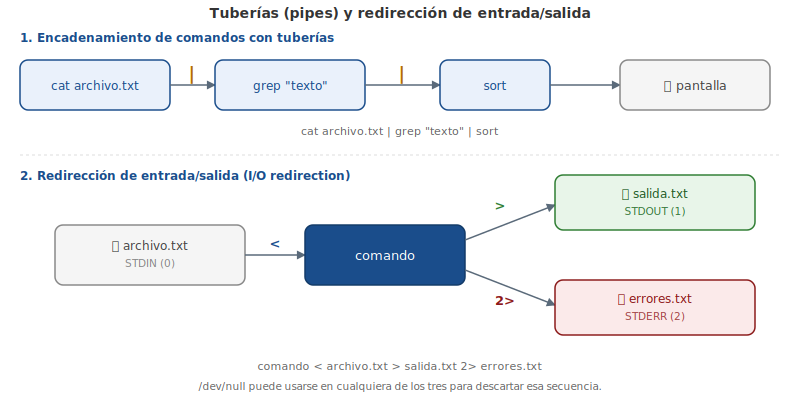

# Capítulo 8: Procesamiento y Filtrado de Texto en la Línea de Comandos

## 8.1 Introducción

Un gran número de los archivos en un típico sistema de archivos son archivos de texto. Los archivos de texto contienen sólo texto, sin características de formato que puedes ver en un archivo de procesamiento de texto.

Ya que hay muchos de estos archivos en un sistema Linux típico, existe un gran número de comandos para ayudar a los usuarios a manipular los archivos de texto. Hay comandos para ver y modificar estos archivos de varias maneras.

Además, existen características disponibles para el shell para controlar la salida de los comandos, así que en lugar de tener la salida en la ventana de la terminal, la salida se puede **redirigir** a otro archivo u otro comando. Estas características de la **redirección** ofrecen a los usuarios un entorno más flexible y potente para trabajar.

> Dato curioso: según el Reporte Linux de Adopción de Usuarios Finales Empresariales 2013 de la Fundación Linux, el 76% de las organizaciones habilitadas en la nube utilizan servidores Linux para la nube.

<figure>

<figcaption>Encadenamiento de comandos con tuberías (pipes) y redirección de STDIN/STDOUT/STDERR.</figcaption>
</figure>

## 8.2 Las Barras Verticales en la Línea de Comandos

Capítulos anteriores describen la manera de usar los comandos individuales para realizar acciones en el sistema operativo, incluyendo cómo crear/mover/eliminar archivos y moverse en todo el sistema. Por lo general, cuando un comando ofrece salida o genera un error, la salida se muestra en la pantalla; sin embargo, esto no tiene que ser el caso.

El carácter barra vertical `|` (o **tubería (pipe)** en inglés) puede utilizarse para enviar la salida de un comando a otro. En lugar de que se imprima en la pantalla, la salida de un comando se convierte en una entrada para el siguiente comando. Esto puede ser una herramienta poderosa, especialmente en la búsqueda de datos específicos; el uso de la tubería (o «piping») se utiliza a menudo para refinar los resultados de un comando inicial.

Los comandos `head` (o «cabeza») y `tail` (o «cola») se utilizarán en muchos ejemplos a continuación para ilustrar el uso de las barras verticales. Estos comandos se pueden utilizar para mostrar solamente algunas de las primeras o las últimas líneas de un archivo (o, cuando se utiliza con una barra vertical, la salida de un comando anterior).

Por defecto, los comandos `head` y `tail` mostrarán diez líneas. Por ejemplo, el siguiente comando muestra las diez primeras líneas del archivo `/etc/sysctl.conf`:

```bash
sysadmin@localhost:~$ head /etc/sysctl.conf
#
# /etc/sysctl.conf - Configuration file for setting system variables
# See /etc/sysctl.d/ for additional system variables
# See sysctl.conf (5) for information.
#

#kernel.domainname = example.com

# Uncomment the following to stop low-level messages on console
#kernel.printk = 3 4 1 3
sysadmin@localhost:~$
```

En el ejemplo siguiente, se mostrarán las últimas diez líneas del archivo:

```bash
sysadmin@localhost:~$ tail /etc/sysctl.conf
# Do not send ICMP redirects (we are not a router)
#net.ipv4.conf.all.send_redirects = 0
#
# Do not accept IP source route packets (we are not a router)
#net.ipv4.conf.all.accept_source_route = 0
#net.ipv6.conf.all.accept_source_route = 0
#
# Log Martian Packets
#net.ipv4.conf.all.log_martians = 1
#
sysadmin@localhost:~$
```

El carácter de la barra vertical permite a los usuarios utilizar estos comandos no sólo en los archivos, sino también en la salida de otros comandos. Esto puede ser útil al listar un directorio grande, por ejemplo el directorio `/etc`:

```
ca-certificates         insserv              nanorc          services
ca-certificates.conf    insserv.conf         network         sgml
calendar                insserv.conf.d       networks        shadow
cron.d                  iproute2             nologin         shadow-
cron.daily              issue                nsswitch.conf   shells
cron.hourly             issue.net            opt             skel
cron.monthly            kernel               os-release      ssh
cron.weekly             ld.so.cache          pam.conf        ssl
crontab                 ld.so.conf           pam.d           sudoers
dbus-1                  ld.so.conf.d         passwd          sudoers.d
debconf.conf            ldap                 passwd-         sysctl.conf
debian_version          legal                perl            sysctl.d
default                 locale.alias         pinforc         systemd
deluser.conf            localtime            ppp             terminfo
depmod.d                logcheck             profile         timezone
dpkg                    login.defs           profile.d       ucf.conf
environment             logrotate.conf       protocols       udev
fstab                   logrotate.d          python2.7       ufw
fstab.d                 lsb-base             rc.local        update-motd.d
gai.conf                lsb-base-logging.sh  rc0.d           updatedb.conf
groff                   lsb-release          rc1.d           vim
group                   magic                rc2.d           wgetrc
group-                  magic.mime           rc3.d           xml
sysadmin@localhost:~$
```

Si te fijas en la salida del comando anterior, notarás que el primer nombre de archivo es `ca-certificates`. Pero hay otros archivos listados "arriba" que sólo pueden verse si el usuario utiliza la barra de desplazamiento. ¿Qué pasa si sólo quieres listar algunos de los primeros archivos del directorio `/etc`?

En lugar de mostrar toda la salida del comando anterior, poner la barra vertical junto al comando `head` muestra sólo las primeras diez líneas:

```bash
sysadmin@localhost:~$ ls /etc | head
adduser.conf
adjtime
alternatives
apparmor.d
apt
bash.bashrc
bash_completion.d
bind
bindresvport.blacklist
blkid.conf
sysadmin@localhost:~$
```

La salida del comando `ls` se pasa al comando `head` por el shell en vez de ser impresa a la pantalla. El comando `head` toma esta salida (del `ls`) como "datos de entrada" y luego imprime su propia salida a la pantalla.

Múltiples barras verticales pueden utilizarse consecutivamente para unir varios comandos. Si se unen tres comandos con la barra vertical, la salida del primer comando se pasa al segundo comando. La salida del segundo comando se pasa al tercer comando. La salida del tercer comando se imprime en la pantalla.

Es importante elegir cuidadosamente el orden en que los comandos están unidos con la barra vertical, ya que el tercer comando sólo verá como entrada la salida del segundo comando. Los siguientes ejemplos ilustran esta situación usando el comando `nl`. En el primer ejemplo, `nl` se utiliza para numerar las líneas de la salida de un comando anterior:

```bash
sysadmin@localhost:~$ ls -l /etc/ppp | nl
     1  total 44
     2  -rw------- 1 root root   78 Aug 22  2010 chap-secrets
     3  -rwxr-xr-x 1 root root  386 Apr 27  2012 ip-down
     4  -rwxr-xr-x 1 root root 3262 Apr 27  2012 ip-down.ipv6to4
     5  -rwxr-xr-x 1 root root  430 Apr 27  2012 ip-up
     6  -rwxr-xr-x 1 root root 6517 Apr 27  2012 ip-up.ipv6to4
     7  -rwxr-xr-x 1 root root 1687 Apr 27  2012 ipv6-down
     8  -rwxr-xr-x 1 root root 3196 Apr 27  2012 ipv6-up
     9  -rw-r--r-- 1 root root    5 Aug 22  2010 options
    10  -rw------- 1 root root   77 Aug 22  2010 pap-secrets
    11  drwxr-xr-x 2 root root 4096 Jun 22  2012 peers
sysadmin@localhost:~$
```

En el ejemplo siguiente, observa que el comando `ls` se ejecuta primero y su salida se envía al comando `nl`, enumerando todas las líneas de la salida del comando `ls`. A continuación, se ejecuta el comando `tail`, mostrando las últimas cinco líneas de la salida de `nl`:

```bash
sysadmin@localhost:~$ ls -l /etc/ppp | nl | tail -5
     7  -rwxr-xr-x 1 root root 1687 Apr 27  2012 ipv6-down
     8  -rwxr-xr-x 1 root root 3196 Apr 27  2012 ipv6-up
     9  -rw-r--r-- 1 root root    5 Aug 22  2010 options
    10  -rw------- 1 root root   77 Aug 22  2010 pap-secrets
    11  drwxr-xr-x 2 root root 4096 Jun 22  2012 peers
sysadmin@localhost:~$
```

Compara la salida anterior con el siguiente ejemplo:

```bash
sysadmin@localhost:~$ ls -l /etc/ppp | tail -5 | nl
    1  -rwxr-xr-x 1 root root 1687 Apr 27  2012 ipv6-down
    2  -rwxr-xr-x 1 root root 3196 Apr 27  2012 ipv6-up
    3  -rw-r--r-- 1 root root    5 Aug 22  2010 options
    4  -rw------- 1 root root   77 Aug 22  2010 pap-secrets
    5  drwxr-xr-x 2 root root 4096 Jun 22  2012 peers
sysadmin@localhost:~$
```

Observa los diferentes números de línea. ¿Por qué sucede esto?

En el segundo ejemplo, la salida del comando `ls` se envía primero al comando `tail`, que "capta" sólo las últimas cinco líneas de la salida. El comando `tail` envía esas cinco líneas al comando `nl`, que las enumera del 1 al 5.

Las barras verticales pueden ser poderosas, pero es importante considerar cómo se unen los comandos con ellas para asegurar que se muestre la salida deseada.

## 8.3 Redirección de E/S

La **Redirección de Entrada/Salida (E/S)** permite que la información pase de la línea de comandos a las diferentes secuencias. Antes de hablar sobre la redirección, es importante entender las secuencias estándar.

### 8.3.1 STDIN

La entrada estándar **STDIN** es la información normalmente introducida por el usuario mediante el teclado. Cuando un comando envía un prompt al shell esperando datos, el shell proporciona al usuario la capacidad de introducir los comandos, que a su vez, se envían al comando como STDIN.

### 8.3.2 STDOUT

Salida estándar o **STDOUT** es la salida normal de los comandos. Cuando un comando funciona correctamente (sin errores), la salida que produce se llama STDOUT. De forma predeterminada, STDOUT se muestra en la ventana de la terminal (pantalla) donde se ejecuta el comando.

### 8.3.3 STDERR

Error estándar o **STDERR** son mensajes de error generados por los comandos. De forma predeterminada, STDERR se muestra en la ventana de la terminal (pantalla) donde se ejecuta el comando.

La redirección de E/S permite al usuario redirigir STDIN para que los datos provengan de un archivo y la salida de STDOUT/STDERR vaya a un archivo. La redirección se logra mediante el uso de los caracteres de flecha: `<` y `>`.

### 8.3.4 Redirigir STDOUT

STDOUT se puede dirigir a los archivos. Para empezar, observa la salida del siguiente comando que se mostrará en la pantalla:

```bash
sysadmin@localhost:~$ echo "Line 1"
Line 1
sysadmin@localhost:~$
```

Utilizando el carácter `>`, la salida puede ser redirigida a un archivo:

```bash
sysadmin@localhost:~$ echo "Line 1" > example.txt
sysadmin@localhost:~$ ls
Desktop    Downloads  Pictures  Templates  example.txt  test
Documents  Music      Public    Videos     sample.txt
sysadmin@localhost:~$ cat example.txt
Line 1
sysadmin@localhost:~$
```

Este comando no muestra ninguna salida en pantalla, porque STDOUT fue enviada al archivo `example.txt` en lugar de la pantalla. Puedes ver el nuevo archivo con la salida del comando `ls`. El archivo recién creado contiene la salida del comando `echo` cuando se ve el contenido del archivo con el comando `cat`.

Es importante tener en cuenta que la flecha sola sobrescribe cualquier contenido de un archivo existente:

```bash
sysadmin@localhost:~$ cat example.txt
Line 1
sysadmin@localhost:~$ echo "New line 1" > example.txt
sysadmin@localhost:~$ cat example.txt
New line 1
sysadmin@localhost:~$
```

El contenido original del archivo ha desaparecido y fue reemplazado por la salida del comando `echo` nuevo.

También es posible preservar el contenido de un archivo existente anexando al mismo. Utiliza la «doble flecha» `>>` para anexar a un archivo en vez de sobrescribirlo:

```bash
sysadmin@localhost:~$ cat example.txt
New line 1
sysadmin@localhost:~$ echo "Another line" >> example.txt
sysadmin@localhost:~$ cat example.txt
New line 1
Another line
sysadmin@localhost:~$
```

En lugar de ser sobrescrito, la salida del comando `echo` reciente se anexa a la parte inferior del archivo.

### 8.3.5 Redirigir la STDERR

Puedes redirigir STDERR de una manera similar a STDOUT. STDOUT es también conocida como secuencia o canal («stream» o «channel») **#1**. A STDERR se le asigna la secuencia **#2**.

Al utilizar las flechas para redirigir, se asumirá la secuencia #1 mientras no venga especificada otra secuencia. Por lo tanto, la secuencia #2 debe especificarse al redirigir STDERR.

Para demostrar la redirección de STDERR, primero observa el siguiente comando que producirá un error porque el directorio especificado no existe:

```bash
sysadmin@localhost:~$ ls /fake
ls: cannot access /fake: No such file or directory
sysadmin@localhost:~$
```

Ten en cuenta que no hay nada en el ejemplo anterior que implique que la salida es STDERR. La salida es claramente un mensaje de error, pero ¿cómo podrías saber que se envía a STDERR? Una manera fácil de determinarlo es redirigir a STDOUT:

```bash
sysadmin@localhost:~$ ls /fake > output.txt
ls: cannot access /fake: No such file or directory
sysadmin@localhost:~$
```

En el ejemplo anterior, STDOUT fue redirigido al archivo `output.txt`. Por lo tanto, la salida que se muestra no puede ser STDOUT porque habría quedado en el archivo `output.txt`. Ya que todos los resultados del comando van a STDOUT o STDERR, la salida mostrada debe ser STDERR.

El STDERR de un comando puede enviarse a un archivo:

```bash
sysadmin@localhost:~$ ls /fake 2> error.txt
sysadmin@localhost:~$ cat error.txt
ls: cannot access /fake: No such file or directory
sysadmin@localhost:~$
```

En el comando de arriba, `2>` indica que todos los mensajes de error deben enviarse al archivo `error.txt`.

### 8.3.6 Redireccionando Múltiples Secuencias

Es posible dirigir STDOUT y STDERR de un comando a la vez. El siguiente comando produce ambas salidas porque existe uno de los directorios especificados y el otro no:

```bash
sysadmin@localhost:~$ ls /fake /etc/ppp
ls: cannot access /fake: No such file or directory
/etc/ppp:
chap-secrets   ip-down   ip-down.ipv6to4    ip-up        ip-up.ipv6to4
ipv6-down      ipv6-up   options            pap-secrets  peers
```

Si sólo se envía la salida STDOUT a un archivo, STDERR todavía se imprimirá a la pantalla:

```bash
sysadmin@localhost:~$ ls /fake /etc/ppp > example.txt
ls: cannot access /fake: No such file or directory
sysadmin@localhost:~$ cat example.txt
/etc/ppp:
chap-secrets
ip-down
ip-down.ipv6to4
ip-up
ip-up.ipv6to4
ipv6-down
ipv6-up
options
pap-secrets
peers
sysadmin@localhost:~$
```

Si sólo se envía la salida STDERR a un archivo, STDOUT todavía se imprimirá a la pantalla:

```bash
sysadmin@localhost:~$ ls /fake /etc/ppp 2> error.txt
/etc/ppp:
chap-secrets   ip-down   ip-down.ipv6to4    ip-up        ip-up.ipv6to4
ipv6-down      ipv6-up   options            pap-secrets  peers
sysadmin@localhost:~$ cat error.txt
ls: cannot access /fake: No such file or directory
sysadmin@localhost:~$
```

Las salidas STDOUT y STDERR pueden enviarse a un archivo mediante el uso de `&>`, un conjunto de caracteres que significa «ambos 1> y 2>»:

```bash
sysadmin@localhost:~$ ls /fake /etc/ppp &> all.txt
sysadmin@localhost:~$ cat all.txt
ls: cannot access /fake: No such file or directory
/etc/ppp:
chap-secrets
ip-down
ip-down.ipv6to4
ip-up
ip-up.ipv6to4
ipv6-down
ipv6-up
options
pap-secrets
peers
sysadmin@localhost:~$
```

Ten en cuenta que cuando se utiliza `&>`, la salida aparece en el archivo con todos los mensajes STDERR en la parte superior y todos los mensajes STDOUT debajo:

```bash
sysadmin@localhost:~$ ls /fake /etc/ppp /junk /etc/sound &> all.txt
sysadmin@localhost:~$ cat all.txt
ls: cannot access /fake: No such file or directory
ls: cannot access /junk: No such file or directory
/etc/ppp:
chap-secrets
ip-down
ip-down.ipv6to4
ip-up
ip-up.ipv6to4
ipv6-down
ipv6-up
options
pap-secrets
peers

/etc/sound:
events
sysadmin@localhost:~$
```

Si no quieres que las salidas STDERR y STDOUT vayan al mismo archivo, puedes redirigirlas a diferentes archivos utilizando `>` y `2>`. Por ejemplo:

```bash
sysadmin@localhost:~$ rm error.txt example.txt
sysadmin@localhost:~$ ls
Desktop    Downloads  Pictures  Templates  all.txt
Documents  Music      Public    Videos
sysadmin@localhost:~$ ls /fake /etc/ppp > example.txt 2> error.txt
sysadmin@localhost:~$ ls
Desktop    Downloads  Pictures  Templates  all.txt    example.txt
Documents  Music      Public    Videos     error.txt
sysadmin@localhost:~$ cat error.txt
ls: cannot access /fake: No such file or directory
sysadmin@localhost:~$ cat example.txt
/etc/ppp:
chap-secrets
ip-down
ip-down.ipv6to4
ip-up
ip-up.ipv6to4
ipv6-down
ipv6-up
options
pap-secrets
peers
sysadmin@localhost:~$
```

No importa el orden en el que vienen las secuencias especificadas.

### 8.3.7 Redirigir la entrada STDIN

El concepto de redireccionar STDIN es difícil de asimilar, ya que es más difícil de entender por qué querrías redirigirlo. Con las salidas STDOUT y STDERR, la respuesta del por qué es bastante fácil: porque a veces quieres almacenar el resultado en un archivo para su uso futuro.

La mayoría de los usuarios de Linux terminan redirigiendo rutinariamente STDOUT, en ocasiones STDERR y STDIN... bien, muy raramente. Hay muy pocos comandos que requieren que redirijas STDIN porque en el caso de la mayoría de los comandos, si quieres pasar los datos desde un archivo a un comando, simplemente puedes especificar el nombre del archivo como un argumento del comando. Después, el comando buscará en el archivo.

En el caso de algunos comandos, si no se especifica un nombre de archivo como argumento, volverán a usar STDIN para obtener los datos. Por ejemplo, considera el siguiente comando `cat`:

```bash
sysadmin@localhost:~$ cat
hello
hello
how are you?
how are you?
goodbye
goodbye
sysadmin@localhost:~$
```

En el ejemplo anterior, el comando `cat` no recibió el nombre de archivo como argumento. Por lo tanto, pidió los datos a mostrar en la pantalla desde la entrada STDIN. El usuario introduce `hello` y luego el comando `cat` muestra `hello` en la pantalla. Tal vez esto es útil para las personas solitarias, pero no es realmente un buen uso del comando `cat`.

Sin embargo, si la salida del comando `cat` se redirige a un archivo, este método podría utilizarse para agregar datos a un archivo existente o colocar texto en un archivo nuevo:

```bash
sysadmin@localhost:~$ cat > new.txt
Hello
How are you?
Goodbye
sysadmin@localhost:~$ cat new.txt
Hello
How are you?
Goodbye
sysadmin@localhost:~$
```

Mientras que el ejemplo anterior muestra otra de las ventajas de redireccionar STDOUT, no aborda el por qué o cómo puedes dirigir STDIN. Para entender esto, consideremos primero un nuevo comando llamado `tr`. Este comando toma un conjunto de caracteres y los plasma en otro conjunto de caracteres.

Por ejemplo, supongamos que quieres poner una línea de comandos en mayúsculas. Puedes utilizar el comando `tr` de la siguiente manera:

```bash
sysadmin@localhost:~$ tr 'a-z' 'A-Z'
watch how this works
WATCH HOW THIS WORKS
sysadmin@localhost:~$
```

El comando `tr` tomó la entrada STDIN desde el teclado (`watch how this works`) y convirtió todas las letras minúsculas antes de enviar la salida STDOUT a la pantalla (`WATCH HOW THIS WORKS`).

Parecería que el comando `tr` sirviera más para realizar la traducción en un archivo, no la entrada del teclado. Sin embargo, el comando `tr` no admite argumentos de nombre de archivo:

```bash
sysadmin@localhost:~$ more example.txt
/etc/ppp:
chap-secrets
ip-down
ip-down.ipv6to4
ip-up
ip-up.ipv6to4
ipv6-down
ipv6-up
options
pap-secrets
peers
sysadmin@localhost:~$ tr 'a-z' 'A-Z' example.txt
tr: extra operand `example.txt'
Try `tr --help' for more information
sysadmin@localhost:~$
```

Sin embargo, puedes decirle al shell que obtenga la STDIN de un archivo en vez de desde el teclado mediante el uso del carácter `<`:

```bash
sysadmin@localhost:~$ tr 'a-z' 'A-Z' < example.txt
/ETC/PPP:
CHAP-SECRETS
IP-DOWN
IP-DOWN.IPV6TO4
IP-UP
IP-UP.IPV6TO4
IPV6-DOWN
IPV6-UP
OPTIONS
PAP-SECRETS
sysadmin@localhost:~$
```

Esto es bastante inusual porque la mayoría de los comandos aceptan nombres de archivo como argumentos. Sin embargo, para los que no, este método podría utilizarse para que el shell lea desde el archivo en lugar de confiar en que el comando tenga esa capacidad.

Una última nota: en la mayoría de los casos probablemente quieras tomar la salida resultante y colocarla en otro archivo:

```bash
sysadmin@localhost:~$ tr 'a-z' 'A-Z' < example.txt > newexample.txt
sysadmin@localhost:~$ more newexample.txt
/ETC/PPP:
CHAP-SECRETS
IP-DOWN
IP-DOWN.IPV6TO4
IP-UP
IP-UP.IPV6TO4
IPV6-DOWN
IPV6-UP
OPTIONS
PAP-SECRETS
sysadmin@localhost:~$
```

## 8.4 Buscar Archivos Utilizando el Comando Find

Uno de los retos al que se enfrentan los usuarios trabajando con el sistema de archivos, es tratar de recordar la ubicación donde se almacenan los archivos. Hay miles de archivos y cientos de directorios en un típico sistema de archivos Linux, así que recordar dónde se encuentran puede plantear desafíos.

Ten en cuenta que la mayoría de los archivos con los que trabajas son los que tú creas. Como resultado, a menudo buscarás en tu propio directorio local para encontrar los archivos. Sin embargo, a veces puede que necesites buscar en otros lugares del sistema de archivos para encontrar archivos creados por otros usuarios.

El comando `find` es una herramienta muy poderosa que puedes utilizar para buscar archivos en el sistema de archivos. Este comando puede buscar archivos por nombre, incluso usando caracteres comodín cuando no estás seguro del nombre exacto del archivo. Además, puedes buscar archivos en función de sus metadatos, tales como tipo de archivo, tamaño de archivo y propiedad de archivo.

La sintaxis del comando `find` es:

```bash
find [directorio de inicio] [opción de búsqueda] [criterio de búsqueda] [opción de resultado]
```

O en inglés:

```bash
find [starting directory] [search option] [search criteria] [result option]
```

Descripción de todos estos componentes:

| Componente | Descripción |
|---|---|
| `[directorio de inicio]` | Aquí el usuario especifica dónde comenzar la búsqueda. El comando `find` buscará en este directorio y todos sus subdirectorios. Si no hay directorio de partida, se utiliza el directorio actual como punto de partida. |
| `[opción de búsqueda]` | Aquí el usuario especifica una opción para determinar qué tipo de metadatos hay que buscar; hay opciones para el nombre de archivo, tamaño de archivo y muchos otros atributos. |
| `[criterio de búsqueda]` | Es un argumento que complementa la opción de búsqueda. Por ejemplo, si el usuario utiliza la opción para buscar un nombre de archivo, el criterio de búsqueda sería el nombre del archivo. |
| `[opción de resultado]` | Esta opción se utiliza para especificar qué acción se debe tomar al encontrar el archivo. Si no se proporciona ninguna opción, se imprimirá el nombre del archivo a STDOUT. |

### 8.4.1 Buscar por Nombre de Archivo

Para buscar un archivo por nombre, utiliza la opción `-name` (o «nombre») del comando `find` (o «buscar»):

```bash
sysadmin@localhost:~$ find /etc -name hosts
find: `/etc/dhcp': Permission denied
find: `/etc/cups/ssl': Permission denied
find: `/etc/pki/CA/private': Permission denied
find: `/etc/pki/rsyslog': Permission denied
find: `/etc/audisp': Permission denied
find: `/etc/named': Permission denied
find: `/etc/lvm/cache': Permission denied
find: `/etc/lvm/backup': Permission denied
find: `/etc/lvm/archive': Permission denied
/etc/hosts
find: `/etc/ntp/crypto': Permission denied
find: `/etc/polkit-l/localauthority': Permission denied
find: `/etc/sudoers.d': Permission denied
find: `/etc/sssd': Permission denied
/etc/avahi/hosts
find: `/etc/selinux/targeted/modules/active': Permission denied
find: `/etc/audit': Permission denied
sysadmin@localhost:~$
```

Observa que se encontraron dos archivos: `/etc/hosts` y `/etc/avahi/hosts`. El resto de la salida eran mensajes STDERR porque el usuario que ejecutó el comando no tiene permiso para acceder a ciertos subdirectorios.

Recuerda que puedes redirigir STDERR a un archivo para no ver estos mensajes de error en la pantalla:

```bash
sysadmin@localhost:~$ find /etc -name hosts 2> errors.txt
/etc/hosts
/etc/avahi/hosts
sysadmin@localhost:~$
```

Mientras que la salida es más fácil de leer, realmente no hay ningún propósito para almacenar los mensajes de error en `error.txt`. Los desarrolladores de Linux se dieron cuenta de que sería bueno tener un archivo de «basura» (o «junk») para enviar los datos innecesarios; se descarta cualquier archivo que envíes a `/dev/null`:

```bash
sysadmin@localhost:~$ find /etc -name hosts 2> /dev/null
/etc/hosts
/etc/avahi/hosts
sysadmin@localhost:~$
```

### 8.4.2 Mostrando los Detalles del Archivo

Puede ser útil obtener información sobre el archivo al utilizar el comando `find`, porque el nombre del archivo por sí sólo podría no proporcionar información suficiente para encontrar el archivo correcto.

Por ejemplo, puede haber siete archivos llamados `hosts`; si supieras que el archivo que necesitas se había modificado recientemente, entonces sería útil ver la hora de modificación del archivo.

Para ver estos detalles, utiliza la opción `-ls` del comando `find`:

```bash
sysadmin@localhost:~$ find /etc -name hosts -ls 2> /dev/null
    41   4 -rw-r--r--   1 root     root      158 Jan 12 2010 /etc/hosts
  6549   4 -rw-r--r--   1 root     root      1130 Jul 19 2011 /etc/avahi/hosts
sysadmin@localhost:~$
```

> Nota: las dos primeras columnas de la salida anterior son el número de inodo del archivo y el número de bloques que el archivo utiliza para el almacenamiento. Ambos están más allá del alcance del tema en cuestión. El resto de las columnas son la salida típica del comando `ls -l`: tipo de archivo, permisos, cuenta de enlaces físicos, usuario propietario, grupo propietario, tamaño del archivo, hora de modificación y nombre de archivo.

### 8.4.3 Buscar Archivos por Tamaño

Una de las muchas opciones útiles de `find` es la que permite buscar archivos por tamaño. La opción `-size` (o «tamaño») te permite buscar archivos que son mayores o menores que un tamaño especificado, así como buscar un tamaño de archivo exacto.

Cuando se especifica un tamaño de archivo, puedes proporcionar el tamaño en:

- **bytes** (`c`)
- **kilobytes** (`k`)
- **megabytes** (`M`)
- **gigabytes** (`G`)

Por ejemplo, la siguiente búsqueda encuentra archivos en la estructura de directorios `/etc` con el tamaño exacto de 10 bytes:

```bash
sysadmin@localhost:~$ find /etc -size 10c -ls 2>/dev/null
   432    4 -rw-r--r--   1 root     root           10 Jan 28  2015 /etc/adjtime
 8814    0 drwxr-xr-x   1 root     root           10 Jan 29  2015 /etc/ppp/ip-down.d
8816    0 drwxr-xr-x   1 root     root           10 Jan 29  2015 /etc/ppp/ip-up.d
 8921    0 lrwxrwxrwx   1 root     root           10 Jan 29  2015 /etc/ssl/certs/349f2832.0 -> EC-ACC.pem
  9234    0 lrwxrwxrwx   1 root     root           10 Jan 29  2015 /etc/ssl/certs/aeb67534.0 -> EC-ACC.pem
 73468    4 -rw-r--r--   1 root     root           10 Nov 16 20:42 /etc/hostname
sysadmin@localhost:~$
```

Si quieres buscar archivos que sean más grandes que un tamaño especificado, puedes usar el carácter `+` antes del tamaño. Por ejemplo, el siguiente ejemplo buscará todos los archivos en la estructura de directorio `/usr` con un tamaño mayor a 100 megabytes:

```bash
sysadmin@localhost:~$ find /usr -size +100M -ls 2> /dev/null
574683 104652 -rw-r--r--   1 root      root      107158256 Aug  7 11:06 /usr/share/icons/oxygen/icon-theme.cache
sysadmin@localhost:~$
```

Si quieres buscar archivos que sean más pequeños que un tamaño especificado, puedes usar el carácter `-` antes del tamaño.

### 8.4.4 Opciones de Búsqueda Útiles Adicionales

Hay muchas opciones de búsqueda. La siguiente tabla muestra algunas:

| Opción | Significado |
|---|---|
| `-maxdepth` | Permite al usuario especificar la profundidad en la estructura de los directorios a buscar. Por ejemplo, `-maxdepth 1` significaría buscar sólo en el directorio especificado y en sus subdirectorios inmediatos. |
| `-group` | Devuelve los archivos que son propiedad de un grupo especificado. Por ejemplo, `-group payroll` devolvería los archivos que son propiedad del grupo `payroll` (o «nómina»). |
| `-iname` | Devuelve los archivos que coinciden con el nombre de archivo, pero a diferencia de `-name`, no es sensible a mayúsculas y minúsculas. Por ejemplo, `-iname hosts` coincidiría con archivos llamados `hosts`, `Hosts`, `HOSTS`, etc. |
| `-mmin` | Devuelve los archivos que fueron modificados según el tiempo de modificación en minutos. Por ejemplo, `-mmin 10` coincidirá con los archivos modificados hace 10 minutos. |
| `-type` | Devuelve los archivos que coinciden con el tipo de archivo. Por ejemplo, `-type f` devuelve los archivos regulares. |
| `-user` | Devuelve los archivos que son propiedad de un usuario especificado. Por ejemplo, `-user bob` devuelve los archivos propiedad del usuario `bob`. |

### 8.4.5 Usar Múltiples Opciones

Si utilizas múltiples opciones, éstas actúan como un operador lógico "y", lo que significa que para que se dé una coincidencia, todos los criterios deben coincidir, no sólo uno. Por ejemplo, el siguiente comando muestra todos los archivos en la estructura de directorio `/etc` con el tamaño de 10 bytes y que son archivos simples:

```bash
sysadmin@localhost:~$ find /etc -size 10c -type f -ls 2>/dev/null
432    4 -rw-r--r--   1 root     root           10 Jan 28  2015 /etc/adjtime
73468    4 -rw-r--r--   1 root     root           10 Nov 16 20:42 /etc/hostname
sysadmin@localhost:~$
```

## 8.5 Visualización de los Archivos Utilizando el Comando less

Mientras que visualizar pequeños archivos con el comando `cat` no plantea ningún problema, no es una opción ideal para los archivos grandes. El comando `cat` no proporciona ninguna manera de pausar y reiniciar la pantalla fácilmente, por lo que el contenido del archivo entero se arroja de golpe a la pantalla.

Para archivos más grandes, querrás usar un comando **pager** que permita ver el contenido. Los comandos pager mostrarán una página de datos a la vez, permitiéndote moverte hacia adelante y hacia atrás en el archivo utilizando teclas de movimiento.

Hay dos comandos pager comúnmente utilizados:

- **`less`**: proporciona una capacidad de paginación muy avanzada. Normalmente es el pager predeterminado utilizado por comandos como `man`.
- **`more`**: ha existido desde los primeros días de UNIX. Aunque tiene menos funciones que `less`, tiene una ventaja importante: `less` no viene siempre incluido en todas las distribuciones de Linux (y en algunas, no viene instalado por defecto). El comando `more` siempre está disponible.

Cuando utilizas los comandos `more` o `less`, te permiten «moverte» en un documento utilizando comandos de tecla. Ya que los desarrolladores de `less` basaron el comando en la funcionalidad de `more`, todos los comandos de tecla disponibles en `more` también funcionan en `less`.

En este manual nos centraremos más en el comando más avanzado (`less`). Sin embargo, resulta útil que te acuerdes de `more` para cuando `less` no esté disponible. Recuerda que la mayoría de los comandos de tecla proporcionados trabajan para ambos comandos.

### 8.5.1 La Pantalla de Ayuda con el Comando less

Al ver un archivo con el comando `less`, puedes utilizar la tecla `h` para mostrar una pantalla de ayuda. La pantalla de ayuda te permite ver qué otros comandos están disponibles. En el ejemplo siguiente, se ejecuta el comando `less /usr/share/dict/words`. Cuando se visualiza el documento, se presiona la tecla `h`, y se muestra la pantalla de ayuda:

```
                    SUMMARY OF LESS COMMANDS
      Commands marked with * may be preceded by a number, N.
      Notes in parentheses indicate the behavior if N is given.

  h  H                 Display this help.
  q  :q  Q  :Q  ZZ     Exit.
 ------------------------------------------------------------------------
                           MOVING

  e  ^E  j  ^N  CR  *  Forward  one line   (or N lines).
  y  ^Y  k  ^K  ^P  *  Backward one line   (or N lines).
  f  ^F  ^V  SPACE  *  Forward  one window (or N lines).
  b  ^B  ESC-v      *  Backward one window (or N lines).
  z                 *  Forward  one window (and set window to N).
  w                 *  Backward one window (and set window to N).
  ESC-SPACE         *  Forward  one window, but don't stop at end-of-file.
  d  ^D             *  Forward  one half-window (and set half-window to N).
  u  ^U             *  Backward one half-window (and set half-window to N).
  ESC-)  RightArrow *  Left  one half screen width (or N positions).
  ESC-(  LeftArrow  *  Right one half screen width (or N positions).
HELP -- Press RETURN for more, or q when done
```

### 8.5.2 Los Comandos de Movimiento para less

Hay muchos comandos de movimiento para el comando `less`, cada uno con múltiples teclas o combinaciones de teclas. Si bien esto puede parecer intimidante, recuerda que no necesitas memorizar todos estos comandos de movimiento; siempre puedes utilizar la tecla `h` para obtener ayuda.

El primer grupo de comandos de movimiento en los que probablemente te quieras enfocar son los que más comúnmente se utilizan. Para hacerlo aún más fácil de aprender, se resumen las teclas que son idénticas para `more` y `less`. De esta manera, aprenderás a moverte en ambos comandos al mismo tiempo:

| Movimiento | Tecla |
|---|---|
| Ventana hacia adelante | Barra espaciadora |
| Ventana hacia atrás | `b` |
| Línea hacia adelante | Entrar |
| Salir | `q` |
| Ayuda | `h` |

Cuando se utiliza el comando `less` para moverse entre páginas, la forma más fácil de avanzar una página hacia adelante es presionando la barra espaciadora.

### 8.5.3 Comandos de Búsqueda less

Hay dos formas de buscar con el comando `less`: puedes buscar hacia adelante o hacia atrás desde tu posición actual usando patrones llamados **expresiones regulares**. Más detalles en relación con las expresiones regulares se proporcionarán más adelante en este capítulo.

Para iniciar una búsqueda hacia adelante desde tu posición actual, utiliza la tecla `/`. A continuación, escribe el texto o el patrón y presiona la tecla Entrar.

Si se encuentra una coincidencia, el cursor se moverá en el documento hasta encontrarla. Por ejemplo, en el siguiente gráfico la expresión «frog» (o «rana») se buscó en el archivo `/usr/share/dict/words`:

```
bullfrog
bullfrog's
bullfrogs
bullheaded
bullhorn
bullhorn's
bullhorns
bullied
bullies
bulling
bullion
bullion's
bullish
bullock
bullock's
bullocks
bullpen
bullpen's
bullpens
bullring
bullring's
bullrings
bulls
:
```

Observa que «frog» no tiene que ser una palabra por sí misma. Observa también que, mientras el comando `less` te llevó a la primera coincidencia desde tu posición actual, todas las coincidencias se resaltaron.

Si no se encuentra ninguna coincidencia hacia adelante desde tu posición actual, la última línea de la pantalla reportará «Pattern not found» (o «Patrón no encontrado»):

```
Pattern not found (press RETURN)
```

Para iniciar una búsqueda hacia atrás desde tu posición actual, pulsa la tecla `?`, después introduce el texto o el patrón y presiona la tecla Entrar. El cursor se moverá hacia atrás hasta encontrar la primera coincidencia o te informará que no se puede encontrar el patrón.

Si la búsqueda encuentra más de una coincidencia, con la tecla `n` te puedes mover a la siguiente coincidencia y la tecla `N` te permitirá ir a la coincidencia anterior.

## 8.6 Revisando los Comandos head y tail

Recordemos que los comandos `head` y `tail` se utilizan para filtrar los archivos y mostrar un número limitado de líneas. Si quieres ver un número de líneas seleccionadas desde la parte superior del archivo, utiliza `head`; si quieres ver un número de líneas seleccionadas en la parte inferior de un archivo, utiliza `tail`.

Por defecto, ambos comandos muestran diez líneas del archivo. La siguiente tabla proporciona algunos ejemplos:

| Comando de ejemplo | Explicación del texto visualizado |
|---|---|
| `head /etc/passwd` | Las primeras diez líneas del archivo `/etc/passwd` |
| `head -3 /etc/group` | Las primeras tres líneas del archivo `/etc/group` |
| `head -n 3 /etc/group` | Las primeras tres líneas del archivo `/etc/group` |
| `help \| head` | Las primeras diez líneas de la salida del comando `help` redirigidas por la barra vertical |
| `tail /etc/group` | Las últimas diez líneas del archivo `/etc/group` |
| `tail -5 /etc/passwd` | Las últimas cinco líneas del archivo `/etc/passwd` |
| `tail -n 5 /etc/passwd` | Las últimas cinco líneas del archivo `/etc/passwd` |
| `help \| tail` | Las últimas diez líneas de la salida del comando `help` redirigidas por la barra vertical |

Como puedes observar en los ejemplos anteriores, ambos comandos darán salida al texto de un archivo regular o de la salida de cualquier comando enviado mediante la barra vertical. Ambos utilizan la opción `-n` para indicar cuántas líneas debe contener la salida.

### 8.6.1 El Valor Negativo de la Opción -n

Tradicionalmente en UNIX, se especifica el número de líneas a mostrar como una opción, así pues `-3` significa mostrar tres líneas. Para el comando `tail`, la opción `-3` o `-n -3` siempre significará mostrar tres líneas. Sin embargo, la versión GNU del comando `head` reconoce `-n -3` como mostrar todo menos las tres últimas líneas, y sin embargo `head` siempre reconoce la opción `-3` como mostrar las tres primeras líneas.

### 8.6.2 El Valor Positivo del Comando tail

La versión GNU del comando `tail` permite una variación de cómo especificar el número de líneas que se deben imprimir. Si utilizas la opción `-n` con un número precedido por el signo más, entonces `tail` reconoce esto en el sentido de mostrar el contenido a partir de la línea especificada y continuar hasta el final.

Por ejemplo, el siguiente ejemplo muestra la línea #22 hasta el final de la salida del comando `nl`:

```bash
sysadmin@localhost:~$ nl /etc/passwd | tail -n +22
    22  sshd:x:103:65534::/var/run/sshd:/usr/sbin/nologin
    23  operator:x:1000:37::/root:/bin/sh
    24  sysadmin:x:1001:1001:System Administrator,,,,:/home/sysadmin:/bin/bash
sysadmin@localhost:~$
```

### 8.6.3 Seguimiento de los Cambios en un Archivo

Puedes ver los cambios en vivo en los archivos mediante la opción `-f` del comando `tail`. Esto es útil cuando quieres seguir cambios en un archivo mientras están sucediendo.

Un buen ejemplo de esto sería cuando quieres ver los archivos de registro como el administrador de sistemas. Los archivos de registro pueden utilizarse para solucionar problemas y a menudo los administradores los verán en una ventana independiente de manera «interactiva» utilizando `tail` mientras van ejecutando los comandos con los cuáles están intentando solucionar los problemas.

Por ejemplo, si vas a iniciar una sesión como el usuario root, puedes solucionar los problemas con el servidor de correo electrónico mediante la visualización de los cambios en tiempo real de su archivo de registro utilizando el comando siguiente:

```bash
tail -f /var/log/mail.log
```

## 8.7 Ordenar Archivos o Entradas

Puede utilizarse el comando `sort` para reorganizar las líneas de archivos o entradas en orden alfabético o numérico basado en el contenido de uno o más campos. Los campos están determinados por un separador de campos contenido en cada línea, que por defecto son espacios en blanco (espacios y tabuladores).

En el ejemplo siguiente se crea un pequeño archivo, usando el comando `head` para tomar las 5 primeras líneas del archivo `/etc/passwd` y enviando la salida a un archivo llamado `mypasswd`.

```bash
sysadmin@localhost:~$ head -5 /etc/passwd > mypasswd
sysadmin@localhost:~$ cat mypasswd
root:x:0:0:root:/root:/bin/bash
daemon:x:1:1:daemon:/usr/sbin:/bin/sh
bin:x:2:2:bin:/bin:/bin/sh
sys:x:3:3:sys:/dev:/bin/sh
sync:x:4:65534:sync:/bin:/bin/sync
sysadmin@localhost:~$
```

Ahora vamos a ordenar (`sort`) el archivo `mypasswd`:

```bash
sysadmin@localhost:~$ sort mypasswd
bin:x:2:2:bin:/bin:/bin/sh
daemon:x:1:1:daemon:/usr/sbin:/bin/sh
root:x:0:0:root:/root:/bin/bash
sync:x:4:65534:sync:/bin:/bin/sync
sys:x:3:3:sys:/dev:/bin/sh
sysadmin@localhost:~$
```

### 8.7.1 Opciones de Campo y Ordenamiento

En el caso de que el archivo o entrada pueda separarse por otro delimitador como una coma o dos puntos, la opción `-t` permitirá especificar otro separador de campo. Para especificar los campos para `sort` (o «ordenar»), utiliza la opción `-k` con un argumento para indicar el número de campo (comenzando con 1 para el primer campo).

Otras opciones comúnmente usadas para `sort` son:

- **`-n`**: realiza un sort numérico.
- **`-r`**: realiza un sort inverso.

En el siguiente ejemplo, se utiliza la opción `-t` para separar los campos por un carácter de dos puntos y realiza un sort numérico utilizando el tercer campo de cada línea:

```bash
sysadmin@localhost:~$ sort -t: -n -k3 mypasswd
root:x:0:0:root:/root:/bin/bash
daemon:x:1:1:daemon:/usr/sbin:/bin/sh
bin:x:2:2:bin:/bin:/bin/sh
sys:x:3:3:sys:/dev:/bin/sh
sync:x:4:65534:sync:/bin:/bin/sync
sysadmin@localhost:~$
```

Ten en cuenta que la opción `-r` se podía haber utilizado para invertir el sort, causando que los números más altos en el tercer campo aparecieran en la parte superior de la salida:

```bash
sysadmin@localhost:~$ sort -t: -n -r -k3 mypasswd
sync:x:4:65534:sync:/bin:/bin/sync
sys:x:3:3:sys:/dev:/bin/sh
bin:x:2:2:bin:/bin:/bin/sh
daemon:x:1:1:daemon:/usr/sbin:/bin/sh
root:x:0:0:root:/root:/bin/bash
sysadmin@localhost:~$
```

Por último, puede que quieras ordenar de una forma más compleja, como un sort por un campo primario y luego por un campo secundario. Por ejemplo, considera los siguientes datos:

```
bob:smith:23
nick:jones:56
sue:smith:67
```

Puede que quieras ordenar primero por el apellido (campo #2), luego el nombre (campo #1) y luego por edad (campo #3). Esto se puede hacer con el siguiente comando:

```bash
sysadmin@localhost:~$ sort -t: -k2 -k1 -k3n filename
```

## 8.8 Visualización de las Estadísticas de Archivo con el Comando wc

El comando `wc` permite que se impriman hasta tres estadísticas por cada archivo, así como el total de estas estadísticas, siempre que se proporcione más de un nombre de archivo. De forma predeterminada, `wc` proporciona el número de líneas, palabras y bytes (1 byte = 1 carácter en un archivo de texto):

```bash
sysadmin@localhost:~$ wc /etc/passwd /etc/passwd-
  35   56 1710 /etc/passwd
  34   55 1665 /etc/passwd-
  69  111 3375 total
sysadmin@localhost:~$
```

El ejemplo anterior muestra la salida de ejecutar `wc /etc/passwd /etc/passwd-`. La salida tiene cuatro columnas: el número de líneas en el archivo, el número de palabras, el número de bytes y el nombre de archivo o total.

Si quieres ver estadísticas específicas, puedes utilizar:

- **`-l`**: para mostrar sólo el número de líneas.
- **`-w`**: para mostrar sólo el número de palabras.
- **`-c`**: para mostrar sólo el número de bytes.

El comando `wc` puede ser útil para contar el número de líneas devueltas por algún otro comando utilizando la barra vertical. Por ejemplo, si deseas saber el número total de archivos en el directorio `/etc`, puedes ejecutar `ls /etc | wc -l`:

```bash
sysadmin@localhost:~$ ls /etc/ | wc -l
136
sysadmin@localhost:~$
```

## 8.9 Utilizar el Comando cut para Filtrar el Contenido del Archivo

El comando `cut` (o «cortar») puede extraer columnas de texto de un archivo o entrada estándar. El uso primario del comando `cut` es para trabajar con archivos delimitados de bases de datos. Estos archivos son muy comunes en los sistemas Linux.

De forma predeterminada, considera que su entrada debe ser separada por el carácter Tab, pero la opción `-d` puede especificar delimitadores alternativos como los dos puntos o la coma.

Utilizando la opción `-f` puedes especificar qué campos quieres que se muestren, ya sea como un rango separado por guiones o una lista separada por comas.

En el ejemplo siguiente se visualiza el primero, quinto, sexto y séptimo campo del archivo de base de datos `mypasswd`:

```bash
sysadmin@localhost:~$ cut -d: -f1,5-7 mypasswd
root:root:/root:/bin/bash
daemon:daemon:/usr/sbin:/bin/sh
bin:bin:/bin:/bin/sh
sys:sys:/dev:/bin/sh
sync:sync:/bin:/bin/sync
sysadmin@localhost:~$
```

Con el comando `cut` puedes también extraer columnas de un texto basado en la posición de los caracteres con la opción `-c`. Esto puede ser útil para extraer campos de archivos de base de datos con un ancho fijo. El siguiente ejemplo muestra sólo el tipo de archivo (carácter #1), los permisos (caracteres #2-10) y el nombre de archivo (caracteres #50+) de la salida del comando `ls -l`:

```bash
sysadmin@localhost:~$ ls -l | cut -c1-11,50-
total 12
drwxr-xr-x Desktop
drwxr-xr-x Documents
drwxr-xr-x Downloads
drwxr-xr-x Music
drwxr-xr-x Pictures
drwxr-xr-x Public
drwxr-xr-x Templates
drwxr-xr-x Videos
-rw-rw-r-- errors.txt
-rw-rw-r-- mypasswd
-rw-rw-r-- new.txt
sysadmin@localhost:~$
```

## 8.10 Utilizar el Comando grep para Filtrar el Contenido del Archivo

Puedes utilizar el comando `grep` para filtrar las líneas en un archivo o en la salida de otro comando basado en la coincidencia de un patrón. El patrón puede ser tan simple como el texto exacto que quieres que coincida, o puede ser mucho más avanzado mediante el uso de **expresiones regulares** (de las que hablaremos más adelante en este capítulo).

Por ejemplo, puedes querer encontrar todos los usuarios que pueden ingresar al sistema con el shell BASH, por lo que se podría utilizar `grep` para filtrar las líneas del archivo `/etc/passwd` que contengan los caracteres `bash`:

```bash
sysadmin@localhost:~$ grep bash /etc/passwd
root:x:0:0:root:/root:/bin/bash
sysadmin:x:1001:1001:System Administrator,,,,:/home/sysadmin:/bin/bash
sysadmin@localhost:~$
```

Para que sea más fácil ver exactamente lo que coincide, utiliza la opción `--color`. Esta opción resaltará los elementos coincidentes en rojo:

```bash
sysadmin@localhost:~$ grep --color bash /etc/passwd
root:x:0:0:root:/root:/bin/bash
sysadmin:x:1001:1001:System Administrator,,,,:/home/sysadmin:/bin/bash
sysadmin@localhost:~$
```

En algunos casos no te interesan las líneas específicas que coinciden con el patrón, sino más bien cuántas líneas coinciden. Con la opción `-c` puedes obtener un conteo del número de líneas que coinciden:

```bash
sysadmin@localhost:~$ grep -c bash /etc/passwd
2
sysadmin@localhost:~$
```

Cuando estás viendo la salida del comando `grep`, puede ser difícil determinar el número original de las líneas. Esta información puede ser útil cuando regreses al archivo (tal vez para editarlo), ya que puedes utilizar esta información para encontrar rápidamente una de las líneas coincidentes.

La opción `-n` del comando `grep` muestra los números de línea originales:

```bash
sysadmin@localhost:~$ grep -n bash /etc/passwd
1:root:x:0:0:root:/root:/bin/bash
24:sysadmin:x:1001:1001:System Administrator,,,,:/home/sysadmin:/bin/bash
sysadmin@localhost:~$
```

Algunas opciones adicionales de `grep` que pueden resultar útiles:

| Ejemplo | Salida |
|---|---|
| `grep -v nologin /etc/passwd` | Todas las líneas que no contengan `nologin` en el archivo `/etc/passwd` |
| `grep -l linux /etc/*` | Lista de los archivos en el directorio `/etc` que contengan `linux` |
| `grep -i linux /etc/*` | Listado de las líneas de los archivos en `/etc` que contengan cualquier tipo de letra (mayúscula o minúscula) del patrón `linux` |
| `grep -w linux /etc/*` | Listado de las líneas de los archivos en `/etc` que contengan el patrón como palabra completa `linux` |

## 8.11 Las Expresiones Regulares Básicas

Una **expresión regular** es una colección de caracteres «normales» y «especiales» que se utilizan para que coincidan con un patrón simple o complejo. Los caracteres normales son caracteres alfanuméricos que coinciden con ellos mismos. Por ejemplo, la letra `a` coincide con una `a`.

Algunos caracteres tienen significados especiales cuando se utilizan dentro de los patrones por comandos como `grep`. Existen las **Expresiones Regulares Básicas** (disponibles para una amplia variedad de comandos de Linux) y las **Expresiones Regulares Extendidas** (disponibles para los comandos más avanzados de Linux). Las Expresiones Regulares Básicas son las siguientes:

| Expresión regular | Coincidencias |
|---|---|
| `.` | Cualquier carácter individual |
| `[ ]` | Una lista o rango de caracteres que coinciden con un carácter, a menos que el primer carácter sea el símbolo de intercalación `^`, lo que entonces significa cualquier carácter que no esté en la lista |
| `*` | El carácter previo que se repite cero o más veces |
| `^` | El texto siguiente debe aparecer al principio de la línea |
| `$` | El texto anterior debe aparecer al final de la línea |

El comando `grep` es sólo uno de los muchos comandos que admiten expresiones regulares. Algunos otros comandos son `more` y `less`. Mientras que a algunas expresiones regulares se les ponen comillas simples innecesariamente, es una buena práctica utilizar comillas simples con tus expresiones regulares para evitar que el shell intente interpretar su significado especial.

### 8.11.1 Expresiones Regulares Básicas - el Carácter .

En el ejemplo siguiente, un archivo simple primero se crea usando la redirección. Después el comando `grep` se utiliza para mostrar una coincidencia de patrón simple:

```bash
sysadmin@localhost:~$ echo 'abcddd' > example.txt
sysadmin@localhost:~$ cat example.txt
abcddd
sysadmin@localhost:~$ grep --color 'a..' example.txt
abcddd
sysadmin@localhost:~$
```

En el ejemplo anterior, se puede ver que el patrón `a..` coincidió con `abc`. El primer carácter `.` coincidió con `b` y el segundo coincidió con `c`.

En el siguiente ejemplo, el patrón `a..c` no coincide con nada, así que el comando `grep` no produce ninguna salida. Para que la coincidencia tenga éxito, hay que poner dos caracteres entre `a` y `c` en `example.txt`:

```bash
sysadmin@localhost:~$ grep --color 'a..c' example.txt
sysadmin@localhost:~$
```

### 8.11.2 Expresiones Regulares Básicas - el Carácter [ ]

Si usas el carácter `.`, entonces cualquier carácter posible podría coincidir. En algunos casos quieres especificar exactamente los caracteres que quieres que coincidan. Por ejemplo, tal vez quieres que coincida un sólo carácter alfa minúscula o un carácter numérico. Para ello, puedes utilizar los caracteres de expresión regular `[ ]` y especificar los caracteres válidos dentro de ellos.

Por ejemplo, el siguiente comando coincide con dos caracteres, el primero es ya sea una `a` o una `b`, mientras que el segundo es una `a`, `b`, `c` o `d`:

```bash
sysadmin@localhost:~$ grep --color '[ab][a-d]' example.txt
abcddd
sysadmin@localhost:~$
```

Ten en cuenta que puedes enumerar cada carácter posible `[abcd]` o proporcionar un rango `[a-d]` siempre que esté en el orden correcto. Por ejemplo, `[d-a]` no funcionaría ya que no es un intervalo válido:

```bash
sysadmin@localhost:~$ grep --color '[d-a]' example.txt
grep: Invalid range end
sysadmin@localhost:~$
```

El rango se especifica mediante un estándar denominado la **tabla ASCII**. Esta tabla es una colección de todos los caracteres imprimibles en un orden específico. Puedes ver la tabla ASCII con el comando `man ascii`. Un pequeño ejemplo:

```
      041  33  21  !                                 141   97  61  a
      042  34  22  “                                 142   98  62  b
      043  35  23  #                                 143   99  63  c
      044  36  24  $                                 144   100 64  d
      045  37  25  %                                 145   101 65  e
      046  38  26  &                                 146   102 66  f
```

Puesto que la `a` tiene un valor numérico más pequeño (141) que la `d` (144), el rango `a-d` incluye todos los caracteres de la `a` a la `d`.

¿Qué pasa si quieres un carácter que puede ser cualquier cosa menos una `x`, `y` o `z`? No querrías proporcionar un conjunto de `[ ]` con todos los caracteres excepto `x`, `y` o `z`.

Para indicar que quieres que coincida un carácter que no es uno de los listados, inicia tu conjunto de `[ ]` con el símbolo `^`. El siguiente ejemplo muestra la coincidencia de un patrón que incluye un carácter que no es `a`, `b` o `c` seguido de una `d`:

```bash
sysadmin@localhost:~$ grep --color '[^abc]d' example.txt
abcddd
sysadmin@localhost:~$
```

### 8.11.3 Expresiones Regulares Básicas - el Carácter *

El carácter `*` se puede utilizar para coincidir con «cero o más del carácter previo». El siguiente ejemplo coincidirá con cero o más caracteres `d`:

```bash
sysadmin@localhost:~$ grep --color 'd*' example.txt
abcddd
sysadmin@localhost:~$
```

### 8.11.4 Expresiones Regulares Básicas - los Caracteres ^ y $

Cuando quieres que coincida un patrón, tal coincidencia puede ocurrir en cualquier lugar de la línea. Puede que quieras especificar que la coincidencia se presente al principio de la línea o al final de la línea. Para que coincida con el principio de la línea, comienza el patrón con el símbolo `^`.

En el ejemplo siguiente se agrega otra línea al archivo `example.txt` para mostrar el uso del símbolo `^`:

```bash
sysadmin@localhost:~$ echo "xyzabc" >> example.txt
sysadmin@localhost:~$ cat example.txt
abcddd
xyzabc
sysadmin@localhost:~$ grep --color "a" example.txt
abcddd
xyzabc
sysadmin@localhost:~$ grep --color "^a" example.txt
abcddd
sysadmin@localhost:~$
```

Ten en cuenta que en la primera salida de `grep`, ambas líneas coinciden debido a que ambas contienen la letra `a`. En la segunda salida, sólo coincide con la línea que comienza con la letra `a`.

Para especificar que coincida al final de la línea, termina el patrón con el carácter `$`. Por ejemplo, para encontrar sólo las líneas que terminan con la letra `c`:

```bash
sysadmin@localhost:~$ grep "c$" example.txt
xyzabc
sysadmin@localhost:~$
```

### 8.11.5 Expresiones Regulares Básicas - el Carácter \

En algunos casos querrás que la búsqueda coincida con un carácter que resulta ser un carácter especial de la expresión regular. Observa el siguiente ejemplo:

```bash
sysadmin@localhost:~$ echo "abcd*" >> example.txt
sysadmin@localhost:~$ cat example.txt
abcddd
xyzabc
abcd*
sysadmin@localhost:~$ grep --color "cd*" example.txt
abcddd
xyzabc
abcd*
sysadmin@localhost:~$
```

En la salida de `grep` anterior, ves que cada línea corresponde porque estás buscando el carácter `c` seguido de cero o más caracteres `d`. Si quieres buscar un carácter `*` literal, coloca el carácter `\` antes del carácter `*`:

```bash
sysadmin@localhost:~$ grep --color "cd\*" example.txt
abcd*
sysadmin@localhost:~$
```

## 8.12 Expresiones Regulares Extendidas

El uso de las **Expresiones Regulares Extendidas** requiere a menudo una opción especial proporcionada al comando para que éste las reconozca. Históricamente, existe un comando llamado `egrep`, similar a `grep`, pero capaz de entender su uso. Ahora, el comando `egrep` es obsoleto en favor del uso de `grep` con la opción `-E`.

Las siguientes expresiones regulares se consideran «extendidas»:

| RE | Significado |
|---|---|
| `?` | Coincide con el carácter anterior cero o una vez más, así que es un carácter opcional |
| `+` | Coincide con el carácter anterior repetido una o más veces |
| `\|` | Alternación, o como un operador lógico |

Algunos ejemplos de expresiones regulares extendidas:

| Comando | Significado | Coincidencias |
|---|---|---|
| `grep -E 'colou?r' 2.txt` | Haz coincidir `colo` seguido por cero o un carácter `u` | `color` `colour` |
| `grep -E 'd+' 2.txt` | Coincide con uno o más caracteres `d` | `d` `dd` `ddd` `dddd` |
| `grep -E 'gray\|grey' 2.txt` | Coincide con `gray` o `grey` | `gray` `grey` |

## 8.13 El Comando xargs

El comando `xargs` se utiliza para construir y ejecutar líneas de comandos a partir de la entrada estándar. Este comando es muy útil cuando se necesita ejecutar un comando con una lista de argumentos muy larga, que en algunos casos puede resultar en un error si la lista de argumentos es demasiado larga.

El comando `xargs` tiene una opción `-0`, que desactiva la cadena de fin de archivo, permitiendo el uso de argumentos que contengan espacios, comillas o barras diagonales inversas.

El comando `xargs` es útil para permitir que los comandos se ejecuten de manera más eficiente. Su objetivo es construir la línea de comandos para que un comando se ejecute las menos veces posibles con tantos argumentos como sea posible, en lugar de ejecutar el comando muchas veces con un argumento cada vez.

El comando `xargs` funciona separando la lista de argumentos en sublistas y ejecutando el comando con cada sublista. El número de argumentos en cada sublista no excederá el número máximo de argumentos para el comando ejecutado, y por lo tanto evita el error de «Argument list too long» (o «Lista de argumentos demasiado larga»).

En el ejemplo siguiente se muestra un escenario donde el comando `xargs` permite que muchos archivos sean eliminados, en un caso donde el uso de un carácter comodín normal (glob) falló:

```bash
sysadmin@localhost:~/many$ rm *
bash: /bin/rm: Argument list too long
sysadmin@localhost:~/many$ ls | xargs rm
sysadmin@localhost:~/many$
```

### Resumen del capítulo

- Las **tuberías (pipes)** (`|`) permiten encadenar comandos, enviando la salida de uno como entrada del siguiente; el orden en que se encadenan los comandos afecta directamente el resultado final.
- La **redirección de E/S** distingue tres secuencias estándar (STDIN, STDOUT #1 y STDERR #2) y usa `>`, `>>`, `<`, `2>` y `&>` para dirigir datos hacia o desde archivos, incluyendo el archivo especial `/dev/null` para descartar salida no deseada.
- El comando `find` localiza archivos por nombre (`-name`, `-iname`), tamaño (`-size`), tipo (`-type`), propietario (`-user`, `-group`) y otros criterios, combinables como condiciones "y".
- Los pagers `less` y `more` permiten visualizar archivos grandes página por página, con búsqueda incorporada (`/`, `?`, `n`, `N`); `head`, `tail`, `sort`, `wc` y `cut` complementan el filtrado y la extracción de columnas y estadísticas de texto.
- `grep` filtra líneas por patrón, con expresiones regulares básicas (`.`, `[ ]`, `*`, `^`, `$`) y extendidas (`?`, `+`, `|`, activadas con `-E`) para búsquedas simples o complejas.
- `xargs` construye y ejecuta líneas de comandos a partir de la entrada estándar, evitando el error "Argument list too long" al dividir listas de argumentos muy largas en sublistas manejables.
