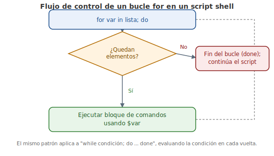

# Capítulo 9: Introducción a los Shell Scripts

## 9.1 Introducción

En este capítulo, vamos a hablar sobre cómo las herramientas que has aprendido hasta ahora pueden transformarse en scripts reutilizables.

> Dato curioso: Linux es usado en el espacio por la NASA, en el Fénix Mars Rover e incluso en la Estación Espacial Internacional.

## 9.2 Scripts Shell en Pocas Palabras

Un **script shell** es un archivo de comandos ejecutables que ha sido almacenado en un archivo de texto. Cuando el archivo se ejecuta, se ejecuta cada comando. Los scripts shell tienen acceso a todos los comandos del shell, incluyendo la lógica. Un **script** (o «secuencia de comandos»), por lo tanto, puede detectar la presencia de un archivo o buscar una salida particular y cambiar su comportamiento en consecuencia. Se pueden crear scripts para automatizar partes repetitivas de tu trabajo, que ahorran tiempo y aseguran consistencia cada vez que utilices el script. Por ejemplo, si ejecutas los mismos cinco comandos todos los días, puedes convertirlos en un script shell que reduce tu trabajo a un comando.

Un script puede ser tan simple como un único comando:

```bash
echo "Hello, World!"
```

El script, `test.sh`, consta de una sola línea que imprime la cadena `Hello, World!` (o «¡Hola, Mundo!») en la consola.

Ejecutar un script puede hacerse, ya sea pasándolo como un argumento a tu shell o ejecutándolo directamente:

```bash
sysadmin@localhost:~$ sh test.sh
Hello, World!
sysadmin@localhost:~$ ./test.sh
-bash: ./test.sh: Permission denied
sysadmin@localhost:~$ chmod +x ./test.sh
sysadmin@localhost:~$ ./test.sh
Hello, World!
```

En el ejemplo anterior, en primer lugar, el script se ejecuta como un argumento del shell. A continuación, se ejecuta el script directamente desde el shell. Es raro tener el directorio actual en la ruta de búsqueda binaria `$PATH`, por lo que el nombre viene con el prefijo `./` para indicar que se debe ejecutar en el directorio actual.

El error `Permission denied` (o «Permiso denegado») significa que el script no ha sido marcado como ejecutable. Un comando `chmod` rápido después y el script funciona. El comando `chmod` se utiliza para cambiar los permisos de un archivo, que se explica en detalle en un capítulo posterior.

Hay varios shells con su propia sintaxis de lenguaje. Por lo tanto, los scripts más complicados indicarán un shell determinado, especificando la ruta absoluta al intérprete como la primera línea, con el prefijo `#!`, tal como lo muestra el siguiente ejemplo:

```bash
#!/bin/sh
echo "Hello, World!"
```

o

```bash
#!/bin/bash
echo "Hello, World!"
```

Los dos caracteres `#!` se llaman tradicionalmente el *hash* y el *bang* respectivamente, lo que conduce a la forma abreviada **«shebang»** cuando se utilizan al principio de un script.

Por cierto, el **shebang** (o *crunchbang*) se utiliza para los scripts shell tradicionales y otros lenguajes basados en texto como Perl, Ruby y Python. Cualquier archivo de texto marcado como ejecutable se ejecutará bajo el intérprete especificado en la primera línea mientras se ejecute el script directamente. Si el script se invoca directamente como argumento a un intérprete, como `sh script` o `bash script`, se utilizará el shell proporcionado, independientemente de lo que esté en la línea del shebang.

Ayuda sentirse cómodo utilizando un editor de texto antes de escribir los scripts shell, ya que se necesitará crear archivos de texto simple. Las herramientas de oficina tradicionales como LibreOffice, que dan salida a archivos que contienen información de formato y otra información adicional, no son adecuadas para esta tarea.

## 9.3 Editar los Scripts Shell

UNIX tiene muchos editores de texto y las ventajas de uno sobre otro se debaten muy a menudo. Dos de ellos vienen mencionados específicamente en el programa del curso de los aspectos esenciales de LPI:

- El editor **GNU nano**: es un editor muy sencillo y bien adaptado para editar pequeños archivos de texto.
- El **Visual Editor** (`vi`), o su versión más reciente, **VI mejorado** (`vim`): es un editor muy potente pero tiene un arduo proceso de aprendizaje.

Nosotros nos centraremos en `nano`.

Introduce `nano test.sh` y verás una pantalla similar a esta:

```
GNU nano 2.2.6              File: test.sh                         modified

#!/bin/sh

echo "Hello, World!"
echo -n "the time is "
date


^G Get Help  ^O WriteOut  ^R Read File ^Y Prev Page ^K Cut Text  ^C Cur Po
^X Exit      ^J Justify   ^W Where Is  ^V Next Page ^U UnCut Text^T To Spell
```

El editor `nano` tiene algunas características que debes conocer. Simplemente escribes con tu teclado, utilizas las flechas para moverte y el botón suprimir/retroceso para borrar texto. A lo largo de la parte inferior de la pantalla puedes ver algunos comandos disponibles, que son sensibles al contexto y cambian dependiendo de lo que estás haciendo. Si te encuentras directamente en la máquina Linux, o sea no te conectas a través de la red, puedes utilizar el ratón para mover el cursor y resaltar el texto.

Para familiarizarte con el editor, comienza a escribir un script shell sencillo dentro del editor `nano`. Ten en cuenta que la opción de la parte inferior izquierda es `^X Exit`, que significa «presiona control y X para salir». Presiona Ctrl con X y la parte inferior cambiará:

```
Save modified buffer (ANSWERING "No" WILL DESTROY CHANGES) ?
 Y Yes
 N No           ^C Cancel
```

En este punto, puedes salir del programa sin guardar los cambios pulsando la tecla N, o guardar primero pulsando Y. El valor predeterminado es guardar el archivo con el nombre de archivo actual. Puedes presionar la tecla Entrar para guardar y salir.

Después de guardar regresarás al shell prompt. Regresa al editor. Esta vez pulsa Ctrl y O para guardar tu trabajo sin salir del editor. Los prompts son iguales en gran parte, salvo que estás de nuevo en el editor.

Esta vez utiliza las teclas de flecha para mover el cursor a la línea que contiene el texto «The time is» (o «La hora es»). Presiona Control y K dos veces para cortar las dos últimas líneas al búfer de copia. Mueve el cursor a la línea restante y presiona Control y U una vez para pegar el búfer de copia a la posición actual. Esto hace que el script muestre la hora actual antes de saludarte y te ahorra tener que volver a escribir las líneas.

Otros comandos útiles que puedas necesitar son:

| Comando | Descripción |
|---|---|
| `Ctrl + W` | buscar en el documento |
| `Ctrl + W`, luego `Control + R` | buscar y reemplazar |
| `Ctrl + G` | mostrar todos los comandos posibles |
| `Ctrl + Y/V` | página hacia arriba / abajo |
| `Ctrl + C` | mostrar la posición actual en el archivo y el tamaño del archivo |

## 9.4 El Scripting Básico

Anteriormente en este capítulo tuviste tu primera experiencia de scripting y recibiste una introducción a un script muy básico que ejecuta un comando simple. El script comenzó con la línea shebang, que le dice a Linux que tiene que utilizar `/bin/bash` (lo que es Bash) para ejecutar un script.

Aparte de ejecutar comandos, hay 3 temas que debes conocer:

- Las **variables**, que contienen información temporal en el script.
- Las **condicionales**, que te dejan hacer varias cosas basadas en las pruebas que vas introduciendo.
- Los **loops**, que te permiten hacer lo mismo una y otra vez.

### 9.4.1 Las Variables

Las **variables** son una parte esencial de cualquier lenguaje de programación. A continuación se muestra un uso muy simple de las variables:

```bash
#!/bin/bash

ANIMAL="penguin"
echo "My favorite animal is a $ANIMAL"
```

Después de la línea shebang está una directiva para asignar un texto a una variable. El nombre de la variable es `ANIMAL` y el signo de igual asigna la cadena `penguin` (o «pingüino»). Piensa en una variable como una caja en la que puedes almacenar cosas. Después de ejecutar esta línea, la caja llamada `ANIMAL` contiene la palabra `penguin`.

Es importante que no haya ningún espacio entre el nombre de la variable, el signo de igual y el elemento que se asignará a la variable. Si le pones espacio, obtendrás un error como «command not found». No es necesario poner la variable en mayúsculas, pero es una convención útil para separar las variables de los comandos que se ejecutarán.

A continuación, el script despliega una cadena en la consola. La cadena contiene el nombre de la variable precedido por un signo de dólar. Cuando el intérprete ve el signo de dólar, reconoce que va a sustituir el contenido de la variable, lo que se llama **interpolación**. La salida del script es `My favorite animal is a penguin`.

Así que recuerda esto:

- Para **asignar** una variable, usa el nombre de la variable.
- Para **acceder** al contenido de la variable, pon el prefijo del signo de dólar.

A continuación, vamos a mostrar una variable a la que se asigna el contenido de otra variable:

```bash
#!/bin/bash

ANIMAL=penguin
SOMETHING=$ANIMAL
echo "My favorite animal is a $SOMETHING"
```

`ANIMAL` contiene la cadena `penguin` (como no hay espacios, se muestra la sintaxis alternativa sin usar comillas). A `SOMETHING` se le asigna el contenido de `ANIMAL` (porque a la variable `ANIMAL` le precede el signo de dólar).

Si quieres, puedes asignar una cadena interpolada a una variable. Esto es bastante común en las grandes secuencias de comandos, ya que puedes construir un comando más grande y ejecutarlo.

Otra forma de asignar una variable es utilizar la salida de otro comando como el contenido de la variable, incluyendo el comando entre comillas invertidas:

```bash
#!/bin/bash
CURRENT_DIRECTORY=`pwd`
echo "You are in $CURRENT_DIRECTORY"
```

Este patrón a menudo se utiliza para procesar texto. Puedes tomar el texto de una variable o un archivo de entrada y pasarlo por otro comando como `sed` o `awk` para extraer ciertas partes y guardar el resultado en una variable.

Es posible obtener entradas del usuario en tu script y asignarlas a una variable mediante el comando `read` (o «leer»):

```bash
#!/bin/bash

echo -n "What is your name? "
read NAME
echo "Hello $NAME!"
```

El comando `read` puede aceptar una cadena directamente desde el teclado o como parte de la redirección de comandos tal como aprendiste en el capítulo anterior.

Hay algunas variables especiales además de las establecidas. Puedes pasar argumentos a tu script:

```bash
#!/bin/bash
echo "Hello $1"
```

El signo de dólar seguido de un número N corresponde al argumento Nth pasado al script. Si invocas al ejemplo anterior con `./test.sh Linux` el resultado será `Hola Linux`. La variable `$0` contiene el nombre del script.

Después de que un programa se ejecuta, ya sea un binario o un script, devuelve el **exit code** (o «código de salida») que es un número entero entre 0 y 255. Puedes probarlo con la variable `$?` para ver si el comando anterior se ha completado con éxito.

```bash
sysadmin@localhost:~$ grep -q root /etc/passwd
sysadmin@localhost:~$ echo $?
0
sysadmin@localhost:~$ grep -q slartibartfast /etc/passwd
sysadmin@localhost:~$ echo $?
1
```

Se utilizó el comando `grep` para buscar una cadena dentro de un archivo con el indicador `-q`, que significa «silencioso» (o «quiet»). El `grep`, mientras se ejecuta en modo silencioso, devuelve 0 si la cadena se encontró y 1 en caso contrario. Esta información puede utilizarse en un condicional para realizar una acción basada en la salida de otro comando.

Además puedes establecer el código de salida de tu propio script con el comando `exit`:

```bash
#!/bin/bash
# Something bad happened!
exit 1
```

El ejemplo anterior muestra un **comentario** (`#`). Todo lo que viene después de la etiqueta hash se ignora; se puede utilizar para ayudar al programador a dejar notas. El comando `exit 1` devuelve el código de salida 1 al invocador. Esto funciona incluso en el shell. Si ejecutas este script desde la línea de comandos y luego introduces `echo $?`, verás que devolverá 1.

Por convención, un código de salida de 0 significa «todo está bien». Cualquier código de salida mayor que 0 significa que ocurrió algún tipo de error, que es específico para el programa. Viste que `grep` utiliza 1 para significar que la cadena no se encontró.

### 9.4.2 Condicionales

Ahora que puedes ver y definir las variables, es hora de hacer que tus propios scripts tengan diferentes funciones basadas en pruebas, llamado **branching** (o «ramificación»). La instrucción `if` (o «si») es el operador básico para implementar un branching.

La instrucción `if` se ve así:

```bash
if somecommand; then
  # do this if somecommand has an exit code of 0
fi
```

El siguiente ejemplo ejecutará «somecommand» (en realidad, todo hasta el punto y coma) y si el código de salida es 0, entonces se ejecutará el contenido hasta el cierre `fi`. Usando lo que sabes acerca de `grep`, ahora puedes escribir un script que hace cosas diferentes, basadas en la presencia de una cadena en el archivo de contraseñas:

```bash
#!/bin/bash

if grep -q root /etc/passwd; then
  echo root is in the password file
else
  echo root is missing from the password file
fi
```

De los ejemplos anteriores podrías recordar que el código de salida de `grep` es 0 si se encuentra la cadena. El ejemplo anterior utiliza esto en una línea para imprimir un mensaje si `root` está en el archivo `passwd`, u otro mensaje si no es así. La diferencia aquí es que en lugar de un `fi` para cerrar, el bloque `if` tiene un `else`. Esto te permite realizar una acción si la condición es verdadera, y otra si la condición es falsa. El bloque `else` siempre debe cerrarse con la palabra clave `fi`.

Otras tareas comunes son buscar la presencia de un archivo o directorio y comparar cadenas y números. Podrías iniciar un archivo de registro si no existe, o comparar el número de líneas en un archivo con la última vez que se ejecutó. El comando `if` es claramente de ayuda aquí, pero ¿qué comando debes usar para hacer la comparación?

El comando `test` te da acceso fácil a los operadores de prueba de comparación y archivos. Por ejemplo:

| Comando | Descripción |
|---|---|
| `test –f /dev/ttyS0` | 0 si el archivo existe |
| `test ! –f /dev/ttyS0` | 0 si el archivo no existe |
| `test –d /tmp` | 0 si el directorio existe |
| `test –x `which ls`` | sustituir la ubicación de `ls` y luego probar si el usuario puede ejecutarlo |
| `test 1 –eq 1` | 0 si tiene éxito la comparación numérica |
| `test ! 1 –eq 1` | NO — 0 si la comparación falla |
| `test 1 –ne 1` | más fácil: ejecutar test si hay desigualdad numérica |
| `test "a" = "a"` | 0 si tiene éxito la comparación de cadenas |
| `test "a" != "a"` | 0 si las cadenas son diferentes |
| `test 1 –eq 1 –o 2 –eq 2` | `-o` es OR: cualquiera de las opciones puede ser igual |
| `test 1 –eq 1 –a 2 –eq 2` | `-a` es AND: ambas comparaciones deben ser iguales |

Es importante tener en cuenta que `test` ve las comparaciones de números enteros y cadenas de manera distinta. `01` y `1` son iguales por comparación numérica, pero no para comparación de cadenas o strings. Siempre debes tener cuidado y recordar qué tipo de entrada esperas.

Hay muchas más pruebas, como `–gt` para mayor que, formas de comprobar si un archivo es más reciente que otros y muchas más. Para más información consulta la página `man test`.

La salida de `test` es bastante larga para un comando que se usa con tanta frecuencia, por lo que tiene un alias llamado `[` (corchete cuadrado izquierdo). Si incluyes tus condiciones en corchetes, es lo mismo que si ejecutaras `test`. Por lo tanto, estas instrucciones son idénticas.

```bash
if test –f /tmp/foo; then
if [ -f /tmp/foo ]; then
```

Mientras que la última forma es de uso más frecuente, es importante entender que el corchete es un comando en sí mismo que funciona de manera semejante a `test` excepto que requiere el corchete cuadrado de cierre.

La instrucción `if` tiene una forma final que te permite hacer varias comparaciones al mismo tiempo usando `elif` (abreviatura de *elseif*).

```bash
#!/bin/bash

if [ "$1" = "hello" ]; then
  echo "hello yourself"
elif [ "$1" = "goodbye" ]; then
  echo "nice to have met you"
  echo "I hope to see you again"
else
  echo "I didn't understand that"
fi
```

El código anterior compara el primer argumento pasado al script. Si es `hello`, se ejecuta el primer bloque. Si no es así, el script comprueba si es `goodbye` e invoca `echo` con un mensaje diferente. De lo contrario, se envía un tercer mensaje. Ten en cuenta que la variable `$1` viene entre comillas y se utiliza el operador de comparación de cadenas en lugar de la versión numérica (`-eq`).

Las pruebas `if`/`elif`/`else` pueden ser bastante detalladas y complicadas. La instrucción `case` proporciona una forma distinta de hacer las pruebas múltiples más fáciles.

```bash
#!/bin/bash

case "$1" in
hello|hi)
  echo "hello yourself"
  ;;
goodbye)
  echo "nice to have met you"
  echo "I hope to see you again"
  ;;
*)
  echo "I didn't understand that"
esac
```

La instrucción `case` comienza con la descripción de la expresión que se analiza: `case EXPRESSION in`. La expresión aquí es `$1` entre comillas.

A continuación, cada conjunto de pruebas se ejecuta como una coincidencia de patrón terminada por un paréntesis de cierre. El ejemplo anterior primero busca `hello` o `hi`; múltiples opciones son separadas por la barra vertical `|`, que es un operador OR en muchos lenguajes de programación. Después de esto, se ejecutan los comandos si el patrón devuelve verdadero y se terminan con dos signos de punto y coma (`;;`). El patrón se repite.

El patrón `*` es igual a `else`, ya que coincide con cualquier cosa. El comportamiento de la instrucción `case` es similar a la instrucción `if`/`elif`/`else` en que el proceso se detiene tras la primera coincidencia. Si ninguna de las otras opciones coincide, el patrón `*` asegura que se produzca coincidencia con la última opción.

Con una sólida comprensión de las condicionales puedes hacer que tus scripts tomen acción sólo si es necesario.

### 9.4.3 Los Loops

Los **loops** (o «ciclos o bucles») permiten que un código se ejecute repetidas veces. Pueden ser útiles en numerosas situaciones, como cuando quieres ejecutar los mismos comandos sobre cada archivo en un directorio, o repetir alguna acción 100 veces. Hay dos loops principales en los scripts del shell:

- El loop **`for`**.
- El loop **`while`**.

<figure>

<figcaption>Flujo de control de un bucle for (el mismo patrón aplica a while con su propia condición).</figcaption>
</figure>

Los loops `for` se utilizan cuando tienes una colección finita que quieres repetir, como una lista de archivos o una lista de nombres de servidor:

```bash
#!/bin/bash

SERVERS="servera serverb serverc"
for S in $SERVERS; do
  echo "Doing something to $S"
done
```

Primero, el script establece una variable que contiene una lista de nombres de servidor separada por espacios. La instrucción `for` entonces cicla (realiza «loops») sobre la lista de los servidores, cada vez que establece la variable `S` con el nombre del servidor actual. La elección de la `S` es arbitraria, pero ten en cuenta que la `S` no tiene un signo de dólar, pero en `$SERVERS` sí lo tiene, lo que muestra que `$SERVERS` se expandirá a la lista de servidores. La lista no tiene que ser una variable. Este ejemplo muestra dos formas más para pasar una lista.

```bash
#!/bin/bash

for NAME in Sean Jon Isaac David; do
  echo "Hello $NAME"
done

for S in *; do
  echo "Doing something to $S"
done
```

El primer loop es funcionalmente el mismo que en el ejemplo anterior, excepto que la lista se pasa directamente al loop `for` en lugar de usar una variable. Usar una variable ayuda a que el script sea más claro, ya que una persona fácilmente puede realizar cambios en la variable en lugar de ver el loop.

El segundo loop utiliza el comodín `*`, que es un **file glob**. El shell expande eso a todos los archivos en el directorio actual.

El otro tipo de loop, un loop `while`, opera en una lista de tamaño desconocido. Su trabajo es seguir ejecutándose y en cada iteración realizar una prueba para ver si se tiene que ejecutar otra vez. Lo puedes ver como «mientras que una condición es verdadera, haz cosas».

```bash
#!/bin/bash

i=0
while [ $i -lt 10 ]; do
  echo $i
  i=$(( $i + 1))
done
echo "Done counting"
```

El ejemplo anterior muestra un loop `while` que cuenta de 0 a 9. Un contador de variable, `i`, arranca en 0. Luego, un loop `while` se ejecuta con una prueba siendo «is $i less than 10?» (o «¿es $i menor que 10?»). Ten en cuenta que el loop `while` utiliza la misma notación que la instrucción `if`.

Dentro del loop `while`, el valor actual de `i` es mostrado en pantalla, y luego se le añade 1 a través del comando `$((aritmética))` y se asigna de regreso a `i`. Una vez que `i` llega a 10, la instrucción `while` regresa falso y el proceso continuará después del loop.

### Resumen del capítulo

- Un **script shell** es un archivo de texto con comandos ejecutables; se ejecuta pasándolo como argumento al shell (`sh script.sh`) o directamente (`./script.sh`) tras darle permisos de ejecución con `chmod +x`.
- La línea **shebang** (`#!/bin/bash`, `#!/bin/sh`) al inicio del script indica qué intérprete debe utilizarse cuando el script se ejecuta directamente.
- El editor `nano` es la herramienta recomendada en el curso para crear y editar scripts, con atajos como `Ctrl+O` (guardar), `Ctrl+X` (salir), `Ctrl+K`/`Ctrl+U` (cortar/pegar) y `Ctrl+W` (buscar).
- Las **variables** almacenan datos temporales (`NOMBRE=valor`, acceso con `$NOMBRE`), pueden recibir la salida de un comando entre comillas invertidas, entrada del usuario con `read`, argumentos posicionales (`$1`, `$0`) y el código de salida del último comando (`$?`).
- Las **condicionales** (`if`/`elif`/`else`/`fi`, `case`/`esac`) permiten ramificar el comportamiento del script según pruebas realizadas con el comando `test` (o su alias `[ ]`), que compara archivos, cadenas y números.
- Los **loops** `for` (para colecciones finitas) y `while` (mientras una condición sea verdadera) permiten repetir bloques de comandos, iterando sobre listas, nombres de archivos (file globs) o contadores numéricos.
